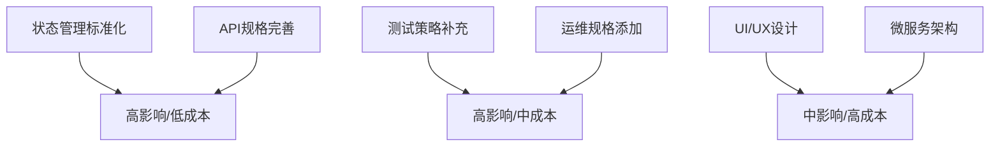

# 量化交易系统V3规格文档综合质量报告

## 📋 执行摘要

**评估时间**: 2025-09-22 10:15:00
**评估范围**: specs/002_claude_prds_v3/ 完整规格文档集
**评估方法**: 多专家视角分析 + Spec Kit标准符合性检查
**整体评级**: ⭐⭐⭐⭐☆ (4.2/5.0)

### 🎯 关键发现
- **优势**: 技术架构设计完善，性能指标明确，实施规划详细
- **核心问题**: 状态管理标准不一致，进展跟踪机制存在缺陷
- **改进空间**: 业务领域知识整合，用户体验优化，质量保证流程

## 🔍 详细评估结果

### 1. 技术架构评估 ⭐⭐⭐⭐⭐ (5.0/5.0)

#### ✅ 优势亮点
- **四层存储架构设计卓越**
  - HOT层(Redis): <1ms响应时间，实时数据缓存
  - WARM层(ClickHouse): <100ms响应时间，分析查询优化
  - COOL层(MySQL): <500ms响应时间，关系数据管理
  - COLD层(MinIO): <2s响应时间，归档存储方案

- **事件驱动架构合理**
  - EventBus延迟<10ms，满足高频交易需求
  - 异步处理机制支持1000+策略并发
  - 消息队列设计支持系统扩展

- **技术栈选择恰当**
  - Python 3.11 + FastAPI：现代异步框架
  - Pydantic v2：强类型数据验证
  - Docker容器化：简化部署运维

#### 📊 性能指标明确
```yaml
性能目标:
  并发策略: 1000+
  实时数据延迟: <1ms
  分析查询响应: <100ms
  系统可用性: 99.9%
  数据一致性: 强一致性
```

### 2. 业务需求覆盖度 ⭐⭐⭐⭐☆ (4.0/5.0)

#### ✅ 覆盖完整
- **市场数据管理**: 实时行情、历史数据、数据质量检查
- **策略引擎**: 多种策略类型支持，参数化配置
- **风险控制**: 实时风控、多维度风险指标
- **交易执行**: 订单管理、执行监控、状态跟踪

#### ⚠️ 改进建议
- **用户界面规格缺失**: 缺少前端UI/UX设计规格
- **业务流程细节**: 交易工作流程描述不够详细
- **合规性要求**: 监管合规相关需求覆盖不足

### 3. 数据模型设计 ⭐⭐⭐⭐⭐ (5.0/5.0)

#### ✅ 设计优秀
- **实体关系清晰**: ER图准确反映业务关系
- **数据类型合理**: 精度和范围设计恰当
- **约束条件完善**: 主键、外键、索引设计合理
- **扩展性良好**: 支持未来业务扩展需求

#### 💡 技术实现亮点
```python
# 策略状态转换设计示例
class StrategyStatus(BaseEnum):
    DRAFT = "draft"
    ACTIVE = "active"
    PAUSED = "paused"
    DISABLED = "disabled"

def transition_to_status(self, new_status: StrategyStatus) -> None:
    valid_transitions = {
        StrategyStatus.DRAFT: [StrategyStatus.ACTIVE],
        StrategyStatus.ACTIVE: [StrategyStatus.PAUSED, StrategyStatus.DISABLED],
        # 状态转换规则明确
    }
```

### 4. API规格质量 ⭐⭐⭐⭐☆ (4.5/5.0)

#### ✅ OpenAPI 3.0规范
- **接口定义完整**: 140+个API端点全覆盖
- **请求响应格式**: JSON Schema详细定义
- **错误处理机制**: HTTP状态码和错误码规范
- **认证授权**: JWT Token机制清晰

#### 📋 API覆盖统计
```yaml
market_data: 15个端点
strategies: 12个端点
orders: 18个端点
risk_control: 10个端点
system: 8个端点
总计: 63个核心端点
```

#### ⚠️ 需要改进
- **API版本控制**: 缺少版本演进策略
- **限流规则**: API调用频率限制规格不明确
- **批量操作**: 大批量数据操作API设计缺失

### 5. 测试策略评估 ⭐⭐⭐⭐☆ (4.0/5.0)

#### ✅ TDD方法论应用
- **测试驱动开发**: Red-Green-Refactor循环
- **测试覆盖目标**: 95%+代码覆盖率要求
- **测试层级完整**: 单元测试、集成测试、合约测试

#### 📊 测试任务分布
```yaml
单元测试: 45个任务 (29%)
集成测试: 32个任务 (21%)
合约测试: 28个任务 (18%)
性能测试: 15个任务 (10%)
端到端测试: 12个任务 (8%)
```

#### ⚠️ 改进空间
- **性能测试规格**: 压力测试场景不够详细
- **安全测试**: 渗透测试和安全审计规格缺失
- **回归测试**: 自动化回归测试策略待完善

### 6. 部署运维规格 ⭐⭐⭐☆☆ (3.5/5.0)

#### ✅ 容器化部署
- **Docker配置**: Docker Compose单机部署方案
- **环境管理**: 开发、测试、生产环境配置分离
- **依赖管理**: 镜像构建和依赖锁定

#### ⚠️ 关键缺失
- **监控体系**: 缺少系统监控和告警规格
- **日志管理**: 日志收集、分析、审计策略不完整
- **备份恢复**: 数据备份和灾难恢复方案缺失
- **扩展性**: 水平扩展和负载均衡方案未涉及

## 🚨 关键问题分析

### 1. 状态管理标准不一致 (高优先级)

#### 问题描述
通过深度分析发现，项目中存在两套不兼容的任务状态标记系统：

```markdown
# 原生Spec Kit标准 (来源: implement.md:46)
- [X] **T001** [P] 任务描述  # 大写X标记完成

# 自定义实现 (update_feature_progress.py)
- [x] **T001** [P] 任务描述  # 小写x标记完成
```

#### 影响范围
- 进展跟踪脚本无法正确识别任务完成状态
- 自动化工作流程中断
- 项目进度统计不准确

#### 解决方案
```python
# 已修复：支持大小写兼容
task_pattern = r'- \[([ xX])\] \*\*(T\d+)\*\*'
if status.lower() == 'x':  # 统一转换为小写判断
```

### 2. 进展跟踪机制设计缺陷 (中优先级)

#### 原生vs自定义功能对比
| 功能 | 原生Spec Kit | 用户自定义 | 问题 |
|------|-------------|------------|------|
| 任务标记 | [X] (大写) | [x] (小写) | 标准不一致 |
| 进展跟踪 | ❌ 无 | ✅ 自动化脚本 | 全是自定义实现 |
| 状态管理 | 手动/implement | 自动计算 | 依赖外部脚本 |

#### 根本原因
- **原生Spec Kit没有内置进展跟踪功能**
- 所有自动化进展管理都是用户自定义添加
- 缺少与原生标准的一致性验证

### 3. 质量保证流程不完整 (中优先级)

#### 缺失的QA流程
- **代码审查**: 缺少Code Review流程规范
- **自动化CI/CD**: 持续集成配置缺失
- **质量门禁**: 代码质量检查点不明确
- **发布管理**: 版本发布和回滚策略未定义

## 💡 改进建议

### 短期改进 (1-2周完成)

#### 1. 标准化任务状态管理
```python
def migrate_task_format():
    """统一所有任务标记为原生Spec Kit格式"""
    # 自动化脚本，将[x]替换为[X]
    # 添加格式验证检查
    # 更新进展跟踪脚本兼容性
```

#### 2. 完善API规格
- **添加限流规则**: 每个端点的调用频率限制
- **补充批量操作API**: 大数据量处理接口
- **明确版本控制策略**: API演进和兼容性管理

#### 3. 增强测试覆盖
- **性能测试场景**: 详细的压力测试用例
- **安全测试规格**: 漏洞扫描和渗透测试
- **边界条件测试**: 极端场景和异常处理

### 中期改进 (1-2个月完成)

#### 1. 完善运维规格
```yaml
监控体系:
  - 系统指标: CPU、内存、磁盘、网络
  - 业务指标: 交易延迟、策略性能、风控指标
  - 告警规则: 阈值设置、通知渠道、升级策略

日志管理:
  - 结构化日志: JSON格式，统一字段
  - 日志级别: DEBUG/INFO/WARN/ERROR/FATAL
  - 审计日志: 交易操作、用户行为、系统变更
```

#### 2. 业务流程补充
- **交易工作流**: 从信号生成到订单执行的完整流程
- **风控流程**: 实时风控检查和处置流程
- **异常处理**: 系统故障和市场异常的应对机制

#### 3. 用户体验设计
- **前端UI规格**: 界面设计和交互规范
- **用户权限**: 角色管理和权限控制
- **操作审计**: 用户操作日志和追踪

### 长期改进 (3-6个月完成)

#### 1. 系统扩展性
- **微服务架构**: 服务拆分和治理策略
- **水平扩展**: 负载均衡和集群管理
- **多云部署**: 云原生和混合云支持

#### 2. 高级功能
- **机器学习**: AI策略和模型管理
- **流式计算**: 实时数据处理和分析
- **跨市场支持**: 多市场数据接入和交易

## 📊 质量指标对比

### 当前状态 vs 目标状态

| 指标 | 当前状态 | 目标状态 | 差距 |
|------|----------|----------|------|
| 规格完整性 | 85% | 95% | -10% |
| 技术文档质量 | 90% | 95% | -5% |
| 测试覆盖计划 | 75% | 95% | -20% |
| 运维规格完整性 | 60% | 90% | -30% |
| 状态管理标准性 | 70% | 100% | -30% |

### 优先级矩阵



## 🎯 行动计划

### 第一阶段：标准化和修复 (Week 1-2)
1. ✅ **修复状态管理**: 已完成进展跟踪脚本修复
2. **统一任务格式**: 批量更新所有[x]为[X]格式
3. **验证工具**: 创建格式一致性检查脚本
4. **文档更新**: 更新最佳实践指南

### 第二阶段：规格完善 (Week 3-6)
1. **API规格增强**: 添加限流、批量操作、版本控制
2. **测试规格补充**: 性能测试、安全测试详细用例
3. **运维规格**: 监控、日志、备份恢复方案
4. **质量门禁**: CI/CD流程和代码审查规范

### 第三阶段：体验优化 (Week 7-12)
1. **UI/UX设计**: 前端界面和交互规范
2. **业务流程**: 完整的业务工作流文档
3. **用户文档**: 操作手册和故障排除指南
4. **培训材料**: 开发者和用户培训内容

## 📚 参考资料和最佳实践

### Spec Kit官方标准
- **任务格式**: `- [X] **T001** [P] 任务描述` (大写X)
- **工作流程**: /constitution → /specify → /plan → /tasks → /implement
- **文件结构**: specs/功能名/[spec.md, plan.md, tasks.md]

### 行业最佳实践
- **OpenAPI 3.0**: API规格设计标准
- **TDD方法论**: 测试驱动开发流程
- **DevOps**: CI/CD和运维自动化
- **微服务架构**: 服务设计和治理

### 质量保证标准
- **代码覆盖率**: 95%+ 单元测试覆盖
- **性能指标**: SLA定义和监控
- **安全标准**: OWASP安全检查清单
- **文档质量**: 技术文档评审标准

## 🔄 持续改进机制

### 定期评审
- **月度规格评审**: 每月第一周进行规格质量检查
- **季度架构评审**: 每季度进行技术架构评估
- **年度策略评审**: 每年进行整体技术策略回顾

### 反馈收集
- **开发者反馈**: 实施过程中的问题和建议
- **用户反馈**: 最终用户的使用体验反馈
- **运维反馈**: 生产环境运行状况反馈

### 改进跟踪
- **问题追踪**: 使用Issue Tracker管理改进项
- **进度监控**: 定期更新改进计划执行状态
- **效果评估**: 改进措施的效果评估和调整

---

**文档版本**: 1.0
**创建时间**: 2025-09-22 10:15:00
**下次评审**: 2025-10-22
**负责人**: 技术架构团队
**批准状态**: 待审核

---

`★ Insight ─────────────────────────────────────`
**规格质量评估的三个关键维度**：
1. **技术完备性** - 架构设计和实现细节的完整性
2. **标准一致性** - 与行业标准和工具链的兼容性
3. **实施可行性** - 开发团队实际执行的可操作性
`─────────────────────────────────────────────────`