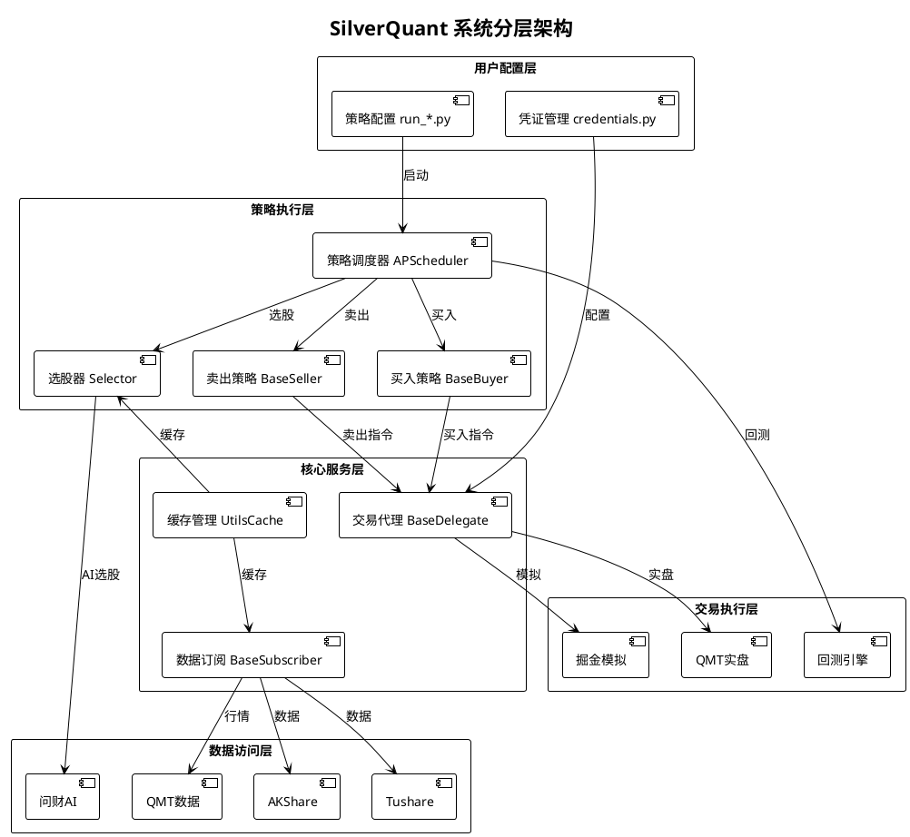
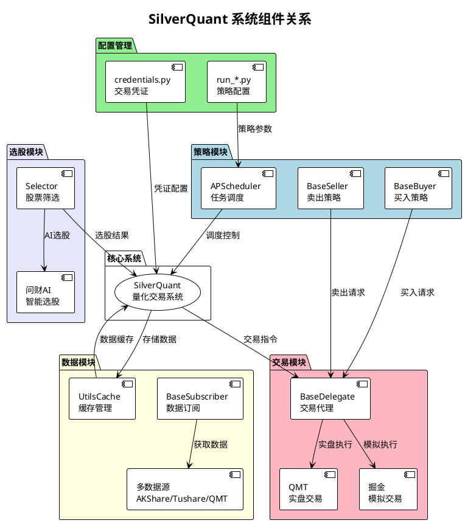
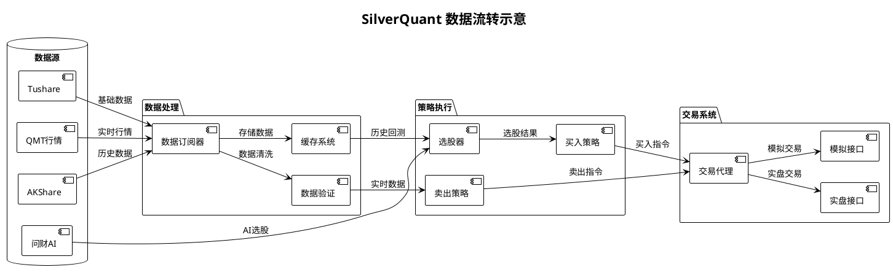

# SilverQuant 系统整体架构图

## 1. 系统分层架构（清晰版）

## 2. 系统组件关系图（简化版）

## 3. 数据流转示意图

## 4. 模块职责说明

### 用户接口层
- **策略配置文件** (`run_*.py`): 各种策略的入口点，配置买卖参数
- **凭证配置** (`credentials.py`): 存储交易账户、API密钥等敏感信息
- **缓存目录** (`_cache/`): 存储历史数据、持仓信息、交易记录等

### 策略执行层
- **策略调度器** (APScheduler): 定时执行选股、买卖扫描任务
- **买入策略** (BaseBuyer): 管理买入逻辑，包括仓位控制、风险限制
- **卖出策略** (BaseSeller): 管理卖出逻辑，组合多种卖出组件
- **股票池管理** (StocksPool): 维护可交易股票范围，过滤黑名单
- **选股器** (Selector): 根据技术指标或AI模型筛选目标股票

### 核心服务层
- **交易代理** (BaseDelegate): 抽象交易接口，支持多交易端
- **数据订阅** (BaseSubscriber): 实时获取行情数据，支持多种数据源
- **缓存管理** (UtilsCache): 管理数据缓存，减少API调用频率
- **通知服务** (DingMessager): 钉钉机器人消息推送

### 数据访问层
- **AKShare**: 获取A股历史和实时数据
- **Tushare**: 备用数据源，需要token
- **通达信TDX**: 本地数据源，支持历史数据回放
- **MiniQMT**: QMT自带的行情数据
- **同花顺问财**: AI选股数据源

### 交易执行层
- **QMT实盘** (xtquant): 连接券商QMT进行实盘交易
- **掘金模拟盘** (gm_delegate): 掘金平台模拟交易
- **回测引擎** (daily_backtest): 历史数据回测功能

## 5. 数据流向说明

### 配置流程
1. 加载 `credentials.py` 配置文件
2. 初始化交易账户和API密钥
3. 加载策略参数配置

### 数据流程
1. 订阅多个数据源获取行情
2. 数据清洗和验证
3. 存储到缓存系统
4. 提供给策略使用

### 策略流程
1. 定时触发选股任务
2. AI或技术指标筛选股票
3. 生成买入/卖出信号
4. 风险控制和仓位管理

### 交易流程
1. 接收策略交易指令
2. 通过交易代理下单
3. 实盘或模拟执行
4. 记录交易结果

## 6. 关键设计特点

### 分层解耦
- 每一层只与相邻层交互，降低耦合度
- 统一接口设计，便于扩展和替换组件

### 组件化策略
- 买入、卖出、选股可独立配置
- 支持组合多个卖出组件，实现灵活风控

### 多数据源容错
- 主数据源失效时自动切换备用源
- 本地缓存保证离线时基本功能可用

### 实时监控
- 钉钉推送交易通知和异常报警
- 本地日志记录详细操作历史