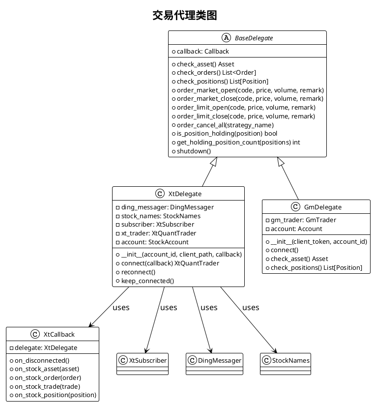
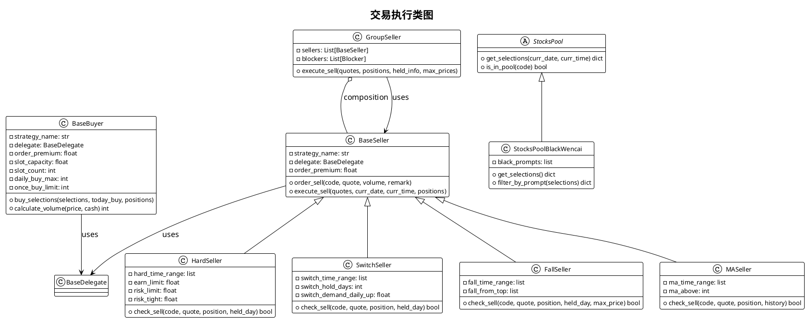
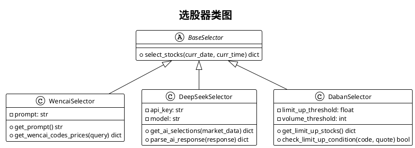
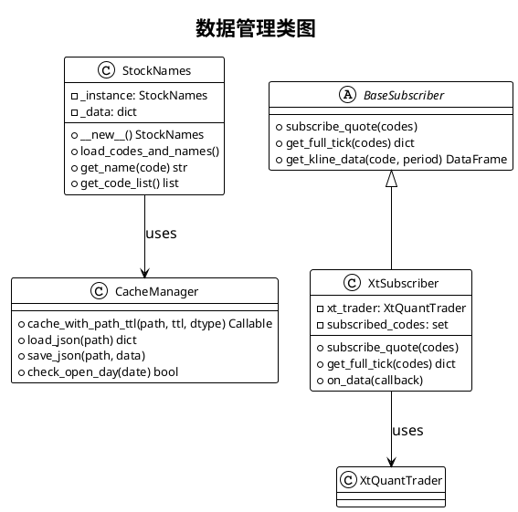
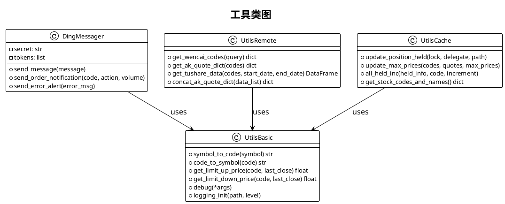

# SilverQuant 核心类图

## 1. 交易代理类图

```plantuml
@startuml
!theme plain
skinparam defaultFontName "Microsoft YaHei"
skinparam defaultFontSize 16
skinparam classFontSize 14
skinparam classAttributeFontSize 13
skinparam sequenceMessageFontSize 14
skinparam sequenceParticipantFontSize 14
skinparam monochrome false
skinparam shadowing false

title 交易代理类图

abstract class BaseDelegate {
    +callback: Callback
    +check_asset() Asset
    +check_orders() List<Order]
    +check_positions() List[Position]
    +order_market_open(code, price, volume, remark)
    +order_market_close(code, price, volume, remark)
    +order_limit_open(code, price, volume, remark)
    +order_limit_close(code, price, volume, remark)
    +order_cancel_all(strategy_name)
    +is_position_holding(position) bool
    +get_holding_position_count(positions) int
    +shutdown()
}

class XtDelegate {
    -ding_messager: DingMessager
    -stock_names: StockNames
    -subscriber: XtSubscriber
    -xt_trader: XtQuantTrader
    -account: StockAccount
    +__init__(account_id, client_path, callback)
    +connect(callback) XtQuantTrader
    +reconnect()
    +keep_connected()
}

class GmDelegate {
    -gm_trader: GmTrader
    -account: Account
    +__init__(client_token, account_id)
    +connect()
    +check_asset() Asset
    +check_positions() List[Position]
}

class XtCallback {
    -delegate: XtDelegate
    +on_disconnected()
    +on_stock_asset(asset)
    +on_stock_order(order)
    +on_stock_trade(trade)
    +on_stock_position(position)
}

BaseDelegate <|-- XtDelegate
BaseDelegate <|-- GmDelegate
XtDelegate --> XtSubscriber : uses
XtDelegate --> DingMessager : uses
XtDelegate --> StockNames : uses
XtDelegate --> XtCallback : uses

@enduml
```

## 2. 交易执行类图

```plantuml
@startuml
!theme plain
skinparam defaultFontName "Microsoft YaHei"
skinparam defaultFontSize 16
skinparam classFontSize 14
skinparam classAttributeFontSize 13
skinparam sequenceMessageFontSize 14
skinparam sequenceParticipantFontSize 14
skinparam monochrome false
skinparam shadowing false

title 交易执行类图

class BaseBuyer {
    -strategy_name: str
    -delegate: BaseDelegate
    -order_premium: float
    -slot_capacity: float
    -slot_count: int
    -daily_buy_max: int
    -once_buy_limit: int
    +buy_selections(selections, today_buy, positions)
    +calculate_volume(price, cash) int
}

class BaseSeller {
    -strategy_name: str
    -delegate: BaseDelegate
    -order_premium: float
    +order_sell(code, quote, volume, remark)
    +execute_sell(quotes, curr_date, curr_time, positions)
}

class HardSeller {
    -hard_time_range: list
    -earn_limit: float
    -risk_limit: float
    -risk_tight: float
    +check_sell(code, quote, position, held_day) bool
}

class SwitchSeller {
    -switch_time_range: list
    -switch_hold_days: int
    -switch_demand_daily_up: float
    +check_sell(code, quote, position, held_day) bool
}

class FallSeller {
    -fall_time_range: list
    -fall_from_top: list
    +check_sell(code, quote, position, held_day, max_price) bool
}

class MASeller {
    -ma_time_range: list
    -ma_above: int
    +check_sell(code, quote, position, history) bool
}

class GroupSeller {
    -sellers: List[BaseSeller]
    -blockers: List[Blocker]
    +execute_sell(quotes, positions, held_info, max_prices)
}

abstract class StocksPool {
    +get_selections(curr_date, curr_time) dict
    +is_in_pool(code) bool
}

class StocksPoolBlackWencai {
    -black_prompts: list
    +get_selections() dict
    +filter_by_prompt(selections) dict
}

BaseSeller <|-- HardSeller
BaseSeller <|-- SwitchSeller
BaseSeller <|-- FallSeller
BaseSeller <|-- MASeller
GroupSeller o-- BaseSeller : composition
StocksPool <|-- StocksPoolBlackWencai

BaseBuyer --> BaseDelegate : uses
BaseSeller --> BaseDelegate : uses
GroupSeller --> BaseSeller : uses

@enduml
```

## 3. 选股器类图

```plantuml
@startuml
!theme plain
skinparam defaultFontName "Microsoft YaHei"
skinparam defaultFontSize 16
skinparam classFontSize 14
skinparam classAttributeFontSize 13
skinparam sequenceMessageFontSize 14
skinparam sequenceParticipantFontSize 14
skinparam monochrome false
skinparam shadowing false

title 选股器类图

abstract class BaseSelector {
    +select_stocks(curr_date, curr_time) dict
}

class WencaiSelector {
    -prompt: str
    +get_prompt() str
    +get_wencai_codes_prices(query) dict
}

class DeepSeekSelector {
    -api_key: str
    -model: str
    +get_ai_selections(market_data) dict
    +parse_ai_response(response) dict
}

class DabanSelector {
    -limit_up_threshold: float
    -volume_threshold: int
    +get_limit_up_stocks() dict
    +check_limit_up_condition(code, quote) bool
}

BaseSelector <|-- WencaiSelector
BaseSelector <|-- DeepSeekSelector
BaseSelector <|-- DabanSelector

@enduml
```

## 4. 数据管理类图

```plantuml
@startuml
!theme plain
skinparam defaultFontName "Microsoft YaHei"
skinparam defaultFontSize 16
skinparam classFontSize 14
skinparam classAttributeFontSize 13
skinparam sequenceMessageFontSize 14
skinparam sequenceParticipantFontSize 14
skinparam monochrome false
skinparam shadowing false

title 数据管理类图

class StockNames {
    -_instance: StockNames
    -_data: dict
    +__new__() StockNames
    +load_codes_and_names()
    +get_name(code) str
    +get_code_list() list
}

class CacheManager {
    +cache_with_path_ttl(path, ttl, dtype) Callable
    +load_json(path) dict
    +save_json(path, data)
    +check_open_day(date) bool
}

abstract class BaseSubscriber {
    +subscribe_quote(codes)
    +get_full_tick(codes) dict
    +get_kline_data(code, period) DataFrame
}

class XtSubscriber {
    -xt_trader: XtQuantTrader
    -subscribed_codes: set
    +subscribe_quote(codes)
    +get_full_tick(codes) dict
    +on_data(callback)
}

BaseSubscriber <|-- XtSubscriber
XtSubscriber --> XtQuantTrader : uses
StockNames --> CacheManager : uses

@enduml
```

## 5. 工具类图

```plantuml
@startuml
!theme plain
skinparam defaultFontName "Microsoft YaHei"
skinparam defaultFontSize 16
skinparam classFontSize 14
skinparam classAttributeFontSize 13
skinparam sequenceMessageFontSize 14
skinparam sequenceParticipantFontSize 14
skinparam monochrome false
skinparam shadowing false

title 工具类图

class UtilsBasic {
    +symbol_to_code(symbol) str
    +code_to_symbol(code) str
    +get_limit_up_price(code, last_close) float
    +get_limit_down_price(code, last_close) float
    +debug(*args)
    +logging_init(path, level)
}

class DingMessager {
    -secret: str
    -tokens: list
    +send_message(message)
    +send_order_notification(code, action, volume)
    +send_error_alert(error_msg)
}

class UtilsRemote {
    +get_wencai_codes(query) dict
    +get_ak_quote_dict(codes) dict
    +get_tushare_data(codes, start_date, end_date) DataFrame
    +concat_ak_quote_dict(data_list) dict
}

class UtilsCache {
    +update_position_held(lock, delegate, path)
    +update_max_prices(codes, quotes, max_prices)
    +all_held_inc(held_info, code, increment)
    +get_stock_codes_and_names() dict
}

DingMessager --> UtilsBasic : uses
UtilsRemote --> UtilsBasic : uses
UtilsCache --> UtilsBasic : uses

@enduml
```