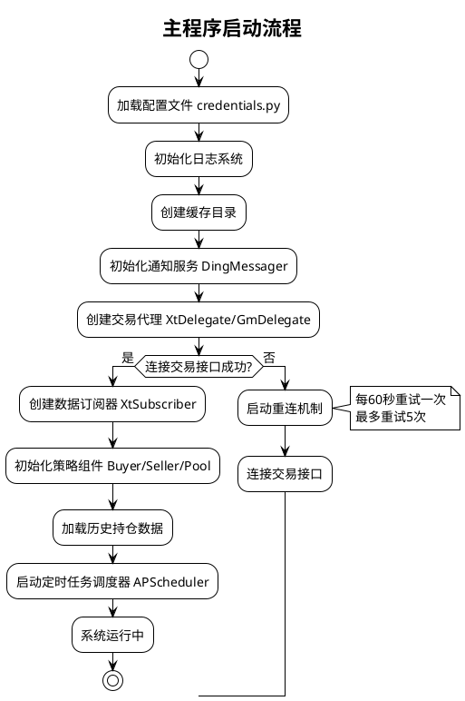
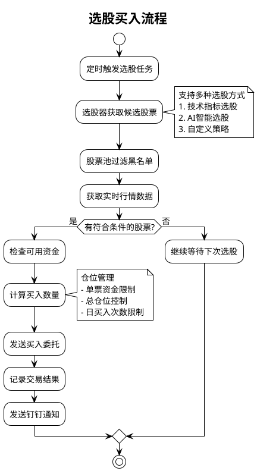
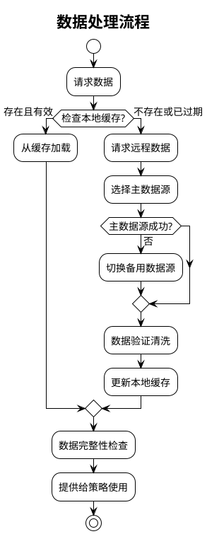

# SilverQuant 策略执行流程图

## 1. 主程序启动流程



## 2. 选股买入流程



## 3. 卖出决策流程

```plantuml
@startuml
!theme plain
skinparam defaultFontName "Microsoft YaHei"
skinparam defaultFontSize 14
skinparam classFontSize 12

title 卖出决策流程

start

:获取持仓列表;

:遍历每个持仓;

:更新持仓天数和历史最高价;

:执行多重卖出策略检查;

alt 硬止损检查
  if (价格 < 成本价×止损线?) then (是)
    :立即止损卖出;
    stop
  endif
end alt

alt 动态止盈检查
  if (价格 < 最高价×回落比例?) then (是)
    :回落止盈卖出;
    stop
  endif
end alt

alt 换仓检查
  if (持仓天数 > 限制?) then (是)
    if (日均收益 < 要求?) then (是)
      :换仓卖出;
      stop
    endif
  endif
end alt

alt 技术指标检查
  :检查均线、MACD等指标;

  if (触发卖出信号?) then (是)
    :指标卖出;
    stop
  endif
end alt

:继续持有;

stop

@enduml
```

## 4. 异常处理流程（简化版）

```plantuml
@startuml
!theme plain
skinparam defaultFontName "Microsoft YaHei"
skinparam defaultFontSize 14
skinparam classFontSize 12

title 异常处理流程

start

:系统监控运行状态;

if (检测到异常?) then (网络异常)
  :重试机制;

  if (重试3次后仍失败?) then (是)
    :切换备用网络;
  endif

else (数据异常)
  :降级处理;

  :切换备用数据源;

  note right: 数据源优先级\n1. QMT实时数据\n2. AKShare\n3. Tushare\n4. 本地缓存

else (交易异常)
  :紧急风控;

  :取消所有委托;

  :进入安全模式;

  :发送紧急通知;

  note right: 保护资金安全\n防止异常损失

else (系统异常)
  :记录详细日志;

  :发送告警通知;

  :尝试自动恢复;

else (正常运行)
  :继续监控;
endif

stop

note top
  SilverQuant 多层异常处理机制

  关键原则：
  1. 快速响应，最小化影响
  2. 自动降级，保证连续性
  3. 实时告警，及时处理
  4. 资金安全，最高优先级
end note

@enduml
```

## 5. 数据处理流程



## 6. 日内交易时间轴

```plantuml
@startuml
!theme plain
skinparam defaultFontName "Microsoft YaHei"
skinparam defaultFontSize 14

title 日内交易时间轴

rectangle "开盘前准备" #E3F2FD {
  (08:30-09:30)
  --
  系统初始化
  连接交易接口
  加载昨日数据
}

rectangle "早盘交易" #C8E6C9 {
  (09:30-11:30)
  --
  集中买入执行
  持续卖出监控
  实时风险检查
}

rectangle "午间休市" #FFF3E0 {
  (11:30-13:00)
  --
  数据更新
  策略调整
  持仓统计
}

rectangle "午盘交易" #FFCDD2 {
  (13:00-14:30)
  --
  继续选股买入
  卖出策略执行
  换仓决策期
}

rectangle "尾盘交易" #E1BEE7 {
  (14:30-15:00)
  --
  密集止盈止损
  收盘前清理
  最后交易机会
}

rectangle "收盘后" #F0F4C3 {
  (15:00-15:30)
  --
  委托清理
  持仓统计
  日志归档
}

@enduml
```