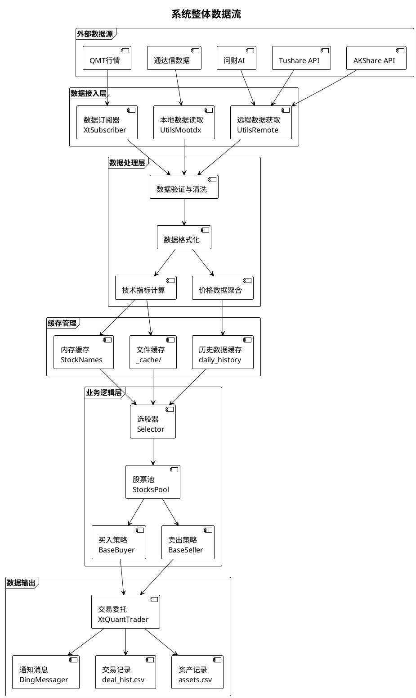
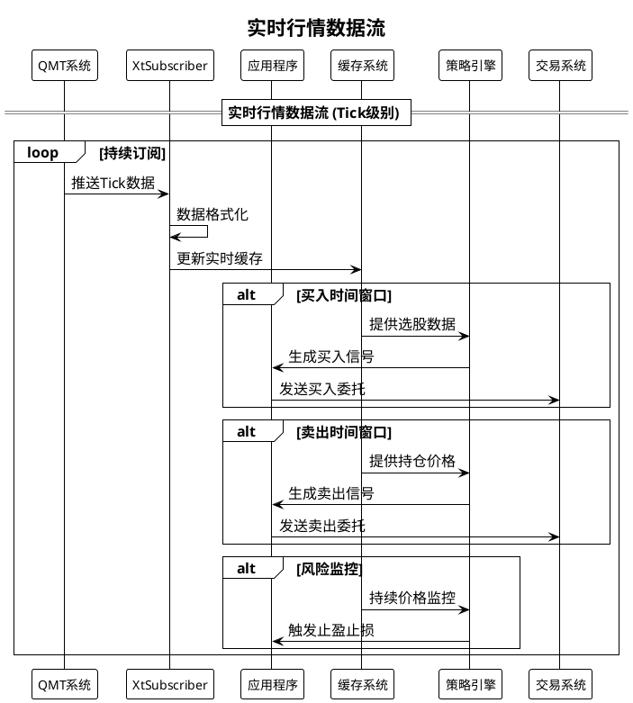
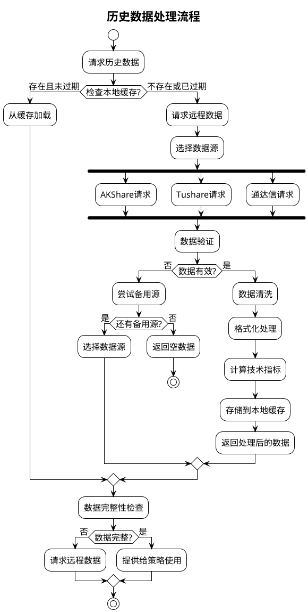
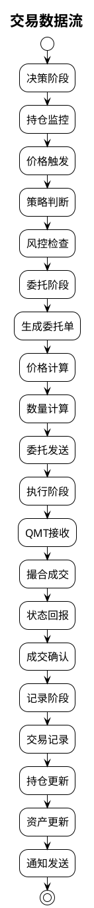
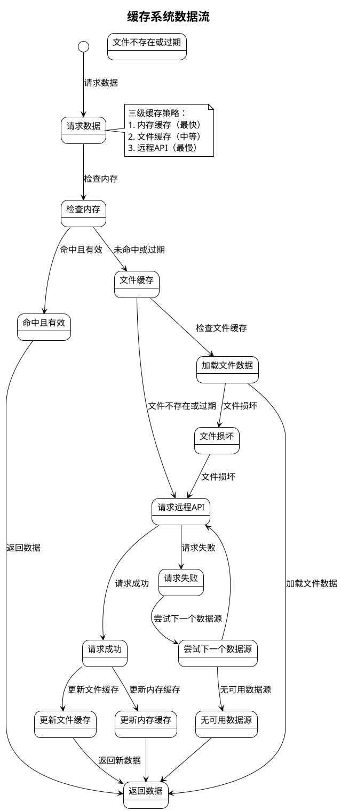
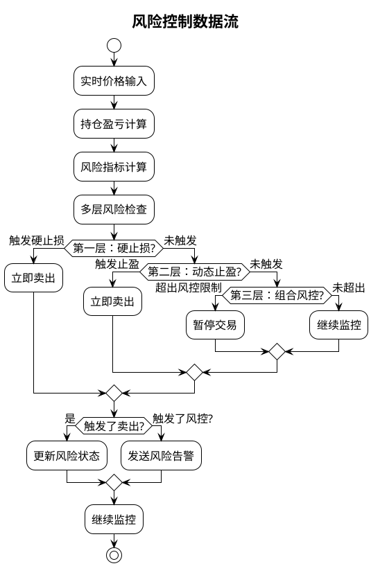
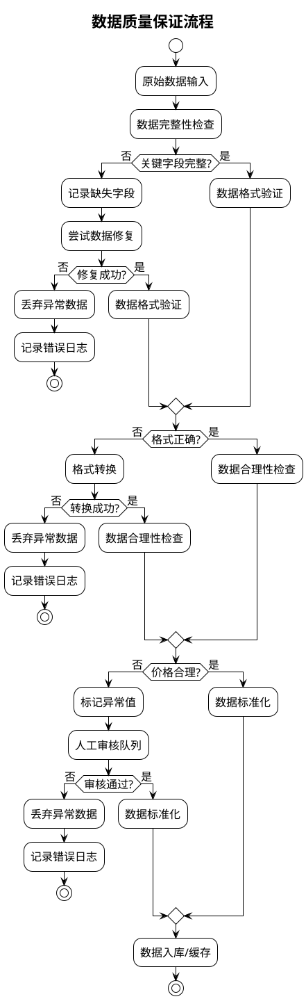

# SilverQuant 数据流图

## 1. 系统整体数据流

```plantuml
@startuml
!theme plain
skinparam defaultFontName "Microsoft YaHei"
skinparam defaultFontSize 16
skinparam classFontSize 14
skinparam classAttributeFontSize 13
skinparam sequenceMessageFontSize 14
skinparam sequenceParticipantFontSize 14
skinparam monochrome false
skinparam shadowing false

title 系统整体数据流

frame "外部数据源" {
  [AKShare API] as A1
  [Tushare API] as A2
  [通达信数据] as A3
  [问财AI] as A4
  [QMT行情] as A5
}

frame "数据接入层" {
  [数据订阅器\nXtSubscriber] as B1
  [远程数据获取\nUtilsRemote] as B2
  [本地数据读取\nUtilsMootdx] as B3
}

frame "数据处理层" {
  [数据验证与清洗] as C1
  [数据格式化] as C2
  [技术指标计算] as C3
  [价格数据聚合] as C4
}

frame "缓存管理" {
  [内存缓存\nStockNames] as D1
  [文件缓存\n_cache/] as D2
  [历史数据缓存\ndaily_history] as D3
}

frame "业务逻辑层" {
  [选股器\nSelector] as E1
  [股票池\nStocksPool] as E2
  [买入策略\nBaseBuyer] as E3
  [卖出策略\nBaseSeller] as E4
}

frame "数据输出" {
  [交易委托\nXtQuantTrader] as F1
  [通知消息\nDingMessager] as F2
  [交易记录\ndeal_hist.csv] as F3
  [资产记录\nassets.csv] as F4
}

A1 --> B2
A2 --> B2
A3 --> B3
A4 --> B2
A5 --> B1

B1 --> C1
B2 --> C1
B3 --> C1

C1 --> C2
C2 --> C3
C2 --> C4

C3 --> D1
C3 --> D2
C4 --> D3

D1 --> E1
D2 --> E1
D3 --> E1

E1 --> E2
E2 --> E3
E2 --> E4

E3 --> F1
E4 --> F1
F1 --> F2
F1 --> F3
F1 --> F4

@enduml
```

## 2. 实时行情数据流

```plantuml
@startuml
!theme plain
skinparam defaultFontName "Microsoft YaHei"
skinparam defaultFontSize 16
skinparam classFontSize 14
skinparam classAttributeFontSize 13
skinparam sequenceMessageFontSize 14
skinparam sequenceParticipantFontSize 14
skinparam monochrome false
skinparam shadowing false

title 实时行情数据流

participant "QMT系统" as QMT
participant "XtSubscriber" as XT
participant "应用程序" as APP
participant "缓存系统" as CACHE
participant "策略引擎" as STRAT
participant "交易系统" as TRADE

== 实时行情数据流 (Tick级别) ==

loop 持续订阅
  QMT -> XT: 推送Tick数据
  XT -> XT: 数据格式化
  XT -> CACHE: 更新实时缓存

  alt 买入时间窗口
    CACHE -> STRAT: 提供选股数据
    STRAT -> APP: 生成买入信号
    APP -> TRADE: 发送买入委托
  end

  alt 卖出时间窗口
    CACHE -> STRAT: 提供持仓价格
    STRAT -> APP: 生成卖出信号
    APP -> TRADE: 发送卖出委托
  end

  alt 风险监控
    CACHE -> STRAT: 持续价格监控
    STRAT -> APP: 触发止盈止损
  end
end

@enduml
```

## 3. 历史数据处理流程

```plantuml
@startuml
!theme plain
skinparam defaultFontName "Microsoft YaHei"
skinparam defaultFontSize 16
skinparam classFontSize 14
skinparam classAttributeFontSize 13
skinparam sequenceMessageFontSize 14
skinparam sequenceParticipantFontSize 14
skinparam monochrome false
skinparam shadowing false

title 历史数据处理流程

start

:请求历史数据;

if (检查本地缓存?) then (存在且未过期)
  :从缓存加载;
else (不存在或已过期)
  :请求远程数据;

  :选择数据源;

  fork
    :AKShare请求;
  fork again
    :Tushare请求;
  fork again
    :通达信请求;
  end fork

  :数据验证;

  if (数据有效?) then (否)
    :尝试备用源;

    if (还有备用源?) then (是)
      :选择数据源;
    else (否)
      :返回空数据;
      stop
    endif
  else (是)
    :数据清洗;

    :格式化处理;

    :计算技术指标;

    :存储到本地缓存;

    :返回处理后的数据;
  endif
endif

:数据完整性检查;

if (数据完整?) then (否)
  :请求远程数据;
else (是)
  :提供给策略使用;
endif

stop

@enduml
```

## 4. 交易数据流

```plantuml
@startuml
!theme plain
skinparam defaultFontName "Microsoft YaHei"
skinparam defaultFontSize 16
skinparam classFontSize 14
skinparam classAttributeFontSize 13
skinparam sequenceMessageFontSize 14
skinparam sequenceParticipantFontSize 14
skinparam monochrome false
skinparam shadowing false

title 交易数据流

start

:决策阶段;

:持仓监控;

:价格触发;

:策略判断;

:风控检查;

:委托阶段;

:生成委托单;

:价格计算;

:数量计算;

:委托发送;

:执行阶段;

:QMT接收;

:撮合成交;

:状态回报;

:成交确认;

:记录阶段;

:交易记录;

:持仓更新;

:资产更新;

:通知发送;

stop

@enduml
```

## 5. 缓存系统数据流

```plantuml
@startuml
!theme plain
skinparam defaultFontName "Microsoft YaHei"
skinparam defaultFontSize 16
skinparam classFontSize 14
skinparam classAttributeFontSize 13
skinparam sequenceMessageFontSize 14
skinparam sequenceParticipantFontSize 14
skinparam monochrome false
skinparam shadowing false

title 缓存系统数据流

state "请求数据" as CheckCache
state "检查内存" as MemoryCache
state "命中且有效" as Valid
state "文件缓存" as FileCache
state "文件不存在或过期" as FileCache2
state "请求远程API" as RemoteAPI
state "请求成功" as Success
state "请求失败" as Fallback
state "更新文件缓存" as UpdateFile
state "更新内存缓存" as UpdateMemory
state "加载文件数据" as LoadFile
state "文件损坏" as FileDamage
state "尝试下一个数据源" as NextSource
state "无可用数据源" as NoData
state "返回数据" as ReturnData

[*] --> CheckCache: 请求数据
CheckCache --> MemoryCache: 检查内存
MemoryCache --> Valid: 命中且有效
MemoryCache --> FileCache: 未命中或过期

Valid --> ReturnData: 返回数据

FileCache --> LoadFile: 检查文件缓存
FileCache --> RemoteAPI: 文件不存在或过期

LoadFile --> ReturnData: 加载文件数据
LoadFile --> FileDamage: 文件损坏

FileDamage --> RemoteAPI: 文件损坏

RemoteAPI --> Success: 请求成功
RemoteAPI --> Fallback: 请求失败

Success --> UpdateFile: 更新文件缓存
Success --> UpdateMemory: 更新内存缓存
UpdateFile --> ReturnData: 返回新数据
UpdateMemory --> ReturnData

Fallback --> NextSource: 尝试下一个数据源
NextSource --> RemoteAPI
NextSource --> NoData: 无可用数据源

NoData --> ReturnData

note right of CheckCache
  三级缓存策略：
  1. 内存缓存（最快）
  2. 文件缓存（中等）
  3. 远程API（最慢）
end note

@enduml
```

## 6. 风险控制数据流

```plantuml
@startuml
!theme plain
skinparam defaultFontName "Microsoft YaHei"
skinparam defaultFontSize 16
skinparam classFontSize 14
skinparam classAttributeFontSize 13
skinparam sequenceMessageFontSize 14
skinparam sequenceParticipantFontSize 14
skinparam monochrome false
skinparam shadowing false

title 风险控制数据流

start

:实时价格输入;

:持仓盈亏计算;

:风险指标计算;

:多层风险检查;

if (第一层：硬止损?) then (触发硬止损)
  :立即卖出;
else (未触发)
  if (第二层：动态止盈?) then (触发止盈)
    :立即卖出;
  else (未触发)
    if (第三层：组合风控?) then (超出风控限制)
      :暂停交易;
    else (未超出)
      :继续监控;
    endif
  endif
endif

if (触发了卖出?) then (是)
  :更新风险状态;
else (触发了风控?)
  :发送风险告警;
endif

:继续监控;

stop

@enduml
```

## 7. 数据质量保证流程

```plantuml
@startuml
!theme plain
skinparam defaultFontName "Microsoft YaHei"
skinparam defaultFontSize 16
skinparam classFontSize 14
skinparam classAttributeFontSize 13
skinparam sequenceMessageFontSize 14
skinparam sequenceParticipantFontSize 14
skinparam monochrome false
skinparam shadowing false

title 数据质量保证流程

start

:原始数据输入;

:数据完整性检查;

if (关键字段完整?) then (否)
  :记录缺失字段;
  :尝试数据修复;

  if (修复成功?) then (否)
    :丢弃异常数据;
    :记录错误日志;
    stop
  else (是)
    :数据格式验证;
  endif
else (是)
  :数据格式验证;
endif

if (格式正确?) then (否)
  :格式转换;

  if (转换成功?) then (否)
    :丢弃异常数据;
    :记录错误日志;
    stop
  else (是)
    :数据合理性检查;
  endif
else (是)
  :数据合理性检查;
endif

if (价格合理?) then (否)
  :标记异常值;
  :人工审核队列;

  if (审核通过?) then (否)
    :丢弃异常数据;
    :记录错误日志;
    stop
  else (是)
    :数据标准化;
  endif
else (是)
  :数据标准化;
endif

:数据入库/缓存;

stop

@enduml
```