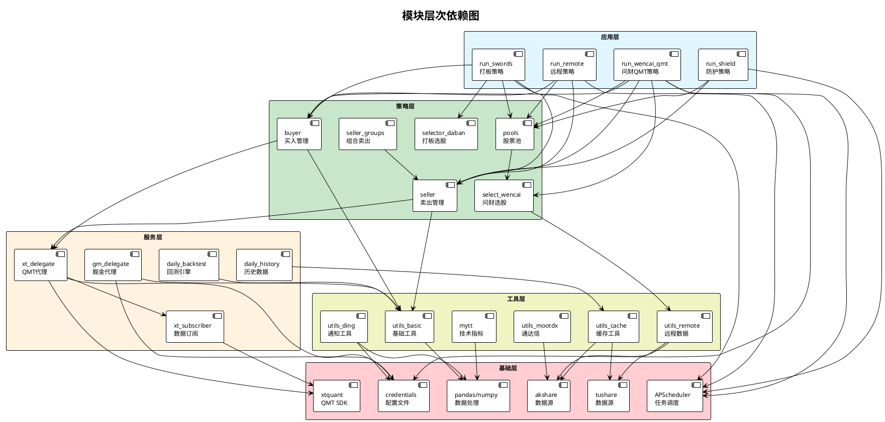
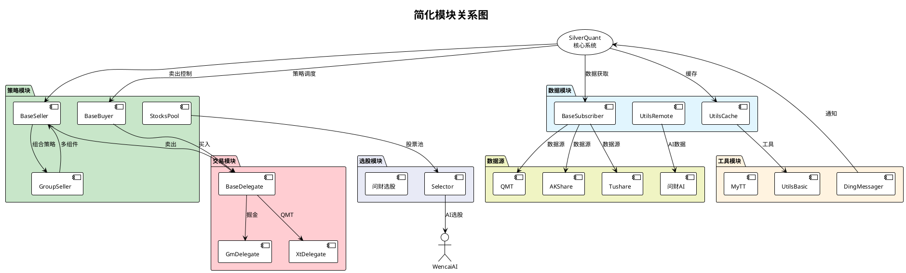
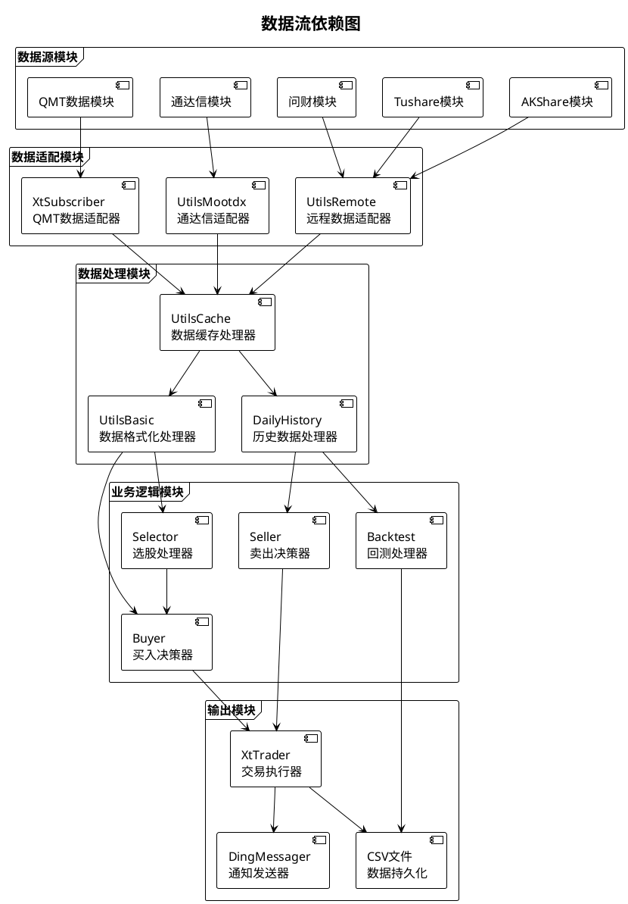
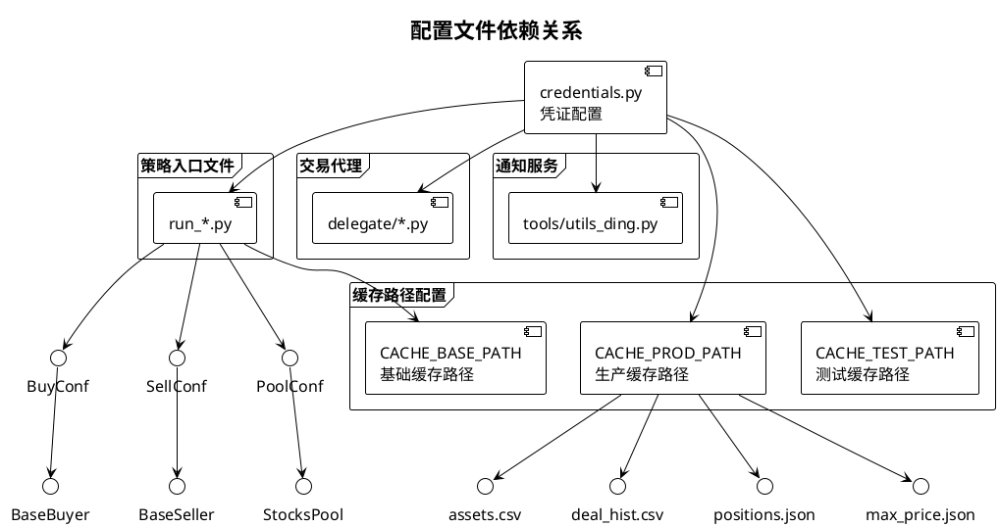
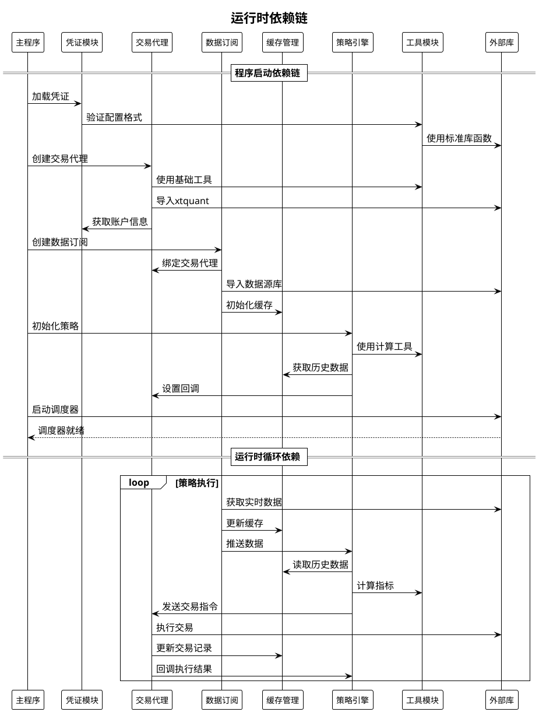

# SilverQuant 模块依赖关系图

## 1. 模块层次依赖图（优化版）

```plantuml
@startuml
!theme plain
skinparam defaultFontName "Microsoft YaHei"
skinparam defaultFontSize 12
skinparam classFontSize 11
skinparam packageStyle rectangle

title 模块层次依赖图

' 应用层 - 策略入口
package "应用层" #E1F5FE {
  [run_wencai_qmt\n问财QMT策略] as A1
  [run_swords\n打板策略] as A2
  [run_shield\n防护策略] as A3
  [run_remote\n远程策略] as A4
}

' 策略层 - 业务逻辑
package "策略层" #C8E6C9 {
  [buyer\n买入管理] as B1
  [seller\n卖出管理] as B2
  [seller_groups\n组合卖出] as B3
  [pools\n股票池] as B4
  [select_wencai\n问财选股] as B5
  [selector_daban\n打板选股] as B6
}

' 服务层 - 核心服务
package "服务层" #FFF3E0 {
  [xt_delegate\nQMT代理] as C1
  [gm_delegate\n掘金代理] as C2
  [xt_subscriber\n数据订阅] as C3
  [daily_backtest\n回测引擎] as C4
  [daily_history\n历史数据] as C5
}

' 工具层 - 通用工具
package "工具层" #F0F4C3 {
  [utils_basic\n基础工具] as D1
  [utils_cache\n缓存工具] as D2
  [utils_remote\n远程数据] as D3
  [utils_ding\n通知工具] as D4
  [utils_mootdx\n通达信] as D5
  [mytt\n技术指标] as D6
}

' 基础层 - 外部依赖
package "基础层" #FFCDD2 {
  [credentials\n配置文件] as E1
  [xtquant\nQMT SDK] as E2
  [akshare\n数据源] as E3
  [tushare\n数据源] as E4
  [pandas/numpy\n数据处理] as E5
  [APScheduler\n任务调度] as E6
}

' 主要依赖关系
A1 --> B1
A1 --> B2
A1 --> B4
A1 --> B5

A2 --> B1
A2 --> B2
A2 --> B4
A2 --> B6

A3 --> B2
A3 --> B4

A4 --> B1
A4 --> B2
A4 --> B4

B1 --> C1
B1 --> D1
B2 --> C1
B2 --> D1
B3 --> B2
B4 --> B5
B5 --> D3

C1 --> C3
C1 --> E2
C2 --> D1
C3 --> E2
C4 --> D1
C5 --> D2

D1 --> E5
D2 --> E3
D2 --> E4
D3 --> E3
D3 --> E4
D4 --> E5
D5 --> E3
D6 --> E5

A1 --> E1
C1 --> E1
C2 --> E1
D4 --> E1

A1 --> E6
A2 --> E6
A3 --> E6
A4 --> E6

@enduml
```

## 2. 简化模块关系图

```plantuml
@startuml
!theme plain
skinparam defaultFontName "Microsoft YaHei"
skinparam defaultFontSize 12
skinparam classFontSize 11

title 简化模块关系图

' 中心 - 核心系统
(SilverQuant\n核心系统) as Core

' 主要模块分组
package "交易模块" #FFCDD2 {
  [BaseDelegate] as Delegate
  [XtDelegate] as XTDelegate
  [GmDelegate] as GMDelegate
}

package "策略模块" #C8E6C9 {
  [BaseBuyer] as Buyer
  [BaseSeller] as Seller
  [GroupSeller] as GroupSeller
  [StocksPool] as Pool
}

package "数据模块" #E1F5FE {
  [BaseSubscriber] as Subscriber
  [UtilsCache] as Cache
  [UtilsRemote] as Remote
}

package "工具模块" #FFF3E0 {
  [UtilsBasic] as Basic
  [DingMessager] as Ding
  [MyTT] as MyTT
}

package "数据源" #F0F4C3 {
  [AKShare] as AK
  [Tushare] as TS
  [QMT] as QMT
  [问财AI] as WC
}

package "选股模块" #E8EAF6 {
  [Selector] as Sel
  [问财选股] as WencaiSel
}

' 主要关系
Core --> Buyer : 策略调度
Core --> Seller : 卖出控制
Core --> Subscriber : 数据获取

Buyer --> Delegate : 买入
Seller --> GroupSeller : 组合策略
Seller --> Delegate : 卖出

GroupSeller --> Seller : 多组件
Pool --> Sel : 股票池

Subscriber --> AK : 数据源
Subscriber --> TS : 数据源
Subscriber --> QMT : 数据源

Remote --> WC : AI数据
Sel --> WencaiAI : AI选股

Delegate --> XTDelegate : QMT
Delegate --> GMDelegate : 掘金

Core --> Cache : 缓存
Cache --> Basic : 工具

Ding --> Core : 通知

@enduml
```

## 3. 数据流依赖图

```plantuml
@startuml
!theme plain
skinparam defaultFontName "Microsoft YaHei"
skinparam defaultFontSize 16
skinparam classFontSize 14
skinparam classAttributeFontSize 13
skinparam sequenceMessageFontSize 14
skinparam sequenceParticipantFontSize 14
skinparam monochrome false
skinparam shadowing false

title 数据流依赖图

frame "数据源模块" {
  [AKShare模块] as A1
  [Tushare模块] as A2
  [通达信模块] as A3
  [问财模块] as A4
  [QMT数据模块] as A5
}

frame "数据适配模块" {
  [UtilsRemote\n远程数据适配器] as B1
  [UtilsMootdx\n通达信适配器] as B2
  [XtSubscriber\nQMT数据适配器] as B3
}

frame "数据处理模块" {
  [UtilsCache\n数据缓存处理器] as C1
  [UtilsBasic\n数据格式化处理器] as C2
  [DailyHistory\n历史数据处理器] as C3
}

frame "业务逻辑模块" {
  [Selector\n选股处理器] as D1
  [Buyer\n买入决策器] as D2
  [Seller\n卖出决策器] as D3
  [Backtest\n回测处理器] as D4
}

frame "输出模块" {
  [XtTrader\n交易执行器] as E1
  [DingMessager\n通知发送器] as E2
  [CSV文件\n数据持久化] as E3
}

A1 --> B1
A2 --> B1
A4 --> B1
A3 --> B2
A5 --> B3

B1 --> C1
B2 --> C1
B3 --> C1

C1 --> C2
C1 --> C3
C2 --> D1
C2 --> D2
C3 --> D3
C3 --> D4

D1 --> D2
D2 --> E1
D3 --> E1
D4 --> E3

E1 --> E2
E1 --> E3

@enduml
```

## 4. 配置文件依赖关系

```plantuml
@startuml
!theme plain
skinparam defaultFontName "Microsoft YaHei"
skinparam defaultFontSize 16
skinparam classFontSize 14
skinparam classAttributeFontSize 13
skinparam sequenceMessageFontSize 14
skinparam sequenceParticipantFontSize 14
skinparam monochrome false
skinparam shadowing false

title 配置文件依赖关系

[credentials.py\n凭证配置] as A

frame "策略入口文件" {
  [run_*.py] as B
}

frame "交易代理" {
  [delegate/*.py] as C
}

frame "通知服务" {
  [tools/utils_ding.py] as D
}

A --> B
A --> C
A --> D

B --> BuyConf
B --> SellConf
B --> PoolConf

BuyConf --> BaseBuyer
SellConf --> BaseSeller
PoolConf --> StocksPool

frame "缓存路径配置" {
  [CACHE_PROD_PATH\n生产缓存路径] as K
  [CACHE_TEST_PATH\n测试缓存路径] as L
  [CACHE_BASE_PATH\n基础缓存路径] as M
}

A --> K
A --> L
B --> M

K --> assets.csv
K --> deal_hist.csv
K --> positions.json
K --> max_price.json

@enduml
```

## 5. 外部依赖关系图

```plantuml
@startuml
!theme plain
skinparam defaultFontName "Microsoft YaHei"
skinparam defaultFontSize 16
skinparam classFontSize 14
skinparam classAttributeFontSize 13
skinparam sequenceMessageFontSize 14
skinparam sequenceParticipantFontSize 14
skinparam monochrome false
skinparam shadowing false

title 外部依赖关系图

frame "Python标准库" {
  [threading] as A1
  [datetime] as A2
  [logging] as A3
  [csv] as A4
  [json] as A5
  [os] as A6
  [time] as A7
}

frame "第三方数据库" {
  [numpy==2.2.4] as B1
  [pandas==2.2.3] as B2
  [requests>=2.31.0] as B3
}

frame "任务调度" {
  [APScheduler>=3.11.0] as C1
  [schedule>=1.2.1] as C2
}

frame "数据源库" {
  [akshare>=1.16.0] as D1
  [tushare>=1.4.21] as D2
  [mootdx>=0.11.7] as D3
  [pywencai>=0.12.3] as D4
}

frame "交易库" {
  [xtquant>=250516.1.1] as E1
  [pycurl>=7.45.0] as E2
}

frame "SilverQuant模块" {
  [tools/utils_basic.py] as F1
  [delegate/xt_delegate.py] as F2
  [trader/buyer.py] as F3
  [selector/select_wencai.py] as F4
  [run_wencai_qmt.py] as F5
}

' 依赖关系
F1 --> A1
F1 --> A2
F1 --> A3
F1 --> A4
F1 --> A5

F1 --> B1
F1 --> B2
F1 --> B3

F5 --> C1
F5 --> C2

F4 --> D1
F1 --> D2
F1 --> D3
F4 --> D4

F2 --> E1
F1 --> E2

F2 --> B1
F2 --> B2
F2 --> A1
F2 --> A2

F3 --> B1
F3 --> B2
F3 --> A1

@enduml
```

## 6. 运行时依赖链

```plantuml
@startuml
!theme plain
skinparam defaultFontName "Microsoft YaHei"
skinparam defaultFontSize 16
skinparam classFontSize 14
skinparam classAttributeFontSize 13
skinparam sequenceMessageFontSize 14
skinparam sequenceParticipantFontSize 14
skinparam monochrome false
skinparam shadowing false

title 运行时依赖链

participant "主程序" as Main
participant "凭证模块" as Cred
participant "交易代理" as Del
participant "数据订阅" as Sub
participant "缓存管理" as Cache
participant "策略引擎" as Strat
participant "工具模块" as Tools
participant "外部库" as Ext

== 程序启动依赖链 ==

Main -> Cred: 加载凭证
Cred -> Tools: 验证配置格式
Tools -> Ext: 使用标准库函数

Main -> Del: 创建交易代理
Del -> Tools: 使用基础工具
Del -> Ext: 导入xtquant
Del -> Cred: 获取账户信息

Main -> Sub: 创建数据订阅
Sub -> Del: 绑定交易代理
Sub -> Ext: 导入数据源库
Sub -> Cache: 初始化缓存

Main -> Strat: 初始化策略
Strat -> Tools: 使用计算工具
Strat -> Cache: 获取历史数据
Strat -> Del: 设置回调

Main -> Ext: 启动调度器
Ext --> Main: 调度器就绪

== 运行时循环依赖 ==

loop 策略执行
  Sub -> Ext: 获取实时数据
  Sub -> Cache: 更新缓存
  Sub -> Strat: 推送数据

  Strat -> Cache: 读取历史数据
  Strat -> Tools: 计算指标
  Strat -> Del: 发送交易指令

  Del -> Ext: 执行交易
  Del -> Cache: 更新交易记录
  Del -> Strat: 回调执行结果
end

@enduml
```