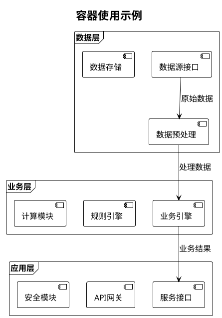
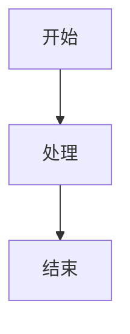

# UML图表类型映射表

## 概述

本文件定义了量化交易系统各阶段需求文档的UML图表类型要求，是项目**唯一的图表类型标准数据源**。

**重要**: 所有其他文档应通过引用本文件获取图表类型要求，遵循DRY原则。

## 图表类型映射表

| 需求阶段 | 核心必需图表 | 重要推荐图表 | 按需使用图表 |
|---------|-------------|--------------|-------------|
| 规划阶段 | 系统架构图 | 用例图、组件图 | 包图 |
| 数据阶段 | 数据流程图 | 类图、时序图 | 协作图 |
| 策略阶段 | 策略逻辑图 | 活动图、状态图 | 用例图 |
| 执行阶段 | 执行流程图 | 序列图、活动图 | 协作图 |
| 风控阶段 | 风控逻辑图 | 状态图、序列图 | 活动图 |
| 运维阶段 | 部署图 | 组件图、状态图 | 包图 |
| 治理阶段 | 合规流程图 | 组织结构图、用例图 | 活动图 |

## 图表重要性说明

### 核心必需图表 (必须创建)

每个阶段至少包含1个核心必需图表，这些图表是系统设计的基石:

1. **系统架构图**: 描述系统组件关系、数据流向，是系统设计的基石
2. **数据流程图**: 描述数据流转过程，确保数据处理逻辑清晰
3. **策略逻辑图**: 展示策略决策流程，是量化交易的核心
4. **执行流程图**: 描述交易执行过程，确保交易指令正确传递
5. **风控逻辑图**: 展示风险控制流程，保障系统安全运行
6. **部署图**: 描述系统部署架构，指导运维部署
7. **合规流程图**: 展示合规检查流程，满足监管要求

### 重要推荐图表 (强烈建议使用)

根据需求复杂度选择使用，这些图表能显著提升需求文档质量:

- **用例图**: 定义系统功能边界和用户角色，明确需求范围，避免范围蔓延
- **类图**: 展示数据结构关系，指导代码设计，确保数据模型一致性
- **活动图**: 描述业务流程和并行处理，适合复杂业务逻辑，明确执行路径
- **序列图**: 展示对象间交互时序，适合API调用和消息传递，确保时序正确
- **状态图**: 描述状态转换逻辑，适合风控状态管理，明确状态边界
- **组件图**: 展示系统组件依赖关系，指导模块划分，降低耦合度
- **组织结构图**: 定义团队职责分工，明确协作关系，提高协作效率
- **时序图**: 详细的时间序列分析，适合高频交易场景，确保时间精度

### 按需使用图表 (特定场景使用)

仅在特定场景下使用，避免过度设计:

- **协作图**: 对象协作关系展示，适合复杂对象交互场景
- **包图**: 包依赖关系管理，适合大型项目模块化管理

## PlantUML标准配置

### 基础配置模板

所有UML图表必须使用以下标准配置:

```plantuml
@startuml
!theme plain
skinparam defaultFontName "Microsoft YaHei"
skinparam defaultFontSize 16
skinparam classFontSize 14
skinparam classAttributeFontSize 13
skinparam sequenceMessageFontSize 14
skinparam sequenceParticipantFontSize 14
skinparam monochrome false
skinparam shadowing false

' 在此处添加UML图表代码

@enduml
```

### 配置说明

- **主题**: 使用 `!theme plain` 保持简洁
- **中文字体**: 设置为 "Microsoft YaHei" 确保中文显示清晰
- **字体大小**:
  - 主字体 16px (defaultFontSize)
  - 类图字体 14px (classFontSize)
  - 属性字体 13px (classAttributeFontSize)
  - 序列图消息字体 14px (sequenceMessageFontSize)
- **单色模式**: 设置为 `false` 允许使用颜色
- **阴影效果**: 设置为 `false` 保持清爽

## 容器使用规范

### 重要规范: 使用frame容器替代package容器

**原因**:
- frame容器带有标题栏，视觉上更突出
- 适合复杂架构图的层次展示
- 与PlantUML官方推荐保持一致

### 推荐示例



### 避免使用示例

```plantuml
' ❌ 不推荐使用package容器
package "数据层" {
  [组件A]
  [组件B]
}
```

## 质量等级标准

### 质量评分体系

- **A级 (90-100分)**: 优秀 - 图表完整准确，技术规范完全符合
- **B级 (80-89分)**: 良好 - 图表基本完整，技术规范基本符合
- **C级 (70-79分)**: 合格 - 图表存在部分问题，技术规范有偏差
- **D级 (<70分)**: 不合格 - 图表不完整或存在严重错误

### 评分公式

```
总质量分 = 完整性得分 × 0.4 + 准确性得分 × 0.4 + 规范性得分 × 0.2
```

### 关键检查项

#### 必须通过的关键项
- [ ] 图表标题清晰明确
- [ ] 组件命名规范一致
- [ ] 关系描述准确完整
- [ ] PlantUML语法正确
- [ ] 中文显示正常
- [ ] **使用frame容器而非package容器**

#### 建议改进的重要项
- [ ] 布局美观合理
- [ ] 颜色主题统一
- [ ] 符号使用规范
- [ ] 导出质量良好
- [ ] 文档说明完整

## 使用指南

### 如何选择图表类型

1. **确定需求阶段**: 识别当前需求属于哪个阶段(规划/数据/策略/执行/风控/运维/治理)
2. **创建核心必需图表**: 根据映射表创建对应阶段的核心必需图表
3. **评估复杂度**: 根据需求复杂度判断是否需要重要推荐图表
4. **特殊场景**: 仅在特定场景下使用按需图表

### 引用本文件的方法

#### 在Obsidian文档中
```markdown
> **图表类型要求**: 详见 [[UML图表类型映射表]]
> **容器使用规范**: 详见 [[UML图表类型映射表#容器使用规范]]
```

#### 在Markdown文档中
```markdown
> **图表类型要求**: 参见 [UML图表类型映射表](../1-量化模板体系/20-UML模板/UML图表类型映射表.md)
> **容器使用规范**: 参见 [UML图表类型映射表#容器使用规范](../1-量化模板体系/20-UML模板/UML图表类型映射表.md#容器使用规范)
```

## 常见问题与解决方案

### 1. 格式兼容性问题

#### 问题描述
- **现象**: 使用Mermaid语法编写的图表在预览模式无法显示
- **原因**: 项目要求使用PlantUML格式，而非Mermaid格式
- **解决方案**: 必须使用PlantUML语法，遵循标准配置模板

#### 正确示例
```plantuml
@startuml
!theme plain
skinparam defaultFontName "Microsoft YaHei"
skinparam defaultFontSize 16

' PlantUML图表内容

@enduml
```

#### 错误示例


### 2. 文本溢出问题

#### 问题描述
- **现象**: 模块名称或组件文本超出容器边框
- **原因**: 字体设置过大，容器宽度过窄
- **解决方案**:
  1. 减小字体大小（16px → 12px）
  2. 使用换行符分隔长文本
  3. 使用缩写或简称

#### 优化示例
```plantuml
' 优化前（文本溢出）
skinparam defaultFontSize 16
[long_module_name_that_overflows]

' 优化后（文本适配）
skinparam defaultFontSize 12
[模块名称\\n简短描述]
```

### 3. 布局混乱问题

#### 问题描述
- **现象**:
  - 连接线交叉重叠
  - 组件排列不整齐
  - 整体布局混乱
- **原因**:
  - 缺乏合理的层次结构
  - 组件位置未优化
  - 缺少适当的分组

#### 解决方案
1. **使用frame容器进行分组**
2. **合理安排组件位置**
3. **避免连接线交叉**
4. **保持适当的间距**

#### 布局优化示例
```plantuml
' 使用frame容器清晰分组
frame "数据层" #E1F5FE {
  [数据源接口]
  [数据存储]
}

frame "业务层" #C8E6C9 {
  [业务引擎]
  [规则引擎]
}

' 合理的连接关系，避免交叉
[数据源接口] --> [业务引擎] : 数据流向
```

### 4. 字体显示问题

#### 问题描述
- **现象**: 中文字符显示为方块或乱码
- **原因**: 字体设置不正确
- **解决方案**:
  - 使用 `"Microsoft YaHei"` 字体
  - 确保系统安装了该字体

#### 字体配置示例
```plantuml
skinparam defaultFontName "Microsoft YaHei"
skinparam defaultFontSize 16
skinparam classFontSize 14
skinparam classAttributeFontSize 13
```

### 5. 图表渲染失败

#### 问题描述
- **现象**: 图表无法正常渲染，显示语法错误
- **原因**:
  - PlantUML语法错误
  - 特殊字符未转义
  - 缺少必要的配置

#### 解决方案
1. **检查语法正确性**
2. **使用标准配置模板**
3. **避免使用特殊字符**
4. **添加必要的注释说明**

### 6. 最佳实践总结

#### 开发流程
1. **先确定图表类型**: 根据映射表选择合适的图表类型
2. **使用标准模板**: 复制标准配置，避免语法错误
3. **逐步添加内容**: 先简单框架，再逐步完善
4. **及时预览检查**: 边写边看，及时调整

#### 优化技巧
1. **字体大小设置**:
   - 复杂图表: 12px
   - 简单图表: 14px
   - 演示图表: 16px

2. **容器使用技巧**:
   - 优先使用frame而非package
   - 合理设置背景色区分层次
   - 保持容器内部整洁

3. **连接线优化**:
   - 避免长距离连接
   - 使用注释说明连接含义
   - 合理使用箭头样式

## 维护说明

### 版本控制

- **当前版本**: v1.1
- **创建时间**: 2025-10-21
- **最后更新**: 2025-12-09
- **维护人**: Claude
- **状态**: 标准文件(单一数据源)
- **更新内容**: 新增常见问题与解决方案章节

### 修改流程

1. **提出修改**: 在需求管理会议中提出修改建议
2. **评审修改**: 由架构师评审修改的合理性
3. **更新文件**: 更新本映射表文件
4. **同步通知**: 通知所有相关人员映射表已更新
5. **更新版本号**: 更新版本号和修改记录

### 变更记录

| 版本 | 日期 | 修改内容 | 修改人 |
|------|------|---------|--------|
| v1.1 | 2025-12-09 | 新增常见问题与解决方案章节，包含格式兼容性、文本溢出、布局混乱等实际问题的解决方法 | Claude |
| v1.0 | 2025-10-21 | 初始创建,定义7个阶段的图表类型映射 | Claude |

---

**重要提醒**:
- 本文件是项目**唯一的图表类型标准数据源**
- 所有其他文档应通过引用本文件获取图表类型要求
- 任何图表类型相关的修改都应该只在本文件中进行
- 遵循DRY(Don't Repeat Yourself)原则，避免在多处维护相同信息
