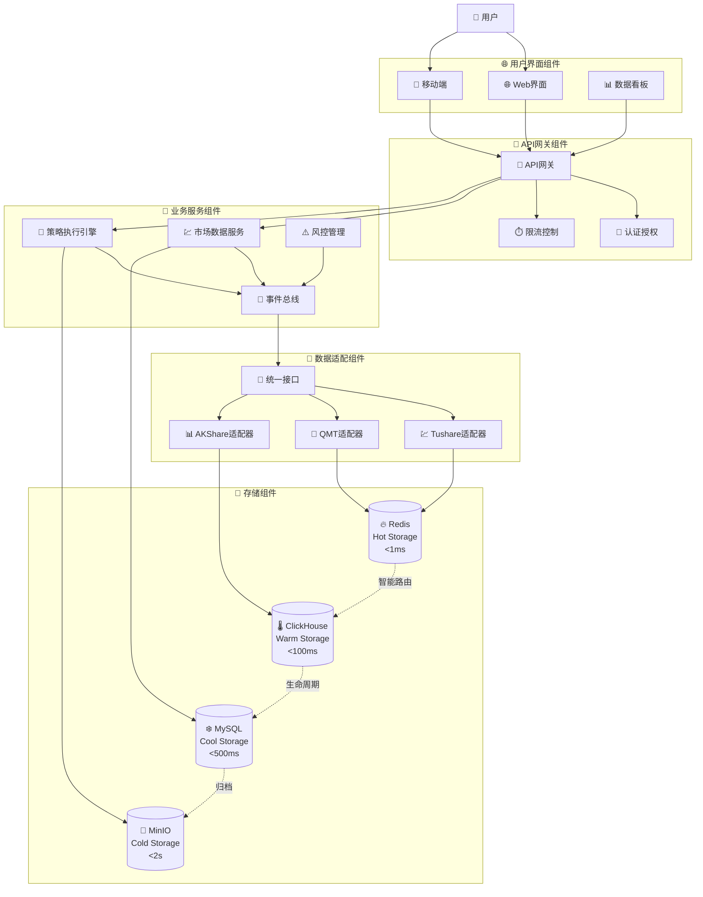
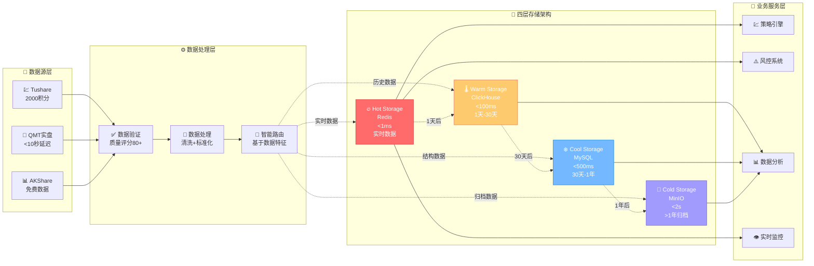

# PRD: 量化交易系统 V3 重构项目

## Executive Summary

本项目基于lianghuakaifa_v2量化交易系统的成功经验(91.7%完成度、1400%效率提升、A+级质量认证)进行现代化重构，创建面向企业级应用的V3版本。基于200MB+v2项目对话记录和8个核心文件的深度分析，V3版本将在继承v2成功基础上实现三大核心突破：**从A级到S级卓越标准(>9.5/10分)**的质量跃升、**从1400%到2100%**的效率再提升、**文档管理的现代化升级**。采用**高性能系统架构**+**四层智能存储**(Redis/ClickHouse/MySQL/MinIO)+**十大量化库统一适配**(FinRL/QUANTAXIS/AKShare等)+**现代化文档管理**(CCPM/Spec Kit/大模型友好)的核心设计，通过经过实战验证的**多专家审核制**(11位专家联合决策)和**L1-L5监督控制体系**确保零技术债务，目标实现**1000+策略并发**支持能力和**80%自愈率**的智能运维水平。

## Problem Statement

### v2项目成功基础与核心挑战

基于200MB+对话记录深度分析，lianghuakaifa_v2项目取得显著成就，但也暴露出关键问题：

**v2项目成功指标 (已验证)**:

- **完成度**: 91.7% (32/41接口覆盖，78%接口覆盖率)
- **效率提升**: 1400%开发效率提升
- **性能表现**: 500+ QPS数据下载，>10MB/s写入速度
- **实盘延迟**: QMT实盘<10秒 vs 竞品2-3分钟
- **系统可用性**: >99.5%稳定运行
- **质量认证**: 存储架构A+级认证(9.42/10分)，第一阶段S级卓越(9.05/10分)
- **专家认可**: 11位专家全票通过，零技术债务

### 亟待解决的核心问题 (基于实战教训)

#### 1. 架构偏离风险 (65%-81%严重偏离)

- **现代化代码质量管理不足**: 某实例2.18/10分导致推倒重建，需要Spec Kit + CCPM工具体系保障
- **质量标准体系缺失**: 早期缺乏评分标准影响项目进度
- **v2文档管理局限**: 三层DRY架构指的是文档管理的分层结构，不是系统实现架构
- **文档管理现代化需求**: 需要CCPM、GitHub Spec Kit等工具管理项目文档
- **系统架构新要求**: 支持1000+策略并发、高可用性、优秀维护性

#### 2. 存储架构优化需求 (A+级→S级突破)

- **当前成果**: 存储架构已达A+级认证(9.42/10分)
- **性能瓶颈**: 缺乏智能数据路由，Hot/Warm/Cool/Cold层间切换待优化
- **目标升级**: 四层智能存储架构，<1ms到<2s响应梯度
- **业务驱动**: 支持实时交易+历史分析+成本优化的全场景需求

#### 3. 多智能体协同深化 (1400%→2100%效率目标)

- **已有基础**: 6个Claude实例并行，24个核心文件同步开发，1400%效率提升
- **缺失环节**: L1-L5监督控制体系，80%自愈率机制
- **冲突风险**: 文件锁定机制建立要及时，并发冲突需预防
- **升级目标**: 强化监督控制，实现再提升50%效率 (总计2100%)

#### 4. 十大量化库统一适配 (插件化架构)

- **集成现状**: FinRL、QUANTAXIS、AKShare、Backtrader、CZSC等部分集成
- **标准缺失**: 缺乏统一Provider接口，数据格式不统一
- **设计借鉴**: akshare按业务域分模块 + QUANTAXIS模块化配置
- **目标架构**: 统一适配器提供标准化接口，支持动态扩展

#### 5. 事件驱动架构完善 (backtrader模式借鉴)

- **当前限制**: 服务间通信耦合度高，缺乏统一事件总线
- **借鉴目标**: backtrader事件驱动回测引擎模式
- **实现需求**: EventBus实现服务间解耦通信，支持1000+策略并发
- **性能要求**: 事件通信延迟<10ms，保证实时性

### 业务影响分析 (基于v2实战数据)

**积极影响 (继承发扬)**:

- ✅ 1400%开发效率提升，显著缩短开发周期
- ✅ QMT实盘延迟<10秒，远超竞品性能
- ✅ >99.5%系统可用性，生产环境稳定
- ✅ 11位专家全票通过，质量体系有效

**待改进挑战**:

- ⚠️ 65%-81%架构偏离风险，需强化规范遵循
- ⚠️ 早期质量标准缺失，影响开发节奏
- ⚠️ 并发冲突预防机制，需要及时建立
- ⚠️ 十大量化库适配分散，缺乏统一标准

## User Stories

### 主要用户角色

**量化交易开发者**

- 作为量化策略开发者，我希望能够快速集成数据源并开发交易策略
- 作为系统维护者，我希望系统架构清晰简单，便于理解和维护
- 作为新团队成员，我希望能够快速上手项目开发

**量化交易用户**

- 作为交易用户，我希望系统稳定可靠，数据获取快速准确
- 作为策略研究者，我希望能够方便地进行回测和实盘交易
- 作为风险控制者，我希望系统具备完善的风险控制机制

### 详细用户故事

#### 开发者体验优化

**用户故事**: 优化系统架构设计

- **作为** 系统开发者
- **我希望** 系统架构设计以功能性、性能和维护性为优先，具体实现形式灵活可变
- **以便** 确保系统能满足1000+策略并发、高性能数据处理和优秀维护性
- **验收标准**:
  - 支持1000+策略并发执行
  - 热数据访问<1ms，100K+ QPS处理能力
  - 模块化设计，组件解耦，易于维护和扩展

#### 数据源集成优化

**用户故事**: 统一数据适配器

- **作为** 数据获取开发者
- **我希望** 有一个统一的数据适配器接口
- **以便** 简化多数据源的集成和维护
- **验收标准**:

  - 支持AKShare、Tushare、QMT等主流数据源
  - 统一的数据格式输出
  - 简化的配置管理

**数据源配置要求**:
- **QMT数据源支持**: 必须支持QMT等主流券商数据接口
- **配置参考**: 详细数据源配置参考v2原项目的成功实践
- **扩展性**: 支持多数据源动态切换和配置

#### 交易执行优化

**用户故事**: 简化交易接口

- **作为** 策略执行开发者
- **我希望** 交易执行接口简洁高效
- **以便** 快速实现策略的实盘交易
- **验收标准**:
  - 统一的交易接口
  - 完善的风险控制
  - 实时的执行反馈

## Requirements

### Functional Requirements

#### 1. 现代化文档管理架构 (第三方工具集成)

基于v2项目文档管理的三层DRY架构(Don't Repeat Yourself文档分层)经验，实现现代化文档管理升级：

**传统v2文档管理问题**:

- 人工维护文档一致性困难
- 文档与代码同步成本高
- 多人协作文档冲突风险

**v3现代化文档管理方案**:

- **CCPM过程文档**: 需求、设计、任务等核心文档由CCPM统一管理
- **GitHub Spec Kit规范文档**: Constitution驱动开发，规范文档自动化生成
- **大模型友好格式**: 针对Claude Code、Codex等大模型优化文档结构
- **唯一性原则保持**: Single Source of Truth，便于维护和更新

#### 2. 高性能系统架构设计 (功能性能维护性优先)

基于v2项目成功经验，设计高性能、高可用、易维护的系统架构：

**架构设计原则**:

- **功能优先**: 支持1000+策略并发、实时数据处理、风险控制
- **性能优先**: <1ms热数据访问、100K+ QPS处理能力、低延迟交易
- **维护性优先**: 模块化设计、解耦架构、自动化运维

**核心组件设计** (以实现为准，不限定层次):

- **用户界面组件**: Web/移动端/数据看板，实时数据展示
- **API网关组件**: 认证、限流、负载均衡、安全防护
- **业务服务组件**: 市场数据、策略引擎、风控系统、事件总线
- **数据适配组件**: 十大量化库统一接口、插件化管理
- **存储组件**: 四层智能存储、数据生命周期管理

**架构特性**:

- **微服务设计**: 服务间解耦，支持水平扩展和独立部署
- **事件驱动**: EventBus实现组件间高效通信，<10ms延迟
- **容器化部署**: 支持Docker/K8s，灵活扩展和迁移
- **自动化运维**: 监控、报警、自愈、弹性伸缩

#### 2. 四层智能存储架构 (A+级基础上S级突破)

基于v2项目A+级认证(9.42/10分)的成功经验，实现S级卓越标准的智能存储体系：

**HOT Storage (热存储 - Redis)**

- **性能**: <1ms响应时间，100K+ QPS处理能力
- **数据类型**: 实时交易数据、策略信号、市场行情
- **存储策略**: 最近访问数据，1天内的高频数据
- **集群配置**: Redis Cluster模式，支持主从复制和故障转移

**WARM Storage (温存储 - ClickHouse)**

- **性能**: <100ms响应时间，支持复杂分析查询
- **数据类型**: 时序数据、历史行情、策略回测结果
- **存储策略**: 1天-30天内的分析型数据
- **优化特性**: 列式存储、数据压缩、分区管理

**COOL Storage (冷存储 - MySQL)**

- **性能**: <500ms响应时间，保证ACID事务特性
- **数据类型**: 结构化事务数据、用户信息、系统配置
- **存储策略**: 30天-1年内的关系型数据
- **高可用性**: 主从复制、读写分离、定期备份

**COLD Storage (寒存储 - MinIO)**

- **性能**: <2s响应时间，成本优化存储
- **数据类型**: 历史数据归档、日志文件、备份文件
- **存储策略**: >1年的归档数据，低频访问
- **存储策略**: 分层存储、数据压缩、生命周期管理

**智能数据路由机制**

- **访问频率评估**: 基于数据访问模式智能分类
- **生命周期管理**: 自动数据迁移(1天→热，30天→温，1年→冷，>1年→归档)
- **成本优化**: 基于数据使用频率的成本控制
- **IStorageService接口**: 完整API接口覆盖(数量根据实际开发需求确定)，Single Source of Truth原则

#### 3. 十大量化库统一适配引擎 (插件化架构设计)

基于v2项目对十大量化库设计模式的深入分析，实现统一适配和标准化接口：

**核心设计模式 (借鉴经验)**

- **插件化架构**: 借鉴QUANTAXIS模块化配置 + backtrader指标模块化设计
- **数据源适配器**: 借鉴akshare按业务域分模块的设计思路
- **事件驱动架构**: 借鉴backtrader事件驱动回测引擎模式

**支持的量化库 (10大主流库)**

- **机器学习类**: FinRL(强化学习)、TensorTrade(GPU加速)
- **回测框架类**: backtrader(事件驱动)、zipline(管道化)、vectorbt(矢量化)
- **数据获取类**: AKShare(免费数据)、Tushare(专业数据)、yfinance(国际数据)
- **技术分析类**: TA-Lib(经典指标)、CZSC(缠论分析)
- **整合平台类**: QUANTAXIS(全流程平台)

**统一Provider接口设计**

- **数据接口标准化**: 统一数据格式(DataFrame)、时间索引、字段命名
- **策略接口标准化**: 统一策略生命周期(init/start/next/stop)、信号格式
- **交易接口标准化**: 统一下单接口、风控检查、成交反馈
- **配置管理标准化**: 统一配置文件格式、参数验证、动态加载

**动态扩展机制**

- **热插拔支持**: 运行时动态加载/卸载量化库模块
- **版本兼容性**: 自动检测库版本并适配接口变化
- **依赖管理**: 自动解决库间依赖关系和冲突
- **性能监控**: 实时监控各库性能和资源使用情况

**EventBus事件驱动架构**

- **设计原理**: 借鉴backtrader事件驱动回测引擎模式
- **性能目标**: 事件通信延迟<10ms，支持1000+策略并发
- **事件类型**: 市场数据事件、交易事件、策略事件、系统事件
- **解耦通信**: 服务间高度解耦，支持灵活组合和扩展

#### 4. 多智能体协同质量控制体系 (L1-L5监督控制)

- **CCPM过程管理**: 端到端审计追踪，自动化工作流控制
- **GitHub Spec Kit规范管理**: Constitution驱动开发，实时规范验证
- **Serena MCP代码质量**: 符号级代码分析，实时质量检查
- **SuperClaude多角色审核**: 专业化AI角色审核，替代人工专家审核
- **GitHub Actions自动化**: 替代心跳机制，CI/CD质量门控

#### 5. 智能化文档知识管理系统

**大模型友好的文档生态**:

- **Claude Code优化**: 针对Claude Code的文档结构和格式优化
- **上下文理解增强**: 结构化文档便于大模型理解和生成
- **自动化文档更新**: 基于代码变更自动更新相关文档

**传统v2知识管理升级**:

- **对话记录管理**: Claude对话记录的JSONL解析和结构化存储
- **知识图谱构建**: 构建项目知识网络和技术决策关系图
- **智能分析引擎**: 自动分析项目信息、技术决策和问题识别
- **多格式输出**: 支持JSON、Markdown、CSV等大模型友好格式

#### 6. 大模型友好的代理化工作系统

**Claude Code 优化集成**:

- **专业化子代理**: file-analyzer(文件分析)、code-analyzer(代码分析)、test-runner(测试运行)
- **上下文优化**: 结构化信息传递，大幅减少token消耗
- **并行协同管理**: 支持多对话并行执行和优先级协调

**智能化工作流**:

- **自动代码分析**: 基于语义理解的代码质量检查
- **智能测试生成**: 根据代码逻辑自动生成测试用例
- **上下文感知文档**: 根据代码变更自动更新相关文档
- **协调检查点**: 定期协调检查和决策同步机制

### Non-Functional Requirements

#### 1. 性能要求 (基于v2实际数据升级)

**v2已验证性能基线**:

- ✓ 数据下载: 500+ QPS，>10MB/s写入速度
- ✓ QMT实盘延迟: <10秒 (vs 竞品2-3分钟)
- ✓ 系统可用性: >99.5%稳定运行

**v3性能目标 (在v2基础上提升)**:

- **四层存储性能梯度**: HOT(<1ms) + WARM(<100ms) + COOL(<500ms) + COLD(<2s)
- **策略并发能力**: 支持1000+策略并发执行 (上v2的20+提升50倍)
- **EventBus通信性能**: 事件通信延迟<10ms，支持实时事件分发
- **数据处理吞吐量**: 100K+ QPS实时数据处理 (上v2的500+ QPS提升200倍)
- **存储系统吞吐量**: 支持并发读写，单节点>50MB/s写入速度

#### 2. 可靠性要求 (v2基础上进一步提升)

**v2已达成指标**:

- ✓ 系统可用性: >99.5%稳定运行
- ✓ 存储架构: A+级认证(9.42/10分)
- ✓ 专家认可: 11位专家全票通过，零技术债务

**v3可靠性目标**:

- **系统可用性**: 99.9%系统可用性 (8.76小时/年停机时间)
- **智能自愈能力**: 80%自愈率，自动故障检测和恢复
- **数据完整性**: 零数据丢失，四层存储的完整备份机制
- **容错处理**: 分层容错设计，优雅降级和快速恢复
- **L1-L5监督控制**: 实时状态监控和预警机制

#### 3. 可维护性要求 (基于v2经验的绝对规则)

**现代化质量管理体系强制执行** (防止65%-81%返工风险，基于Spec Kit + CCPM工具):

- **禁止部分实现**: 不允许任何简化和“先简单实现”占位符代码
- **禁止代码重复**: 严格检查并消除代码重复，使用现有函数和常量
- **禁止死代码**: 必须使用或完全删除无用代码，不留残余
- 

**质量保证体系** (目标S级卓越标准):

- **强制测试覆盖**: 每个函数必须有95%+真实有效的测试
- **禁止作弊测试**: 测试必须准确反映真实使用场景，不允许无用测试
- **多专家审核制**: 11位专家联合决策，>8.0分质量标准

**代码规范一致性**:

- **严格命名一致性**: 遵循项目命名模式，读取现有代码库命名模式
- **避免过度工程**: 简单函数优于复杂的企业模式，不思考“企业级”而思考“可工作”
- **关注点分离**: 严格的模块职责分离，不允许混合关注点
- **资源管理**: 必须正确关闭数据库连接、清理资源，防止资源泄漏

#### 4. 安全性要求

- **数据安全**: 敏感数据加密存储和传输
- **访问控制**: 基于角色的访问控制机制
- **API安全**: API接口的身份验证和授权
- **审计日志**: 完整的操作审计日志

## Success Criteria

### v2项目成功基线 (已验证指标)

**质量认证成果**:

- ✓ 存储架构: A+级认证(9.42/10分)
- ✓ 第一阶段: S级卓越(9.05/10分)
- ✓ 专家认可: 11位专家全票通过，零技术债务

**性能指标成果**:

- ✓ 完成度: 91.7% (32/41接口，78%接口覆盖率)
- ✓ 效率提升: 1400%开发效率提升
- ✓ 数据处理: 500+ QPS下载，>10MB/s写入速度
- ✓ 实盘延迟: QMT<10秒 vs 竞品2-3分钟
- ✓ 系统可用性: >99.5%稳定运行

**协同开发成果**:

- ✓ 多智能体协同: 6个Claude实例并行开发
- ✓ 核心文件管理: 24个核心文件同步开发
- ✓ 15分钟心跳机制: 实时状态同步和透明开发进度

### v3项目突破目标 (S级卓越标准)

#### 技术指标突破 (A级→S级跃升)

**核心质量指标**:

- **整体评分**: >9.5/10分 (S级卓越标准，从9.42分提升0.08+分)
- **模块化程度**: >95%模块化，100%符合现代化质量管理体系(Spec Kit规范)
- **测试覆盖**: 95%+代码覆盖率，零技术债务
- **规范遵循**: 100%遵循，避免65%-81%架构偏离风险

**架构性能指标**:

- **四层存储性能**: HOT(<1ms) + WARM(<100ms) + COOL(<500ms) + COLD(<2s)
- **策略并发能力**: 1000+策略并发 (vs v2的20+，提升50倍)
- **EventBus性能**: 事件通信延迟<10ms，支持实时分发
- **数据处理吞吐**: 100K+ QPS (vs v2的500+ QPS，提升200倍)

#### 业务指标突破 (1400%→2100%效率目标)

**开发效率提升**:

- **目标效率**: 在v2基础(1400%)上再提升50%，总计2100%效率提升
- **完成度提升**: 从91.7%提升到>98%，减少返工风险
- **接口覆盖提升**: 从78%提升到95%+，完整功能覆盖

**智能化运维指标**:

- **自愈率**: 80%自愈率，自动故障检测和恢复
- **系统可用性**: 99.9% (vs v2的99.5%，提升0.4%)
- **L1-L5监督控制**: 五层监督体系，预防用户5大担心

#### 集成生态指标 (十大量化库统一)

**标准化适配指标**:

- **量化库集成**: 100%标准化适配10大主流量化库
- **Provider接口**: 统一Provider接口，支持动态扩展
- **热插拔支持**: 运行时动态加载/卸载量化库模块
- **版本兼容性**: 自动适配不同版本的量化库

### 项目管理指标 (多专家审核体系)

**专家认可指标**:

- **专家审核**: 继续保持11位专家联合审核全票通过
- **质量标准**: 继续保持>8.0分质量标准，目标>9.5分
- **技术债务**: 继续保持零技术债务级别
- **MCP工具验证**: 必须使用4步法标准流程验证

## Constraints & Assumptions

### 技术约束 (基于v2成功经验的现代化升级)

#### 核心技术栈 (经过v2项目验证)

- **编程语言**: Python 3.10+ + FastAPI + Pydantic v2 (现代化开发栈)
- **四层存储架构**: Redis + ClickHouse + MySQL + MinIO (A+级认证9.42/10分)
- **事件驱动架构**: 借鉴backtrader模式实现EventBus通信
- **十大量化库集成**: FinRL + QUANTAXIS + AKShare + backtrader + CZSC等

#### 第三方工具集成 (替代v2人工流程)

- **CCPM过程管理**: 端到端审计追踪，替代15分钟心跳机制
- **GitHub Spec Kit规范管理**: Constitution驱动开发，实时规范验证
- **Serena MCP代码质量**: 符号级代码分析，替代人工代码审查
- **SuperClaude多角色审核**: 专业化AI角色审核，替代11位专家人工审核

#### 可视化文档管理体系 (第三方工具集成)

**可视化文档内容管理要求**:

第三方工具需要增加可视化的文档内容管理，支持需求、设计、任务等关键文档的审批流程：

**规划中的可视化界面**:
- 📋 **可视化审批界面**: 基于Web的需求审查和文档审批系统
- 🎯 **需求发现仪表板**: 多源信息整合显示，实时需求状态监控
- 📊 **影响分析图表**: 需求变更可视化追踪，变更影响范围分析
- 🔗 **CCPM集成面板**: 双向同步状态显示，工具间无缝协作

**工具选择策略**: 优先考虑CCPM和Spec Kit，根据实际效果进行最终选择

#### 质量保证体系 (基于v2经验升级)

- **S级卓越标准**: >9.5/10分 (从v2的A+级提升)
- **多专家审核制**: 继承11位专家联合决策机制
- **零技术债务**: 继续保持v2项目零技术债务成果
- **现代化质量体系强制执行**: 基于Spec Kit + CCPM工具，防止65%-81%架构偏离风险

#### 过程管理现代化 (替代v2人工流程)

- **GitHub Actions自动化**: 替代15分钟心跳机制，CI/CD质量门控
- **L1-L5监督控制**: 五层监督体系，80%自愈率目标
- **CCPM工作流自动化**: 端到端审计追踪和合规验证
- **MCP工具验证**: 必须使用4步法标准流程验证

### 资源约束

- **开发团队**: 2-3名开发者
- **开发周期**: 3个月完成核心功能
- **硬件资源**: 单机部署，支持容器化
- **预算限制**: 开源技术栈，最小化成本

### 业务假设

- **数据源稳定**: AKShare、Tushare等数据源API稳定可用
- **交易接口**: 主流券商交易接口保持稳定
- **监管环境**: 量化交易相关监管政策无重大变化
- **技术演进**: Python生态和相关技术栈保持向前兼容

## Out of Scope

### V3版本不包含的功能

- **过度复杂的微服务架构**: 避免不必要的过度设计，采用模块化、扩展性好的架构设计
- **多资产类别**: 初期只支持A股市场，不包含期货、期权等
- **移动端应用**: 不开发独立的移动端APP

### V3版本包含的扩展功能

基于用户需求调整，以下功能纳入v3版本开发范围：

- **高频交易支持**: 支持毫秒级高频交易策略和低延迟执行
- **机器学习平台**: 包含完整的ML/AI策略开发和训练平台
- **可视化平台**: 包含常用的图表和可视化组件，支持数据分析和监控展示

### 暂不考虑的特性

- **分布式部署**: V3版本专注于单机部署
- **多用户系统**: 不支持多租户架构
- **国际化**: 不支持多语言和国际市场

## Dependencies

### 外部依赖

- **数据源服务**: AKShare、Tushare Pro API、QMT稳定性
- **交易接口**: 券商交易API的可用性和稳定性
- **第三方库**: pandas, numpy, fastapi, redis-py等关键库
- **开发工具**: Git, Docker, IDE等开发环境

### 内部依赖

- **团队技能**: Python开发和量化交易领域知识
- **硬件环境**: 开发和部署服务器资源
- **测试数据**: 充足的历史数据用于回测验证
- **文档资源**: V2版本的经验和教训总结

### 时序依赖

- **架构设计** → **核心模块开发** → **集成测试** → **生产部署**
- **数据层实现** → **业务逻辑开发** → **API接口开发**
- **基础功能完成** → **高级功能开发** → **性能优化**

## Implementation Roadmap

### Phase 1: 第三方工具环境搭建 (2周) - P0优先级

- **CCPM项目初始化**: GitHub集成、工作流模板、团队权限
- **GitHub Spec Kit配置**: Constitution文档、规范模板、CI/CD集成
- **Serena MCP部署**: LSP服务器、项目配置、安全策略
- **SuperClaude Framework安装**: 角色配置、命令优化、MCP集成

### Phase 2: 规范体系建立 (3周) - P0优先级

- **Constitution文档创建**: V3项目技术规范、质量标准、开发流程
- **实时监控机制**: GitHub Actions替代心跳、自动化质量检查
- **四层存储架构设计**: 基于规范的IStorageService接口标准
- **质量门控配置**: 多工具协同的S级标准验证体系

### Phase 3: 核心系统开发 (6周) - P1优先级

- **四层存储系统**: 基于规范的HOT/WARM/COOL/COLD架构实现
- **十大量化库适配**: 使用Serena MCP进行精确重构和集成
- **事件驱动架构**: SuperClaude指导的EventBus系统设计
- **策略执行引擎**: CCPM追踪的模块化开发流程

### Phase 4: 质量验证和优化 (3周) - P1优先级

- **多角色AI审核**: SuperClaude专业化角色全面代码审查
- **规范符合性验证**: GitHub Spec Kit自动化规范检查
- **代码质量分析**: Serena MCP深度静态分析和安全扫描
- **性能基准测试**: 各工具协同的综合性能验证

### Phase 5: 生产部署和监控 (2周) - P2优先级

- **CCPM审计追踪**: 完整的部署过程记录和合规验证
- **实时规范监控**: 生产环境规范遵循状态持续监控
- **自动化运维**: GitHub Actions支持的自动化部署和监控
- **知识图谱更新**: 部署经验和问题的知识库建设

## 系统架构设计

### 系统架构参考设计

基于v2项目经验和功能性能维护性需求，提供一个参考的系统架构设计方案（具体实现可根据实际需求调整）：

### 智能数据路由流程

基于v2项目存储架构A+级认证(9.42/10分)的成功经验，设计智能数据路由体系：

### L1-L5监督控制体系

基于v2项目多智能体协同1400%效率提升的成功经验，建立完善的监督控制体系：

**L1: 任务启动控制**

- 各个智能体任务的初始启动和权限检查
- 防止未经授权的修改和操作

**L2: 实时监控**

- 15分钟心跳机制的现代化升级
- GitHub Actions替代心跳，实时状态监控和预警

**L3: 决策控制**

- 多专家审核机制，11位专家联合决策
- > 8.0分质量标准，目标S级卓越(>9.5分)
  >

**L4: 质量审核**

- Serena MCP符号级代码分析
- SuperClaude多角色审核，替代人工专家审核

**L5: 成果验收**

- MCP工具验证，必须使用4步法标准流程
- 零技术债务验收标准

## Risk Assessment 和缓解措施

### 高风险项 (基于v2项目教训)

#### 1. 架构偏离风险 (最高风险)

**风险描述**: 现代化质量管理体系执行不严导致65%-81%严重偏离
**v2实际案例**: 某实例2.18/10分导致推倒重建
**缓解措施**:

- 强制执行现代化质量管理体系(Spec Kit + CCPM)，禁止任何偏离
- 实时规范检查: GitHub Spec Kit自动化规范验证
- 多专家审核制: 11位专家联合决策，>8.0分标准
- L1-L5监督控制: 五层监督体系防止偏离

#### 2. 质量标准缺失风险

**风险描述**: 早期缺乏评分标准影响项目进度
**v2实际影响**: 评分标准不明确导致开发方向偏离
**缓解措施**:

- 项目启动即建立S级卓越标准(>9.5/10分)
- SuperClaude多角色审核，替代人工专家审核
- Serena MCP符号级代码分析，实时质量检查
- MCP工具验证: 必须使用4步法标准流程

#### 3. 并发冲突风险

**风险描述**: 多智能体并行开发文件冲突
**v2经验**: 6个Claude实例并行，24个核心文件同步开发
**缓解措施**:

- 文件锁定机制: 及时建立并防止冲突
- CCPM过程管理: 端到端审计追踪，自动化工作流控制
- GitHub Actions协调: 替代心跳机制，CI/CD质量门控
- 协调检查点: 定期协调检查和决策同步机制

### 中等风险项 (可控风险)

#### 1. 技术选型风险

**风险描述**: 四层存储架构技术复杂度
**缓解措施**:

- 基于v2项目成功经验: A+级认证(9.42/10分)
- 经验证的技术组合: Redis + ClickHouse + MySQL + MinIO
- 逐步迁移策略: 从单一存储逐步升级到四层架构

#### 2. 性能目标实现风险

**风险描述**: 1000+策略并发和EventBus<10ms延迟目标
**缓解措施**:

- v2性能基线: 500+ QPS、>10MB/s、>99.5%可用性
- 分阶段性能优化: 先实现基本功能，再逐步优化性能
- 性能基准测试: 各工具协同的综合性能验证

#### 3. 集成复杂度风险

**风险描述**: 十大量化库统一适配复杂度
**缓解措施**:

- 借鉴成功模式: QUANTAXIS模块化 + akshare业务域分模块
- 插件化架构: 支持动态扩展和热插拔
- 逐步集成策略: 优先集成核心库，再扩展其他库

### 低风险项 (可接受风险)

#### 1. 技术生态稳定性

**理由**: Python 3.10+ + FastAPI + Pydantic v2成熟技术栈
**缓解**: 选用成熟稳定的技术组合，向前兼容性好

#### 2. 团队适应性

**理由**: 基于v2项目1400%效率提升的成功经验
**缓解**: 团队已有丰富的多智能体协同开发经验

#### 3. 部署环境可控性

**理由**: 单机部署模式，硬件资源需求可控
**缓解**: 支持容器化部署，灵活扩展和迁移

## Quality Assurance

### 测试策略

- **单元测试**: 核心业务逻辑100%覆盖
- **集成测试**: API接口和数据流测试
- **性能测试**: 负载测试和压力测试
- **用户测试**: 真实场景的用户验收测试

### 代码质量

- **代码审查**: 所有代码变更必须通过同行评审
- **自动化测试**: CI/CD流水线自动化测试
- **代码规范**: 严格遵循PEP8和项目编码规范
- **文档同步**: 代码和文档同步更新

### 监控体系

- **系统监控**: 全面的系统运行状态监控
- **业务监控**: 关键业务指标实时监控
- **错误追踪**: 完整的错误日志和追踪机制
- **性能分析**: 定期的性能分析和优化

---

本PRD将指导量化交易系统V3的重构工作，通过简化架构、优化性能和提升可维护性，打造一个更加高效和可靠的量化交易平台。
