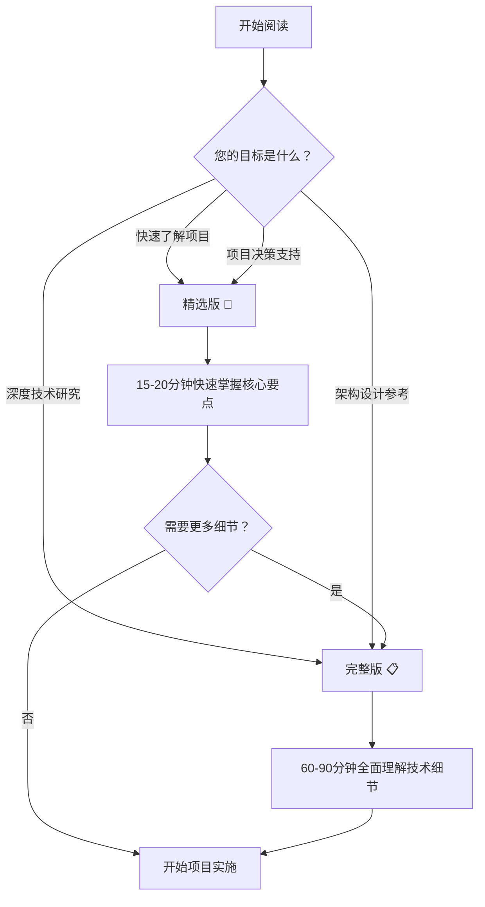

# 量化交易系统v3重构项目 - 设计文档

## 📚 文档概览

本目录包含量化交易系统v3重构项目的核心设计思路文档，基于lianghuakaifa_v2项目的丰富实战经验，为v3项目提供全面的技术蓝图。

## 📖 文档版本说明

### 🎯 精选版 (推荐快速了解)
**文件**: [`量化交易系统v3重构项目核心设计思路文档-精选版.md`](./量化交易系统v3重构项目核心设计思路文档-精选版.md)

**适用对象**: 项目决策者、技术负责人、快速了解项目概况的读者

**内容特点**:
- ⏰ **阅读时间**: 15-20分钟
- 🎯 **核心聚焦**: Top 3需求 + 关键技术栈 + 重要经验教训
- 📊 **数据驱动**: 关键性能指标和成果数据
- ✅ **行动导向**: 立即可执行的行动清单

**主要章节**:
1. 项目概述与v2成果
2. 3大核心需求解析
3. 核心技术栈选择
4. 关键设计模式借鉴
5. v3改进目标与创新点
6. 立即行动清单

---

### 📋 完整版 (深度技术参考)
**文件**: [`量化交易系统v3重构项目核心设计思路文档-完整版.md`](./量化交易系统v3重构项目核心设计思路文档-完整版.md)

**适用对象**: 架构师、开发团队、需要深度技术细节的专业人员

**内容特点**:
- ⏰ **阅读时间**: 60-90分钟
- 🔍 **全面深入**: 6大需求详解 + 完整架构设计 + 详细实施方案
- 📈 **数据丰富**: 基于200MB+对话记录分析
- 🛠️ **实战经验**: v2项目完整生命周期经验沉淀

**主要章节**:
1. 项目概述与背景
2. 6大核心需求深度分析
3. 五层架构详细设计
4. 十大量化库设计经验借鉴
5. 技术栈选择与理由
6. 质量保证机制
7. 重构决策过程
8. 经验教训总结
9. v3项目改进方向
10. 对话记录分析来源

---

## 🎯 如何选择文档版本？

## 📊 分析数据来源

### 🗂️ 数据规模
- **总分析数据**: 200MB+ 对话记录
- **核心文件数**: 8个关键对话记录文件
- **时间跨度**: 2024年8月28日 - 9月16日
- **项目周期**: 完整的v2项目生命周期

### 📈 分析方法
- **智能体分析**: 使用file-analyzer专业智能体
- **交叉验证**: 多文件信息交叉验证确保准确性
- **实战验证**: 基于真实项目开发过程
- **数据驱动**: 提取具体性能指标和成果数据

### 🎯 分析价值
这些文档基于真实的项目开发实践，提供了：
- ✅ 经过实战验证的架构设计模式
- ✅ 多智能体协同开发的成功经验
- ✅ 质量保证和风险控制的具体措施
- ✅ 技术选型和性能优化的实践数据
- ✅ 项目管理和团队协作的最佳实践

---

## 🚀 开始使用

1. **快速启动**: 从[精选版](./量化交易系统v3重构项目核心设计思路文档-精选版.md)开始
2. **深度学习**: 继续阅读[完整版](./量化交易系统v3重构项目核心设计思路文档-完整版.md)
3. **实践应用**: 根据文档中的指导开始v3项目实施

---

*文档持续更新中，将根据v3项目进展补充新的设计思路和实践经验*