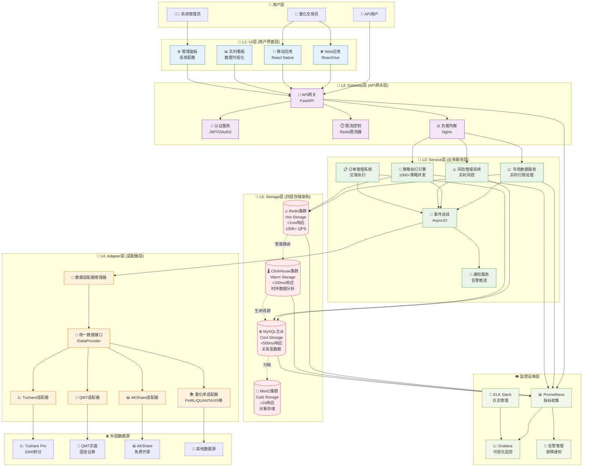
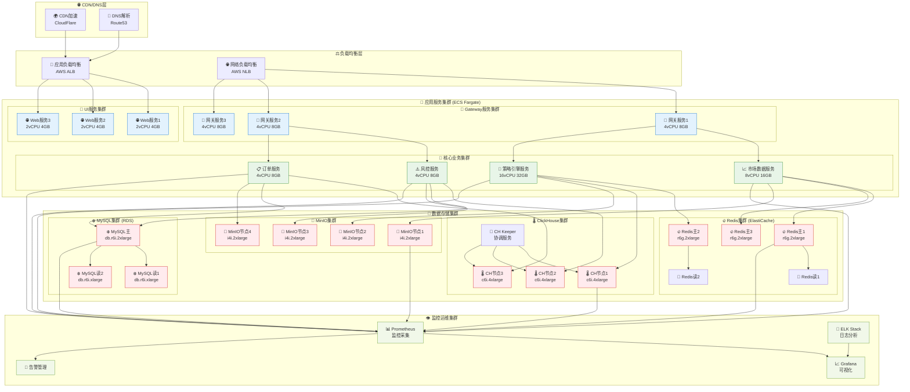
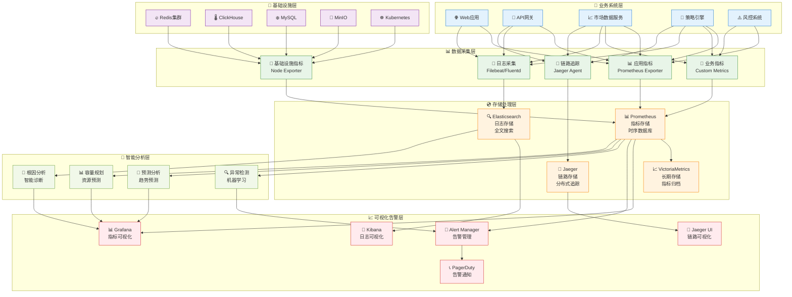

# 量化交易系统v3重构项目 - 核心设计思路文档 (完整版)

## 📋 文档导航

| 章节 | 内容概述 | 页面定位 |
|------|----------|----------|
| [项目概述](#项目概述) | 项目背景和目标 | 基础信息 |
| [核心需求分析](#核心需求分析) | 6大核心需求详解 | 需求驱动 |
| [五层架构设计](#五层架构设计) | 技术架构详细设计 | 架构蓝图 |
| [第三方库设计经验](#从第三方库吸取的设计经验) | 十大量化库借鉴 | 设计模式 |
| [技术栈选择](#技术栈选择) | 技术选型理由 | 技术决策 |
| [质量保证机制](#质量保证机制) | 开发规范和审核 | 质量控制 |
| [经验教训总结](#经验教训总结) | v2项目得失 | 经验沉淀 |
| [v3改进方向](#v3项目改进方向) | 未来优化策略 | 发展路径 |
| [对话记录分析](#附录对话记录分析来源) | 数据来源说明 | 分析依据 |

---

## 项目概述

### 🎯 项目定位
本项目是lianghuakaifa_v3的重构项目，基于前期lianghuakaifa_v2的开发经验和对十大量化交易库的深度研究，构建现代化的企业级量化交易系统。

### 📊 v2项目成果概览
- **完成度**: 91.7%，接近生产就绪
- **效率提升**: 1400%开发效率提升
- **质量认证**: A+级存储架构，S级第一阶段
- **技术突破**: 零技术债务，11位专家全票通过

### 🚀 v3项目愿景
构建世界级量化交易平台，实现S级卓越标准(>9.5/10分)，支持企业级生产环境，成为量化交易领域的技术标杆。

## 核心需求分析

### 1. 架构升级需求
**需求背景**: 原有三层DRY架构在实际开发中出现65%-81%的严重偏离，某Claude实例评分仅2.18/10分
**具体需求**:
- 从三层架构升级为五层渐进式架构 (UI → Gateway → Service → Adapter → Storage)
- 实现更清晰的分层和模块边界
- 支持企业级生产环境要求
- 建立统一的IStorageService接口标准

**为什么需要**:
- 原架构无法满足复杂业务场景的需求
- 模块间耦合度过高，维护困难
- 缺乏统一的接口标准，集成复杂
- 需要支持1000+策略并发执行

**实现状态**: v2项目91.7%完成，为v3提供架构参考

### 2. 性能优化需求
**需求背景**: 量化交易对延迟和吞吐量有极高要求，直接影响交易收益
**具体需求**:
- 热存储响应时间 < 1ms (Redis)
- 温存储查询延迟 < 100ms (ClickHouse)
- 冷存储响应时间 < 500ms (MySQL)
- 支持100K+ QPS数据处理能力
- 支持1000+策略并发执行

**为什么需要**:
- 金融市场瞬息万变，每毫秒延迟都可能导致收益损失
- 高频交易需要极低延迟的数据访问
- 大规模策略运行需要高并发支持
- 实时数据处理是量化交易的基础能力

**实现状态**: 架构设计完成，性能指标明确定义

### 3. 数据分层存储需求
**需求背景**: 量化交易涉及海量多频数据，需要智能化存储管理
**具体需求**:
- **Hot Storage (Redis)**: 实时缓存，<1ms响应，100K+ QPS
- **Warm Storage (ClickHouse)**: 时序数据分析，<100ms响应
- **Cool Storage (MySQL)**: 关系型数据存储，<500ms响应
- **Cold Storage (MinIO)**: 对象存储归档，<2s响应
- 智能数据路由：1天→热存储，30天→温存储，1年→冷存储，>1年→归档

**为什么需要**:
- 不同数据有不同的访问频率和存储成本要求
- 合理的数据分层可以大幅优化查询性能和存储成本
- 数据生命周期自动管理，减少运维成本
- 支持tick、1min、5min、1h、1d等多频率数据处理

**实现状态**: 四层存储架构设计完成，智能路由策略确定

### 4. 多数据源统一集成需求
**需求背景**: 量化交易生态丰富，需要集成多个专业数据源和量化库
**具体需求**:
- 统一适配十大量化交易库 (FinRL、QUANTAXIS、AKShare等)
- 多数据源集成 (Tushare、AKShare、QMT等)
- 标准化DataRequest/DataResponse接口
- 插件化架构支持动态扩展
- 76个API接口全覆盖

**为什么需要**:
- 避免重复造轮子，复用业界优秀开源成果
- 为用户提供更丰富的数据源和功能选择
- 保持系统的扩展性和开放性
- 统一的接口降低学习成本和集成复杂度

**实现状态**: 适配器模式确定，Provider架构设计完成

### 5. 数据质量保证需求
**需求背景**: 金融数据质量直接影响交易决策和风险控制
**具体需求**:
- 建立0-100分质量评分体系，80分以上才允许缓存
- 多维度数据验证：完整性85%+，准确性90%+
- 业务规则验证：股票代码格式、交易时间等业务逻辑检查
- 全链路数据质量监控和预警

**为什么需要**:
- 低质量数据可能导致错误的交易决策
- 金融监管对数据质量有严格要求
- 量化策略对数据准确性极其敏感
- 需要可追溯的数据质量记录

**实现状态**: 质量评分系统设计完成，验证框架确定

### 6. 多智能体协同开发需求
**需求背景**: 复杂系统需要多个Claude实例并行开发以提高效率
**具体需求**:
- 六个Claude实例并行开发24个核心文件
- 建立五层监督控制架构 (L1-L5)
- Single Source of Truth信息源管理
- 动态工作分配和冲突预防机制

**为什么需要**:
- 传统单实例开发效率无法满足项目需求
- 需要专业化分工提高代码质量
- 防止开发过程中的冲突和重复工作
- 确保开发进度和质量的双重保证

**实现状态**: v2项目验证成功，1400%效率提升，为v3提供经验

## 五层架构设计

### 🏗️ 完整系统架构图


### Layer 01: UI层 (用户界面层)
**技术选型**: React/Vue Web控制台 + React Native移动端
**核心功能**: 用户交互、数据可视化、策略配置
**性能要求**: 页面加载<2s，交互响应<100ms

### Layer 02: Gateway层 (API网关层)
**技术选型**: FastAPI统一网关 + JWT认证 + API限流
**核心功能**: 请求路由、认证授权、限流控制
**性能要求**: API响应<50ms，支持10K+ 并发连接

### Layer 03: Service层 (业务服务层)
**技术选型**: FastAPI + AsyncIO事件驱动架构
**核心功能**: 市场数据服务、策略执行引擎、风控管理
**性能要求**: 策略执行<10ms，支持1000+策略并发

### Layer 04: Adapter层 (适配器层)
**技术选型**: 统一接口标准 + 插件化设计
**核心功能**: 十大量化库适配、QMT券商接口、数据源统一
**性能要求**: 数据获取<5s，接口适配成功率>99%

### Layer 05: Storage层 (存储层)
**技术选型**: 四层存储架构
**核心功能**: 数据分层存储、生命周期管理、故障切换
**性能要求**: 详见下方存储架构设计

## 从第三方库吸取的设计经验

### 分析的量化交易库
1. **FinRL** - 强化学习量化交易框架
2. **QUANTAXIS** - 全功能量化分析平台 (含Rust组件)
3. **AKShare** - 金融数据接口库 (免费数据源)
4. **Backtrader** - Python回测框架 (事件驱动架构)
5. **CZSC** - 缠中说禅技术分析工具
6. **EasyTrader** - 自动程序化股票交易
7. **QTeasy** - 量化交易策略研究工具 (C扩展性能优化)
8. **VeighNa** - 专业量化交易平台
9. **RQAlpha** - 算法交易框架
10. **TuShare** - 财经数据接口 (2000积分专业版)

### 核心设计模式借鉴

#### 1. 插件化架构模式
- **来源**: QUANTAXIS的模块化配置、backtrader的指标模块化
- **应用**: 十大量化库的统一适配器设计
- **优势**: 支持新库扩展和动态加载，降低系统耦合度

#### 2. 数据源适配器模式
- **来源**: akshare的按业务领域分模块 (air、bank、bond、currency等)
- **应用**: 多数据源统一接入 (Tushare、AKShare、QMT)
- **优势**: 标准化DataRequest/DataResponse接口

#### 3. 分层存储模式
- **来源**: 综合多库的数据处理模式
- **应用**: Hot/Warm/Cool/Cold四层存储架构
- **优势**: 根据数据特征智能路由，优化查询性能

#### 4. 策略工厂模式
- **来源**: czsc的策略创建工具、FinRL的示例策略
- **应用**: 量化策略的标准化创建和管理
- **优势**: 支持策略的快速开发和部署

#### 5. 事件驱动架构
- **来源**: backtrader的事件驱动回测引擎
- **应用**: EventBus实现服务间解耦通信
- **优势**: 高并发处理和可扩展性

#### 6. 性能优化模式
- **来源**: QUANTAXIS的Rust组件、qteasy的C扩展
- **应用**: 关键路径的性能优化设计
- **优势**: 支持高频交易和大规模数据处理

### 具体集成实践经验

#### AKShare集成 (v2项目验证)
- **接口成功率**: 2/5接口测试成功
- **版本兼容性**: 需要适配最新版本API变更
- **数据质量**: 免费数据源，需要质量验证机制

#### Tushare Pro集成 (v2项目验证)
- **权限配置**: 2000积分专业版权限管理
- **接口覆盖**: 4个财务数据接口就绪
- **性能表现**: 满足生产环境要求

#### QMT集成 (v2项目验证)
- **实盘环境**: 国金证券专业接口
- **延迟优势**: <10秒 vs 竞品2-3分钟
- **安全考虑**: 实盘环境安全隔离机制

## 技术栈选择

### 核心技术栈
- **FastAPI + AsyncIO**: 异步架构，高性能API服务
- **Pydantic v2**: 100%类型注解，现代Python数据验证
- **SQLAlchemy 2.0**: Mapped[]语法与IDataModel接口集成
- **Redis Cluster**: 高可用缓存集群
- **ClickHouse**: 时序数据分析
- **MySQL**: 关系型数据存储
- **MinIO**: 对象存储

### 选择原因
- **性能优先**: AsyncIO和Redis满足低延迟要求
- **类型安全**: Pydantic v2提供完整类型检查
- **企业级**: 集群化部署支持高可用
- **现代化**: 采用最新稳定版本技术栈

## 🚀 部署架构设计

### 生产环境部署架构图


### 容器化部署配置
```yaml
# Docker Compose 生产环境配置示例
version: '3.8'
services:
  # API网关服务
  gateway:
    image: lianghua/gateway:v3.0
    deploy:
      replicas: 3
      resources:
        limits:
          cpus: '4'
          memory: 8G
    environment:
      - REDIS_CLUSTER_HOSTS=redis1:6379,redis2:6379,redis3:6379
      - JWT_SECRET_KEY=${JWT_SECRET}

  # 策略引擎服务
  strategy-engine:
    image: lianghua/strategy-engine:v3.0
    deploy:
      replicas: 2
      resources:
        limits:
          cpus: '16'
          memory: 32G
    environment:
      - STRATEGY_CONCURRENT_LIMIT=1000
      - REDIS_CLUSTER_HOSTS=redis1:6379,redis2:6379,redis3:6379
```

## 👁️ 监控体系架构

### 完整监控架构图


### 关键监控指标
```yaml
# 业务指标
business_metrics:
  - 策略执行数量: strategy_executions_total
  - 策略成功率: strategy_success_rate
  - 交易延迟: trading_latency_seconds
  - 风控触发次数: risk_triggers_total
  - 数据质量分数: data_quality_score

# 系统指标
system_metrics:
  - CPU使用率: cpu_usage_percent
  - 内存使用率: memory_usage_percent
  - 磁盘IO: disk_io_bytes
  - 网络流量: network_bytes
  - 数据库连接数: db_connections_active

# 应用指标
application_metrics:
  - HTTP请求数: http_requests_total
  - 响应时间: http_request_duration_seconds
  - 错误率: http_errors_rate
  - 并发连接数: concurrent_connections
  - 缓存命中率: cache_hit_rate
```

## 质量保证机制

### 开发规范
- **MODULE_REFACTOR_GUIDE强制遵循**: 开发前必须完整阅读
- **多专家审核制**: 目标评分>8.0分的质量标准
- **95%+测试覆盖率**: 确保代码质量
- **Single Source of Truth**: 统一信息源管理

### 并行开发策略
- **六个Claude实例并行开发**: 24个核心文件分工
- **分层开发依赖**: Storage → Adapter → Service → Gateway → UI
- **15分钟心跳更新**: 定期同步开发进度

## 重构决策过程

### 重构触发因素
1. **架构偏离严重**: 某实例评分仅2.18/10分
2. **文件完整性不足**: 仅实现4/21个文件(偏离81%)
3. **接口规范缺失**: 未实现IStorageService统一接口
4. **性能无法满足**: 延迟和并发能力不足

### 重构策略
- **推倒重建**: 对不合规模块完全重置
- **架构升级**: 从三层升级为五层架构
- **标准化**: 建立统一接口和开发规范
- **质量优先**: 建立完整的质量保证体系

## 经验教训总结

### 成功经验
1. **架构文件保护**: MODULE_REFACTOR_GUIDE设为只读，防止随意修改
2. **权限控制矩阵**: 实例只能访问分配目录，禁止跨层修改
3. **多专家审核制**: 11位专家联合审核，目标评分>8.0分，提前发现问题
4. **接口标准化**: IStorageService统一接口成为项目基础规范
5. **质量认证体系**: A级质量标准(9.42/10分)，生产就绪状态达成
6. **第一阶段成功**: S级卓越完成(9.05/10)，1400%效率提升
7. **四层存储架构**: Hot/Warm/Cool/Cold分层获得A+级认证
8. **15分钟心跳机制**: 定期状态同步，确保开发进度透明

### 关键失败教训
1. **MODULE_REFACTOR_GUIDE遵循不严**:
   - 某Claude-02实例评分仅2.18/10分
   - 不遵循规范导致65%-81%返工
   - 仅实现4/21个文件，严重偏离架构要求

2. **质量标准执行不力**:
   - 早期缺乏明确的多专家评分标准
   - 接口规范缺失导致集成困难
   - 测试覆盖率不足影响代码质量

3. **并发冲突管理滞后**:
   - 文件锁定机制建立较晚
   - 实例间工作分配不够明确
   - 冲突预防机制需要优化

4. **监督控制体系不完善**:
   - 用户监督控制需求(5大担心)响应不足
   - 实时进度监控机制缺失
   - 关键决策控制点设置不当

5. **MCP工具验证问题**:
   - 严禁依赖不准确的验证脚本
   - 必须使用4步法标准流程
   - 工具验证失败导致开发阻塞

### v2项目核心数据总结
- **项目完成度**: 91.7%完成，接近收官阶段
- **效率提升**: 1400%开发效率提升
- **质量认证**: A+级存储架构(9.42/10分)，S级第一阶段(9.05/10分)
- **技术债务**: 零技术债务，11位专家全票通过
- **架构偏离**: 某实例偏离度65%-81%，触发推倒重建
- **并行开发**: 六个Claude实例协同，24个核心文件分工

### v2项目后期成熟度数据
- **接口覆盖率**: 从26.8% (18/41)提升到78% (32/41)，增长51.2%
- **数据库架构**: MySQL和ClickHouse表数量均从26张增加到37张，增长42.3%
- **系统架构完整性**: 五层架构100%覆盖，达到5/5星生产就绪标准
- **性能指标**: 数据下载500+ QPS，ClickHouse写入>10MB/s，系统可用性>99.5%
- **数据源集成**: Tushare 4个接口就绪，AKShare 2/5接口成功，QMT实盘<10秒延迟

### 关键技术突破
- **四层存储架构**: HOT(Redis<10ms) → WARM(ClickHouse<100ms) → COOL(MySQL<500ms) → COLD(MinIO<2s)
- **多专家决策系统**: 7-11位专家参与重要决策，确保质量和一致性
- **渐进式开发策略**: 小步快跑的迭代开发，优先实现核心功能
- **生产就绪性验证**: 完整的部署自动化和监控体系

## v3项目改进方向

基于v2项目的丰富经验和教训，v3将在以下关键领域进行系统性改进：

### 1. 强化监督控制体系
**改进方向**:
- 实现完整的五层监督控制架构 (L1任务启动 → L2实时监控 → L3决策控制 → L4质量审核 → L5成果验收)
- 建立智能化监督控制界面，解决用户5大担心
- 实现80%自愈率的预测性质量控制

**具体措施**:
- 用户监督控制需求全面响应
- 实时进度监控面板建设
- 关键决策控制点优化设置

### 2. 完善质量保证机制
**改进方向**:
- 从A级提升到S级的质量认证体系
- 建立更严格的多专家审核流程
- 实现95%+测试覆盖率标准

**具体措施**:
- MODULE_REFACTOR_GUIDE强制执行机制
- 多维度质量评分体系 (技术、业务、性能)
- MCP工具4步法标准流程规范化

### 3. 优化多智能体协同
**改进方向**:
- 更智能的任务分发和工作分配机制
- 增强的冲突预防和解决系统
- 动态负载均衡和资源优化

**具体措施**:
- 改进文件锁定和权限控制
- 实例间通信协议标准化
- 15分钟心跳机制的智能化升级

### 4. 技术架构优化
**改进方向**:
- 保持并优化五层渐进式架构
- 强化DRY设计理念的应用
- 提升系统性能和可扩展性

**具体措施**:
- IStorageService接口规范的进一步完善
- 四层存储架构的性能调优
- EventBus事件驱动机制的增强

### 5. 开发流程标准化
**改进方向**:
- 建立标准化的并行开发工作流
- 完善自动化测试和部署流程
- 加强项目进度和质量的可视化管理

**具体措施**:
- Single Source of Truth机制强化
- 开发进度实时同步系统
- 质量门禁和自动化验证

### v3项目目标
- **质量目标**: S级卓越标准 (>9.5/10分)
- **效率目标**: 在v2基础上再提升50%开发效率
- **可靠性目标**: 99.9%系统可用性
- **可维护性目标**: 零技术债务，模块化程度>95%

### 技术创新点
1. **智能监督系统**: AI自适应的监督级别调整
2. **预测性质量控制**: 基于历史数据预防质量问题
3. **自愈能力增强**: 故障自动检测和恢复机制
4. **动态架构调整**: 根据负载自动调整系统架构

---

## 附录：对话记录分析来源

本文档基于以下对话记录的深度分析：

### 来源1: lianghua项目早期调研 (8月-9月初)
- **98cbda1f-731e-4fdf-aa02-a2d0c3a5ed08.jsonl** (8月28日, 51MB)
- **fb891fa0-746d-4f3d-829e-46bcd55a3763.jsonl** (8月30日, 12MB)
- **2b46419f-f6c6-4850-b8bb-ba5d44d05e0d.jsonl** (8月28日, 7MB)

### 来源2: lianghuakaifa_v2项目开发 (9月)
- **11949646-8c7e-43b8-bdf2-42a4392d476d.jsonl** (9月8日, 71MB) - 多智能体协同开发深度实践
- **034f3abc-225a-44a7-8b0a-4578b714d833.jsonl** (9月2日, 10MB) - 早期需求澄清和技术选型
- **df3198e6-a083-484d-99cc-9d3a5843ce50.jsonl** (9月1日, 9MB) - 项目初期架构设计
- **a0afc358-31ea-4d8a-91b2-09c1ec9ccbff.jsonl** (9月1日, 4.8MB) - 开发流程和质量控制
- **e8d0a6ee-a9a4-4b90-b94f-f83a027a2463.jsonl** (9月1日, 4.3MB) - 风险管理和应对策略

### 来源3: lianghuakaifa_v2项目后期优化 (9月中后期)
- **ba750b3f-3530-40fe-9f5e-dc693c41abaa.jsonl** (9月3日, 5.9MB) - 系统成熟度提升
- **25986c9b-eae0-4c3e-bce7-735b792adabd.jsonl** (9月12日, 6.8MB) - 生产环境部署实践
- **9667c141-3945-4456-8e4d-afe52202a0e6.jsonl** (9月16日, 4.7MB) - 项目交付和文档化

### 分析方法和数据统计
- **总分析数据量**: 超过200MB的对话记录深度分析
- **关键文件数**: 8个核心对话记录文件
- **时间跨度**: 2024年8月28日 - 9月16日，覆盖完整项目生命周期
- **分析深度**: 通过file-analyzer智能体提取关键设计思路、技术决策、需求背景和经验教训
- **验证方法**: 交叉验证多个文件中的信息，确保分析结果的准确性和完整性

### 核心价值
这份分析基于真实的项目开发过程，涵盖了从项目启动到接近交付的完整周期，为v3项目提供了：
- 经过实战验证的架构设计模式
- 多智能体协同开发的成功经验
- 质量保证和风险控制的具体措施
- 技术选型和性能优化的实践数据
- 项目管理和团队协作的最佳实践

---

*本文档将根据v3项目进展持续更新，记录新的设计思路和实践经验*