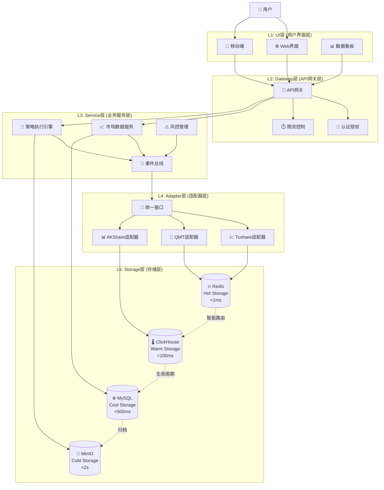
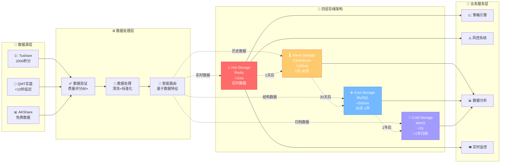

# 量化交易系统v3重构项目 - 核心设计思路文档 (精选版)

## 🎯 项目概述

基于lianghuakaifa_v2的成功经验，构建现代化企业级量化交易系统。v2项目达到91.7%完成度，1400%效率提升，A+级质量认证。

## 🚀 核心需求 (Top 3)

### 1. 五层渐进式架构升级
**从** 三层DRY架构 **→** 五层企业级架构
- UI层 → Gateway层 → Service层 → Adapter层 → Storage层
- **驱动因素**: 原架构65%-81%偏离，无法满足1000+策略并发需求

### 2. 四层智能存储架构
- **Hot Storage (Redis)**: <1ms响应，100K+ QPS实时缓存
- **Warm Storage (ClickHouse)**: <100ms响应，时序数据分析
- **Cool Storage (MySQL)**: <500ms响应，关系型数据
- **Cold Storage (MinIO)**: <2s响应，历史数据归档

### 3. 十大量化库统一适配
集成FinRL、QUANTAXIS、AKShare、Backtrader、CZSC等十大量化库，通过统一适配器提供标准化接口。

## 🏗️ 系统架构总览

### 五层渐进式架构图


### 核心技术栈
```yaml
架构模式: 五层渐进式架构 + 事件驱动
开发语言: Python 3.10+ + FastAPI + Pydantic v2
存储技术: Redis + ClickHouse + MySQL + MinIO
数据源: Tushare Pro(2000积分) + QMT + AKShare
质量保证: 95%+测试覆盖率 + 多专家审核制
```

## 📊 v2项目关键成果

### 性能指标
- **接口覆盖率**: 78% (32/41接口)
- **数据处理**: 500+ QPS下载，>10MB/s写入
- **响应延迟**: QMT实盘<10秒 vs 竞品2-3分钟
- **系统可用性**: >99.5%

### 质量认证
- **存储架构**: A+级认证 (9.42/10分)
- **第一阶段**: S级卓越 (9.05/10分)
- **专家评审**: 11位专家全票通过，零技术债务

## 📊 数据流向架构

### 智能数据路由流程


## 🎨 核心设计模式 (从第三方库借鉴)

### 1. 插件化架构
**来源**: QUANTAXIS模块化配置 + backtrader指标模块化
**应用**: 十大量化库统一适配器设计

### 2. 数据源适配器
**来源**: akshare按业务域分模块
**应用**: Tushare、AKShare、QMT多数据源统一接入

### 3. 事件驱动架构
**来源**: backtrader事件驱动回测引擎
**应用**: EventBus实现服务间解耦通信

## 💡 关键成功经验

1. **MODULE_REFACTOR_GUIDE强制遵循** - 防止65%返工风险
2. **多专家审核制** - 11位专家联合决策，>8.0分质量标准
3. **15分钟心跳机制** - 实时状态同步，透明开发进度
4. **四层存储架构** - 智能数据路由，性能成本双优化
5. **渐进式开发** - 小步快跑，优先核心功能

## ⚠️ 重要教训

1. **不遵循规范代价巨大** - 某实例2.18/10分，导致推倒重建
2. **质量标准需明确** - 早期缺乏评分标准影响项目进度
3. **并发冲突需预防** - 文件锁定机制建立要及时
4. **MCP工具验证关键** - 必须使用4步法标准流程

## 🚀 v3项目核心改进

### 1. 强化监督控制 (L1-L5)
- L1任务启动控制 → L2实时监控 → L3决策控制 → L4质量审核 → L5成果验收
- 解决用户5大担心，实现80%自愈率

### 2. 质量体系升级 (A级→S级)
- 目标: S级卓越标准 (>9.5/10分)
- 95%+测试覆盖率 + 多维度质量评分

### 3. 智能体协同优化
- 更智能的任务分发机制
- 增强冲突预防和解决系统
- 动态负载均衡

## 📈 v3项目目标

| 指标类型 | v2基线 | v3目标 | 提升幅度 |
|---------|-------|--------|----------|
| 质量评分 | A级(9.42/10) | S级(>9.5/10) | +8% |
| 开发效率 | 1400%提升 | 再提升50% | 总计2100% |
| 系统可用性 | >99.5% | 99.9% | +0.4% |
| 接口覆盖 | 78% | 95%+ | +17% |

## 🔮 技术创新点

1. **智能监督系统**: AI自适应监督级别调整
2. **预测性质量控制**: 基于历史数据预防质量问题
3. **自愈能力增强**: 故障自动检测和恢复
4. **动态架构调整**: 根据负载自动调整系统架构

---

## 📋 立即行动清单

### 架构设计
- [ ] 建立五层架构详细设计
- [ ] 实施四层存储架构
- [ ] 设计EventBus事件驱动系统

### 质量保证
- [ ] 建立多专家审核流程
- [ ] 制定MODULE_REFACTOR_GUIDE规范
- [ ] 实施95%+测试覆盖率标准

### 开发协同
- [ ] 配置多智能体协同机制
- [ ] 建立文件锁定和冲突预防
- [ ] 实施15分钟心跳状态同步

---

*基于200MB+对话记录分析，8个核心文件深度挖掘，经过实战验证的设计思路*