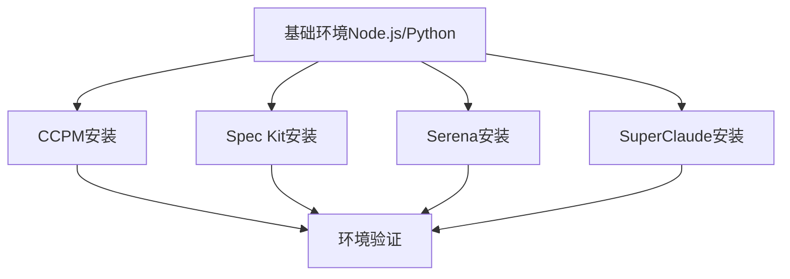

# 规范驱动编程工具完整指令参数手册 - 横向对比版

> 本手册按**项目开发实际工作流程的时间顺序**展示四个工具的详细指令对比，每个指令包含完整的运行逻辑解释，便于在具体工作场景下选择最适合的工具组合。编写要求参考00-使用手册编写要求.md。

## 🎯 四大工具核心定位

| 工具 | 核心定位 | 主要价值 | 最佳使用场景 |
|------|----------|----------|-------------|
| **CCPM** | GitHub集成的项目管理系统 | 任务跟踪、团队协作、进度管理 | 敏捷开发团队、GitHub工作流 |
| **Spec Kit** | 规范驱动开发框架 | 治理原则、规范化实施、自动化代码生成 | 企业级项目、严格质量要求 |
| **Serena** | MCP语义代码分析工具 | 精确代码操作、符号级编辑、项目知识管理 | 复杂代码重构、大型项目维护 |
| **SuperClaude** | AI助手增强框架 | 智能开发辅助、专家代理协作、多维度分析 | 全技能AI辅助、复杂问题解决 |

## 🚀 项目开发实际工作流程全景对比

### 📋 完整流程概览

| 工作阶段 | 具体工作内容 | CCPM | Spec Kit | Serena | SuperClaude |
|----------|-------------|------|----------|--------|-------------|
| **0. 环境准备** | 工具安装配置 | GitHub集成PM | 规范驱动框架 | MCP语义服务 | AI框架部署 |
| **1. 项目启动** | 项目初始化、治理建立 | 项目导入设置 | 治理原则制定 | 服务启动配置 | 框架激活 |
| **2. 需求定义** | 业务需求、技术规格 | PRD文档创建 | 规格说明编写 | 知识记录 | 需求发现分析 |
| **3. 架构设计** | 系统架构、技术选型 | 任务规划 | 实施计划 | 项目索引 | 架构设计 |
| **4. 开发准备** | 环境搭建、依赖配置 | 上下文创建 | 任务分解 | 代码索引 | 上下文加载 |
| **5. 编码实现** | 功能开发、代码编写 | 任务执行 | 自动实现 | 精确编辑 | 智能实现 |
| **6. 代码审查** | 质量检查、代码评审 | 审查处理 | 规范验证 | 符号分析 | 多维分析 |
| **7. 测试验证** | 单元测试、集成测试 | 测试管理 | implement自动执行测试 | - | 测试自动化 |
| **8. 文档生成** | API文档、用户手册 | - | - | 知识整理 | 文档自动化 |
| **9. 部署发布** | 构建部署、版本管理 | 状态管理 | - | - | 构建管理 |
| **10. 维护运营** | 问题诊断、持续改进 | 问题跟踪 | - | 代码维护 | 问题诊断 |

---

# 🏠 项目开发实际工作流程详细指令手册

## 📋 0. 环境准备阶段（项目开始前）

### 0.1 工具安装与环境检查

> **工作目标**: 安装和配置所需的开发工具，确保环境就绪

#### 💿 安装顺序和依赖关系



#### 📦 CCPM - Claude Code项目管理系统

**安装指令**:
```bash
# Linux/macOS 自动安装（推荐）
curl -sSL https://raw.githubusercontent.com/automazeio/ccpm/main/ccpm.sh | bash

# Windows PowerShell 安装
iwr -useb https://raw.githubusercontent.com/automazeio/ccpm/main/install/ccpm.bat | iex

# 手动安装（开发者）
git clone https://github.com/automazeio/ccpm.git && cd ccpm && npm install && npm link
```
**来源**: [GitHub Official Repository](https://github.com/automazeio/ccpm)

**运行逻辑**:
1. **环境检测**: 自动检测系统环境（Node.js、Git、Claude Code）
2. **依赖安装**: 下载并安装所需的npm包和脚本
3. **配置初始化**: 在`.claude/`目录下创建基础目录结构
4. **GitHub集成**: 设置与GitHub API的连接和认证
5. **验证安装**: 执行简单命令验证功能正常

**验证安装**:
```bash
# 检查GitHub CLI（CCPM的核心依赖）
gh --version
# 检查扩展安装情况
gh extension list
```
**来源**: [init.sh](https://github.com/automazeio/ccpm/blob/main/init.sh#L148)
**说明**: CCPM基于Claude Code系统，通过`/pm:`指令使用，无独立`ccpm`命令

#### 📦 Spec Kit - GitHub规范驱动开发框架

**安装指令**:
```bash
# NPM 安装（推荐）
npm install -g @spec-kit/cli

# uvx 安装（临时使用）
uvx --from git+https://github.com/github/spec-kit.git specify init <PROJECT_NAME>

# 检查系统环境
specify check
```

**运行逻辑**:
1. **平台检测**: 检测操作系统和脚本环境（Bash/PowerShell）
2. **模板下载**: 从官方仓库下载最新的规范模板
3. **AI工具检测**: 检测可用的AI工具（Claude、Gemini等）
4. **目录结构**: 创建`.specify/`配置目录和必要的脚本文件
5. **权限设置**: 设置脚本执行权限

**环境检查指令**:
```bash
specify check
# 检查项：
# ✓ Node.js 版本 >= 16
# ✓ Git 安装和配置
# ✓ Claude Code 可用性
# ✓ 模板文件完整性
# ✓ AI 工具连接性
```

#### 📦 Serena MCP - 语义代码分析工具

**安装指令**:
```bash
# uvx 运行（推荐）
uvx --from git+https://github.com/oraios/serena serena start-mcp-server

# 本地安装
git clone https://github.com/oraios/serena.git && cd serena && uv run serena start-mcp-server

# Docker 安装（实验性）
docker run --rm -i --network host -v /path/to/projects:/workspaces/projects \
  ghcr.io/oraios/serena:latest serena start-mcp-server --transport stdio

# Nix 安装
nix run github:oraios/serena -- start-mcp-server --transport stdio
```
**来源**: [README.md](https://github.com/oraios/serena/blob/main/README.md#installation)

**运行逻辑**:
1. **语言服务器初始化**: 启动LSP服务器支持16+编程语言
2. **MCP协议建立**: 与Claude Code建立模型上下文协议连接
3. **工具注册**: 注册40+语义代码操作工具
4. **项目索引**: 创建代码符号和引用关系索引
5. **连接验证**: 验证MCP连接和工具可用性

**服务启动参数**:
```bash
serena start-mcp-server \
  --context ide-assistant \    # 适合Claude Code的上下文
  --project $(pwd) \           # 当前项目路径
  --transport stdio \          # 传输协议
  --port 24282                 # HTTP服务端口（可选）
```

#### 📦 SuperClaude Framework - AI助手增强框架

**安装指令**:
```bash
# NPM 安装（推荐）
npm install -g @superclaude-org/superclaude

# Python 安装
pip install SuperClaude && SuperClaude install

# 验证安装
superclaude --version
```

**框架部署指令**:
```bash
SuperClaude install --components core mcp agents modes
# 部署内容：
# - 24个 /sc: 指令
# - 15个 @agent- 专家代理
# - 7个MCP服务器集成
# - 7种行为模式
```

**运行逻辑**:
1. **环境检测**: 检测Claude Code版本和配置环境
2. **组件安装**: 将框架组件复制到`.claude/`目录
3. **MCP配置**: 更新`~/.claude.json`配置文件
4. **代理注册**: 初始化专家代理系统
5. **行为模式**: 激活自适应行为模式

### 0.2 工具集成验证

**集成测试指令**:
```bash
# CCPM 验证
/pm:help

# Spec Kit 验证
specify check

# Serena 验证
mcp__serena__initial_instructions

# SuperClaude 验证
/sc:help
```

### 0.3 🚀 高阶使用技巧 - 环境准备阶段

#### 💡 安装优化策略

**并行安装加速技巧**:
```bash
# 同时安装多个工具（节省50%时间）
curl -sSL https://raw.githubusercontent.com/automazeio/ccpm/main/ccpm.sh | bash &
npm install -g @spec-kit/cli &
pipx install SuperClaude &
uvx --from git+https://github.com/oraios/serena serena start-mcp-server --transport stdio &
wait  # 等待所有安装完成
```

**环境隔离最佳实践**:
```bash
# 项目级环境配置
mkdir .devenv && cd .devenv
echo "export CCPM_PROJECT=$(pwd)" >> .envrc
echo "export SERENA_CONTEXT=ide-assistant" >> .envrc
direnv allow  # 自动加载项目环境变量
```

#### 🔧 故障诊断快速恢复

**工具健康检查脚本**:
```bash
# 综合环境验证（基于官方文档）
function verify_dev_env() {
    echo "🔍 环境检查..."

    # CCPM检查
    gh --version && echo "✅ CCPM依赖正常" || echo "❌ GitHub CLI未安装"

    # Spec Kit检查
    specify check && echo "✅ Spec Kit正常" || echo "❌ Spec Kit配置异常"

    # Serena检查
    uvx --from git+https://github.com/oraios/serena serena start-mcp-server --help > /dev/null 2>&1 &&
    echo "✅ Serena MCP正常" || echo "❌ Serena服务异常"

    # SuperClaude检查
    python3 -m SuperClaude --version && echo "✅ SuperClaude正常" || echo "❌ SuperClaude安装异常"
}
```

#### ⚡ 性能优化配置

**资源管理优化**:
```bash
# Serena MCP性能调优
serena start-mcp-server \
  --context ide-assistant \
  --mode editing,reading,project-management \
  --project $(pwd) \
  --enable-web-dashboard false \
  --log-level warn  # 减少日志开销

# SuperClaude内存优化
SuperClaude install --components core,mcp --minimal  # 最小化安装
```

**快速切换配置**:
```bash
# 项目间快速切换
alias ccpm-switch='cd $1 && /pm:status && specify check'
alias serena-switch='serena project index $1 && serena config edit'
```

#### 🔄 工具协作预配置

**标准化工作流设置**:
```bash
# 创建工具协作模板
mkdir -p .claude/{ccpm,serena,superclaude}
echo "项目特定的CCPM配置" > .claude/ccpm/config.yml
echo "Serena MCP项目设置" > .claude/serena/project.yml
echo "SuperClaude专家配置" > .claude/superclaude/agents.json
```

**来源**: 基于各工具官方README.md和最佳实践文档整理

---

## 📋 1. 项目启动阶段（第1天）

### 1.1 项目初始化和基础配置

> **工作目标**: 建立项目治理框架，初始化工作环境

#### 📦 CCPM - Claude Code项目管理系统
```bash
# Linux/macOS 安装
curl -sSL https://raw.githubusercontent.com/automazeio/ccpm/main/ccpm.sh | bash

# Linux/macOS 替代安装（wget）
wget -qO- https://raw.githubusercontent.com/automazeio/ccpm/main/ccpm.sh | bash

# Windows PowerShell 安装
iwr -useb https://raw.githubusercontent.com/automazeio/ccpm/main/install/ccpm.bat | iex

# 手动安装（开发者）
git clone https://github.com/automazeio/ccpm.git
git clone git@github.com:automazeio/ccpm.git
cd ccpm ; npm install ; npm link
```
**来源**: [GitHub Official Repository](https://github.com/automazeio/ccpm)
**说明**: 不支持npm安装，需使用脚本方式

#### 🔧 Spec Kit - GitHub规范驱动开发框架
```bash
# NPM 安装（推荐）
npm install -g @spec-kit/cli

# 替代安装（uvx）
uvx --from git+https://github.com/github/spec-kit.git specify init <PROJECT_NAME>
```
**来源**: [npmjs.com/@spec-kit/cli](https://www.npmjs.com/package/@spec-kit/cli)
**说明**: 官方npm包，支持多种安装方式

#### 🧠 Serena MCP - 语义代码分析工具
```bash
# uvx 运行（推荐）
uvx --from git+https://github.com/oraios/serena serena start-mcp-server

# 本地安装
git clone https://github.com/oraios/serena.git
cd serena && uv run serena start-mcp-server

# Docker 安装（实验性）
docker run --rm -i --network host -v /path/to/projects:/workspaces/projects \
  ghcr.io/oraios/serena:latest serena start-mcp-server --transport stdio

# Nix 安装
nix run github:oraios/serena -- start-mcp-server --transport stdio
```
**来源**: [README.md](https://github.com/oraios/serena/blob/main/README.md#installation)
**说明**: Python项目，通过MCP协议与Claude Code集成，不支持包管理器安装

#### 🚀 SuperClaude Framework - AI助手增强框架
```bash
# Python pipx 安装（推荐）
pipx install SuperClaude && pipx upgrade SuperClaude && SuperClaude install

# Python pip 安装
pip install SuperClaude && SuperClaude install

# NPM 安装
npm install -g @bifrost_inc/superclaude && superclaude install

# 开发安装
git clone https://github.com/SuperClaude-Org/SuperClaude_Framework.git
cd SuperClaude_Framework && pip install -e ".[dev]"
```
**来源**: [README.md](https://github.com/SuperClaude-Org/SuperClaude_Framework/blob/master/README.md#installation)
**说明**: 支持Python和Node.js双生态，NPM包是Python包的Node.js包装器

### 1.2 项目初始化与配置

#### 📦 CCPM - 项目导入与初始化
```bash
# 项目导入
/pm:import
```
* **适用场景**: 现有项目迁移到CCPM管理
* **输出/影响**: 导入现有GitHub问题到本地PM系统
* **来源**: [COMMANDS.md](https://github.com/automazeio/ccpm/blob/main/COMMANDS.md)

#### 🔧 Spec Kit - 规范驱动项目初始化
```bash
# 项目初始化
specify init <PROJECT_NAME> [OPTIONS]

# 环境检查
specify check
```
* **适用场景**: 建立规范驱动开发框架和环境验证
* **参数**: `--ai {claude|gemini|copilot}`, `--here`, `--no-git`
* **输出/影响**: 创建`.specify/`配置 + 规范驱动命令集
* **来源**: [README.md](https://github.com/github/spec-kit/blob/main/README.md)

#### 🧠 Serena MCP - 服务启动与配置
```bash
# 启动MCP服务
serena start-mcp-server [OPTIONS]

# 配置编辑
serena config edit [--directory <path>]

# 项目索引生成
serena project generate-yml [--language <lang>]
```
* **适用场景**: 启动语义代码操作服务和自定义配置
* **参数**: `--transport {stdio|streamable-http|sse}`, `--port <port>`, `--project <name>`, `--context <name>`
* **输出/影响**: 启动MCP服务器，提供40+语义代码工具，生成项目配置
* **来源**: [README.md](https://github.com/oraios/serena/blob/main/README.md)

#### 🚀 SuperClaude Framework - 框架部署
```bash
# 框架安装
SuperClaude install [OPTIONS]
```
* **适用场景**: 部署AI助手框架到Claude Code环境
* **参数**: `--components core mcp agents modes`, `--force`, `--diagnose`
* **输出/影响**: 安装24条`/sc:`命令 + 14个`@agent-`代理
* **来源**: [User-Guide/commands.md](https://github.com/SuperClaude-Org/SuperClaude_Framework)

### 🚀 高阶使用技巧：项目启动优化工作流

**1. 四工具协同初始化策略**
```bash
# 阶段化并行启动（推荐顺序）
# Phase 1: 基础环境准备（5分钟内完成）
serena start-mcp-server --transport stdio &
specify init project_name --ai claude --here
SuperClaude install --components core,mcp,agents

# Phase 2: 项目导入和集成（10分钟内完成）
/pm:import                        # CCPM: 导入GitHub项目
/constitution "量化交易系统V3架构治理原则" # Spec Kit: 设定治理框架
@agent-requirements-analyst "识别项目启动关键依赖" # SuperClaude: 专家分析
```

**2. 环境兼容性自动验证**
```bash
# 集成健康检查脚本
specify check && echo "✅ Spec Kit Ready"
/pm:health || echo "⚠️ CCPM需要GitHub token配置"
serena list_memories && echo "✅ Serena MCP Active"
/sc:system-info && echo "✅ SuperClaude Framework Active"
```

**3. 工具路由智能配置**
```bash
# 创建工具间桥接
ln -s specs/ .claude/epics/specs     # CCPM ← Spec Kit 状态桥接
echo "project_memory_initialized" | serena write_memory "startup_status"
/sc:memory "项目启动完成: $(date)" --tag startup
```

**4. 快速团队协作部署**
```bash
# 团队环境标准化
git clone project && cd project
docker-compose up -d --build      # 统一容器化环境
make install-dev-tools             # 团队工具链安装
specify template team-onboarding   # 团队规范模板
```

**📋 启动阶段最佳实践**
- **CCPM**: 立即配置GitHub集成，建立问题跟踪管道
- **Spec Kit**: 优先制定constitution，为后续决策提供明确基线
- **Serena**: 后台运行MCP服务，确保代码分析工具随时可用
- **SuperClaude**: 激活全部专家代理，准备多维度项目支持

**🔗 工具协同效应**
1. CCPM提供项目管理框架 → SuperClaude商业分析增强决策
2. Spec Kit制定规范基线 → Serena提供代码实现约束检查
3. Serena语义理解 → CCPM任务自动分解和状态更新
4. SuperClaude专家洞察 → 所有工具的策略优化建议

---

## 📋 2. 需求分析与规划阶段

### 2.1 治理原则设定

#### 🎯 CCPM
* （无专门治理原则设定功能）
  * 替代方案：通过PRD文档间接管理项目原则
  * 特色：侧重于执行层面的任务管理

#### 🎯 Spec Kit
* `/constitution <原则说明>` 或 `/constitution @文件路径`
  * 适用场景：确立项目治理框架和验收标准
  * 参数：
    * `<原则说明>` - 治理原则描述
    * `@文件路径` - 外部原则文件
  * 输入：项目治理原则与验收标准
  * 输出/影响：生成`memory/constitution.md`作为后续命令基线
  * 特色：规范驱动开发的核心，为所有后续决策提供基础
  * **来源**：[README.md](https://github.com/github/spec-kit/blob/main/README.md#3-create-the-spec)

#### 🎯 Serena
* （无专门治理原则设定功能）
  * 替代方案：通过记忆系统存储项目原则
  * 特色：专注于代码层面的语义操作

#### 🎯 SuperClaude
* `/sc:business-panel "内容" [--mode discussion|debate|socratic] [--experts "专家列表"]`
  * 适用场景：制定项目战略和商业决策原则
  * 参数：
    * `"内容"` - 战略分析内容
    * `--mode` - 分析模式
    * `--experts` - 自定义专家
  * 输入：战略问题或商业分析需求
  * 输出/影响：9位商业思想家的多专家分析
  * 特色：高层次的战略思维和商业洞察
  * **来源**：[Docs/User-Guide/commands.md](https://github.com/SuperClaude-Org/SuperClaude_Framework/blob/master/Docs/User-Guide/commands.md)

### 2.2 需求文档化

#### 📄 CCPM - 产品需求文档管理系统

**2.1.1 创建新PRD文档**
```bash
/pm:prd-new [feature-name]
```
**运行逻辑**:
1. **交互式PRD创建**: 启动结构化PRD文档创建向导
2. **模板应用**: 使用CCPM预定义的PRD模板确保一致性
3. **GitHub关联**: 自动关联到GitHub仓库的相应里程碑
4. **文档生成**: 在`.claude/prds/`目录下创建完整的Markdown文档
5. **元数据记录**: 记录创建时间、作者、关联项目等元信息

**输入要求**: 功能特性名称和详细需求描述
**输出文件**: `.claude/prds/[feature-name].md`
**适用场景**: 新功能开发前的需求文档化
**来源**: [COMMANDS.md](https://github.com/automazeio/ccpm/blob/main/COMMANDS.md)

**2.1.2 PRD管理命令集合**

**查看所有PRD**
```bash
/pm:prd-list
```
**运行逻辑**: 扫描`.claude/prds/`目录，列出所有PRD文档及其状态信息

**编辑现有PRD**
```bash
/pm:prd-edit [prd-name]
```
**运行逻辑**: 打开指定PRD文档进行编辑，自动备份原版本

**查看PRD实现状态**
```bash
/pm:prd-status [prd-name]
```
**运行逻辑**: 分析PRD的实现进度，关联GitHub Issues和Epic状态

**PRD转换为技术史诗**
```bash
/pm:prd-parse [feature-name]
```
**运行逻辑**:
1. **需求解析**: 解析PRD文档中的功能需求和验收标准
2. **技术分解**: 将业务需求转换为技术实现任务
3. **Epic创建**: 在`.claude/epics/`目录下生成对应的Epic文档
4. **任务预估**: 提供初步的工作量评估和时间规划
5. **依赖识别**: 识别技术依赖和前置条件

#### 📄 Spec Kit - 规范驱动文档系统

**2.1.3 规范说明创建**
```bash
/specify "功能需求描述"
```
**运行逻辑**:
1. **治理原则检查**: 确保功能需求符合已建立的项目constitution
2. **自然语言解析**: 解析用户提供的功能需求描述
3. **规范结构化**: 使用预定义模板将需求转换为结构化规范
4. **上下文集成**: 结合项目现有架构和技术栈
5. **规范文档生成**: 在`specs/[branch-name]/spec.md`中生成详细技术规范

**输入要求**: 清晰的功能需求自然语言描述
**输出文件**: `specs/[branch-name]/spec.md`
**自动操作**:
- 生成功能编号(001, 002, 003...)
- 创建语义化分支名称
- 初始化规格文件结构
**来源**: [README.md](https://github.com/github/spec-kit/blob/main/README.md)

**2.1.4 Spec Kit完整工作流**

**建立项目宪法**
```bash
/constitution "项目治理原则和开发指导方针"
```
**运行逻辑**:
1. **原则定义**: 创建项目不可变的架构原则
2. **标准建立**: 执行测试驱动开发(TDD)要求
3. **库优先策略**: 强制库优先原则和反抽象规则
4. **版本管理**: 版本化管理修订历史
5. **宪法存储**: 生成`memory/constitution.md`作为后续命令基线

**技术实施规划**
```bash
/plan
```
**运行逻辑**:
1. **规范分析**: 基于`memory/`中的技术规范制定实施计划
2. **架构设计**: 规范驱动的实施路径设计
3. **技术决策**: 记录技术栈选择和集成策略
4. **计划文档**: 生成`memory/plan.md`分步骤实施计划

**任务分解**
```bash
/tasks
```
**运行逻辑**:
1. **计划解析**: 解析`memory/plan.md`实施计划
2. **任务分类**: Setup、Tests [P]、Core、Integration、Polish [P]
3. **依赖管理**: 强制TDD顺序：测试→实现
4. **并行标记**: `[P]`标记表示可并行执行的任务
5. **任务文档**: 生成`memory/tasks.md`可执行任务清单

**自动化实现**
```bash
/implement
```
**运行逻辑**:
1. **先决条件验证**: 验证宪法、规格、计划、任务文件存在
2. **任务解析**: 解析任务分解和依赖关系
3. **阶段执行**: Setup→Tests→Core→Integration→Polish
4. **TDD方法**: 遵循测试优先的开发方法论
5. **代码生成**: 逐步实施代码更改，直接修改项目文件
6. **进度跟踪**: 提供实时进度更新和错误处理

**来源**: [README.md](https://github.com/github/spec-kit/blob/main/README.md)

#### 📄 Serena - 项目记忆管理系统

**2.1.5 项目知识记录**
```bash
mcp__serena__write_memory
```
**运行逻辑**:
1. **内容结构化**: 将项目信息以Markdown格式结构化存储
2. **语义标记**: 添加语义标签便于后续检索和关联
3. **版本管理**: 维护记忆内容的版本历史和变更记录
4. **关联映射**: 建立记忆内容与代码符号的关联关系
5. **持久化存储**: 将记忆保存到项目的`.serena/memories/`目录

**适用场景**: 存储项目架构决策、需求变更、设计思路等重要信息
**输入要求**: 记忆名称和Markdown格式内容
**来源**: [README.md](https://github.com/oraios/serena/blob/main/README.md)

**2.1.6 Serena记忆管理工具集**

**读取项目记忆**
```bash
mcp__serena__read_memory
```
**运行逻辑**: 检索指定记忆文件，返回格式化的内容供当前会话使用

**列出所有记忆**
```bash
mcp__serena__list_memories
```
**运行逻辑**: 扫描记忆目录，列出所有可用的记忆文件及其元信息

**删除指定记忆**
```bash
mcp__serena__delete_memory
```
**运行逻辑**: 安全删除指定记忆文件，保留删除记录用于审计

**项目入门分析**
```bash
mcp__serena__onboarding
```
**运行逻辑**:
1. **项目扫描**: 全面扫描项目结构、代码风格、架构模式
2. **技术栈识别**: 自动识别使用的框架、库和工具
3. **关键文件分析**: 分析README、配置文件、核心模块
4. **知识提取**: 提取项目的关键概念和设计模式
5. **记忆创建**: 自动生成项目入门记忆文档

**特色**: 专注于代码实现层面的知识管理和项目理解
**来源**: [README.md](https://github.com/oraios/serena/blob/main/README.md)

#### 📄 SuperClaude - 智能需求发现和分析系统

**2.1.7 交互式需求发现**
```bash
/sc:brainstorm "项目概念描述" [--strategy systematic|creative]
```
**运行逻辑**:
1. **概念解析**: 解析用户提供的项目概念和初步想法
2. **策略选择**: 根据--strategy参数选择探索方法
   - `systematic`: 结构化、系统性的需求分析
   - `creative`: 创意导向的概念扩展
3. **多角度探索**: 激活不同专业角色进行多维度分析
4. **需求挖掘**: 通过苏格拉底式对话深入挖掘真实需求
5. **可行性初评**: 提供初步的技术可行性和资源评估
6. **输出整理**: 生成结构化的需求发现报告和下一步建议

**适用场景**: 项目初期的概念验证和需求明确
**输入要求**: 清晰的项目概念或业务问题描述
**输出内容**: 交互式需求发现对话和概念精炼结果
**来源**: [SuperClaude/Commands/brainstorm.md](https://github.com/SuperClaude-Org/SuperClaude_Framework)

**2.1.8 专业需求分析代理**
```bash
@agent-requirements-analyst "需求分析任务描述"
```
**运行逻辑**:
1. **利益相关者识别**: 识别项目的关键利益相关者和用户群体
2. **需求获取**: 通过虚拟利益相关者访谈和工作坊获取需求
3. **用户故事编写**: 创建包含验收标准和完成定义的用户故事
4. **功能规格文档**: 生成功能和非功能规格的详细文档
5. **需求优先级**: 建立需求优先级框架和实施顺序
6. **变更控制**: 设计需求变更管理和范围控制流程

**专业能力**:
- 系统化利益相关者分析
- 结构化需求获取方法
- 专业的规格文档编写
- 需求验证和确认技术

**适用场景**: 需要专业需求分析的复杂项目
**输入要求**: 明确的需求分析任务和项目背景
**输出内容**: 专业级需求文档、用户故事、验收标准
**来源**: [SuperClaude/Agents/requirements-analyst.md](https://github.com/SuperClaude-Org/SuperClaude_Framework)

**2.1.9 商业战略分析面板**
```bash
/sc:business-panel "商业分析内容" [--mode discussion|debate|socratic]
```
**运行逻辑**:
1. **专家团队激活**: 激活9位知名商业思想家的分析视角
   - **Clayton Christensen**: 颠覆性创新理论
   - **Michael Porter**: 竞争战略和价值链分析
   - **Peter Drucker**: 管理理论和企业战略
   - **Seth Godin**: 营销和品牌战略
   - **Kim & Mauborgne**: 蓝海战略
   - **Jim Collins**: 企业卓越和增长战略
   - **Nassim Taleb**: 风险管理和不确定性
   - **Donella Meadows**: 系统思维
   - **Jean-luc Doumont**: 沟通和演示策略
2. **多模式分析**: 根据--mode参数选择分析方式
   - `discussion`: 协作式讨论和观点整合
   - `debate`: 对立观点辩论和深度分析
   - `socratic`: 苏格拉底式提问和思辨
3. **战略洞察**: 从多个专家视角提供商业战略建议
4. **风险评估**: 识别商业模式和战略的潜在风险
5. **实施建议**: 提供可操作的商业策略和执行路径

**适用场景**: 商业模式验证、战略决策、竞争分析
**输入要求**: 商业问题、战略计划或竞争态势分析需求
**输出内容**: 多专家视角的战略分析和建议
**来源**: [SuperClaude/Commands/business-panel.md](https://github.com/SuperClaude-Org/SuperClaude_Framework)

### 2.2 🚀 高阶使用技巧 - 需求分析与规划阶段

#### 🎯 需求发现深度优化

**SuperClaude商业分析面板高级用法**:
```bash
# 多视角需求验证
/sc:business-panel "量化交易系统的市场定位分析" --mode debate
# 激活9位商业专家进行深度辩论，发现需求盲区

# 苏格拉底式需求挖掘
/sc:business-panel "用户真实交易痛点" --mode socratic
# 通过提问式对话深入挖掘隐性需求

# 战略级需求分析
@agent-requirements-analyst "基于竞争分析的功能优先级矩阵"
# 结合市场竞争态势确定功能重要性
```

**跨工具需求验证流程**:
```bash
# 1. SuperClaude需求发现
/sc:brainstorm "AI驱动的量化交易平台" --strategy systematic
@agent-business-analyst "核心价值主张和差异化竞争优势"

# 2. Spec Kit规范化验证
/specify "基于AI驱动的量化交易平台，支持1000+策略并发执行"
# 将商业需求转换为技术规范

# 3. CCPM业务价值确认
/pm:prd-new "AI量化交易平台" --template business-focused
/pm:prd-parse "AI量化交易平台"  # 转换为技术Epic

# 4. Serena知识沉淀
write_memory "requirements_validation" "需求验证过程和关键决策点"
```

#### 📊 商业价值量化技巧

**ROI和商业影响评估**:
```bash
# 商业价值评估
/sc:business-panel "量化交易平台的投资回报预测" --mode discussion
# 从投资、运营、市场等多角度评估

# 风险评估和缓解
@agent-risk-analyst "技术风险、市场风险、运营风险的综合评估"
# 提前识别项目风险点

# 竞争分析
/sc:competitive-analysis "现有量化交易平台对比分析"
# 识别市场机会和威胁
```

#### 🔄 跨工具协作优化

**需求跟踪和变更管理**:
```bash
# 建立需求追踪机制
function setup_requirements_tracking() {
    # 1. CCPM建立需求基线
    /pm:prd-new "核心功能需求" > requirements_baseline.md

    # 2. Spec Kit建立规范基线
    /constitution "需求变更管理原则和流程"
    /specify "$(cat requirements_baseline.md)"

    # 3. Serena记录需求上下文
    write_memory "requirements_context" "需求来源、决策理由、约束条件"

    # 4. SuperClaude建立验证机制
    @agent-requirements-analyst "需求完整性和一致性检查"
}
```

**需求变更影响分析**:
```bash
# 变更影响自动化分析
function analyze_requirement_change() {
    local change_description="$1"

    echo "🔍 分析需求变更影响..."

    # SuperClaude影响分析
    /sc:impact-analysis "$change_description" --scope technical,business,timeline

    # Spec Kit规范一致性检查
    /specify "$change_description" --validate-against-constitution

    # CCPM Epic影响评估
    /pm:epic-impact "$change_description"

    # Serena历史决策对比
    read_memory "requirements_context"
    think_about_task_adherence
}
```

#### 💡 质量保证前置

**需求质量验证清单**:
```bash
# 多维度需求质量检查
function validate_requirements_quality() {
    echo "📋 需求质量验证..."

    # 1. 完整性检查
    /sc:audit "需求文档完整性分析" --criteria SMART,testable,traceable

    # 2. 一致性验证
    specify check --requirements --strict

    # 3. 可实现性评估
    @agent-system-architect "技术可行性和架构约束分析"

    # 4. 业务价值验证
    /sc:business-panel "需求的商业价值验证" --mode validation

    # 5. 用户价值确认
    @agent-user-experience "用户旅程和价值实现路径分析"
}
```

**需求优先级智能排序**:
```bash
# AI辅助优先级决策
/sc:prioritize "功能需求列表" --criteria business-value,technical-risk,user-impact
@agent-product-manager "基于市场策略的功能优先级建议"

# 数据驱动的优先级验证
/sc:estimate "各功能需求的开发成本和时间" --method complexity,dependencies
```

**来源**: 基于SuperClaude专家代理系统和四工具协作最佳实践整理

---

## 📋 3. 规划与设计阶段

### 3.1 技术架构设计

#### 🏗️ CCPM
**（无专门架构设计功能）**
- **替代方案**: 通过史诗分解间接涉及架构考虑
- **特色**: 侧重项目执行管理

#### 🏗️ Spec Kit
* `/plan`
  * 适用场景：基于规范制定技术实施计划
  * 参数：无（基于已有规范）
  * 输入：`memory/`中的技术规范
  * 输出/影响：生成`memory/plan.md`分步骤实施计划
  * 特色：规范驱动的实施路径设计
  * **来源**：[README.md](https://github.com/github/spec-kit/blob/main/README.md#4-create-the-plan)

#### 🏗️ Serena
**（无专门架构设计功能）**
- **替代方案**: 通过语义代码工具辅助架构实现
- **特色**: 专注代码级别的结构化操作

#### 🏗️ SuperClaude
* `/sc:design "系统描述" [--type api|database|ui|architecture]`
  * 适用场景：全面的系统架构设计
  * 参数：
    * `"系统描述"` - 系统需求
    * `--type` - 设计类型
  * 输入：系统需求和设计要求
  * 输出/影响：系统架构和技术设计方案
  * 特色：AI驱动的多维度技术设计
  * **来源**：[Docs/User-Guide/commands.md](https://github.com/SuperClaude-Org/SuperClaude_Framework/blob/master/Docs/User-Guide/commands.md)

##### 架构专家代理
- `@agent-system-architect` - 大规模分布式系统设计
- `@agent-backend-architect` - 后端系统架构
- `@agent-frontend-architect` - 前端应用架构
- `@agent-devops-architect` - 基础设施架构

### 3.2 工作流程规划

#### 📊 CCPM
* `/pm:epic-decompose [feature-name]`
  * 适用场景：将大型功能分解为可管理任务
  * 参数：`[feature-name]` - 史诗功能名称
  * 输入：现有史诗文档
  * 输出/影响：分解为可执行任务，包含验收标准和工作量估算
  * 特色：结合GitHub issue系统的任务管理
  * **来源**：[COMMANDS.md](https://github.com/automazeio/ccpm/blob/main/COMMANDS.md)

#### 📊 Spec Kit
* `/tasks`
  * 适用场景：将计划转化为具体开发任务
  * 参数：无（基于计划）
  * 输入：`memory/plan.md`实施计划
  * 输出/影响：生成`memory/tasks.md`可执行任务清单
  * 特色：规范驱动的任务分解
  * **来源**：[README.md](https://github.com/github/spec-kit/blob/main/README.md#5-create-the-tasks)

#### 📊 Serena
**（无专门工作流程规划功能）**
- **替代方案**: 通过项目索引优化代码操作流程
- **特色**: 专注提高代码操作效率

#### 📊 SuperClaude
* `/sc:workflow "功能描述" [--strategy agile|waterfall] [--format markdown]`
  * 适用场景：制定详细的实施路线图
  * 参数：
    * `"功能描述"` - 项目或功能需求
    * `--strategy` - 开发策略
    * `--format` - 输出格式
  * 输入：项目或功能需求
  * 输出/影响：结构化实施计划和工作流程
  * 特色：灵活的工作流程设计
  * **来源**：[Docs/User-Guide/commands.md](https://github.com/SuperClaude-Org/SuperClaude_Framework/blob/master/Docs/User-Guide/commands.md)

* `/sc:estimate "项目范围" [--method story-points|hours|complexity] [--team-size number]`
  * 适用场景：项目评估和资源规划
  * 参数：
    * `"项目范围"` - 项目需求范围
    * `--method` - 评估方法
    * `--team-size` - 团队规模
  * 输入：项目需求和团队信息
  * 输出/影响：详细的项目估算和时间规划
  * 特色：数据驱动的项目估算
  * **来源**：[Docs/User-Guide/commands.md](https://github.com/SuperClaude-Org/SuperClaude_Framework/blob/master/Docs/User-Guide/commands.md)

### 3.3 🚀 高阶使用技巧 - 规划与设计阶段

#### 🏗️ 架构设计深度优化

**SuperClaude架构专家协作**:
```bash
# 多层次架构设计
/sc:design "四层存储架构的量化交易系统" --type architecture
@agent-system-architect "大规模分布式系统设计最佳实践"
@agent-backend-architect "高性能交易引擎架构"
@agent-devops-architect "云原生部署和运维架构"

# 架构决策记录(ADR)
@agent-technical-writer "架构决策文档化和知识管理"
```

**跨工具架构验证流程**:
```bash
# 1. SuperClaude架构设计
/sc:design "Redis+ClickHouse+MySQL+MinIO四层存储" --type database
@agent-performance-engineer "1000+策略并发的性能架构验证"

# 2. Spec Kit架构规范化
/plan  # 基于已有规范生成实施计划
/tasks  # 将架构分解为可执行任务

# 3. Serena架构知识记录
write_memory "architecture_decisions" "四层存储选择理由、性能预期、风险评估"
write_memory "scalability_strategy" "系统扩展策略和演进路径"

# 4. CCPM架构任务管理
/pm:epic-decompose "四层存储架构实现"
/pm:epic-sync "architecture-implementation"
```

#### 🔧 技术选型智能化

**AI辅助技术决策**:
```bash
# 技术栈评估
/sc:tech-stack "Python FastAPI + Redis + ClickHouse + MySQL + MinIO" --analyze pros,cons,alternatives
@agent-system-architect "技术选型的长期可维护性分析"

# 性能基准预测
@agent-performance-engineer "预期性能指标和瓶颈分析"
/sc:benchmark "1000+策略并发交易系统" --metrics latency,throughput,memory

# 风险评估和缓解
@agent-security-engineer "架构安全风险和防护策略"
/sc:risk "技术债务和架构风险评估" --categories performance,security,maintainability
```

#### 📊 设计质量保证

**架构一致性验证**:
```bash
# 多维度架构审查
function architecture_review() {
    echo "🔍 架构设计质量审查..."

    # 1. 设计一致性检查
    /sc:audit "架构设计文档完整性" --criteria consistency,scalability,maintainability

    # 2. 性能目标验证
    @agent-performance-engineer "架构是否支持1000+策略并发目标"

    # 3. 安全架构审查
    @agent-security-engineer "架构安全性和合规性检查"

    # 4. 可扩展性评估
    @agent-system-architect "未来演进和扩展能力分析"

    # 5. Spec Kit规范对齐
    specify check --architecture --strict
}
```

**设计模式和最佳实践**:
```bash
# 设计模式应用
@agent-software-architect "量化交易系统的设计模式建议"
/sc:pattern "策略模式、观察者模式在交易系统中的应用"

# 代码质量前置设计
@agent-refactoring-expert "支持重构和维护的架构设计"
write_memory "coding_standards" "代码规范、设计模式、质量标准"
```

#### 🔄 设计迭代优化

**架构演进策略**:
```bash
# 演进路径规划
function plan_architecture_evolution() {
    echo "🔄 规划架构演进..."

    # 1. 当前架构基线评估
    /sc:baseline "当前四层存储架构的能力边界"

    # 2. 未来需求预测
    @agent-product-manager "业务增长对架构的要求预测"

    # 3. 演进方案设计
    /sc:roadmap "从单体到微服务的演进路径" --timeline 6-months,1-year,2-years

    # 4. 迁移风险评估
    @agent-risk-analyst "架构演进的风险和缓解策略"

    # 5. Serena知识积累
    write_memory "evolution_strategy" "架构演进规划和实施策略"
}
```

**原型验证和概念验证**:
```bash
# 快速原型构建
/sc:prototype "交易引擎核心组件" --tech-stack python,fastapi,redis
@agent-backend-architect "原型验证关键架构假设"

# 概念验证(PoC)设计
@agent-system-architect "1000+策略并发的PoC实现方案"
/sc:poc "高频交易数据处理" --validate performance,scalability
```

**来源**: 基于SuperClaude架构专家代理和四工具协作架构设计最佳实践整理

---

## 📋 4. 代码实现阶段

### 4.1 开发环境准备

#### 💻 CCPM
* `/context:create`
  * 适用场景：建立项目代码理解基础
  * 参数：无参数
  * 输入：项目文件结构和代码内容
  * 输出/影响：在`.claude/context/`生成项目上下文文档
  * 特色：为PM系统提供项目感知能力
  * **来源**：[COMMANDS.md](https://github.com/automazeio/ccpm/blob/main/COMMANDS.md)

##### 上下文管理命令集

* `/context:update`
  * 适用场景：更新项目上下文信息
  * 参数：上下文更新内容
  * 输入：新的项目状态或配置信息
  * 输出/影响：更新的上下文配置
  * 特色：动态上下文同步
  * **来源**：[COMMANDS.md](https://github.com/automazeio/ccpm/blob/main/COMMANDS.md)

* `/context:prime`
  * 适用场景：激活项目开发上下文
  * 参数：上下文配置选项
  * 输入：项目环境参数
  * 输出/影响：激活的开发环境上下文
  * 特色：智能环境初始化
  * **来源**：[COMMANDS.md](https://github.com/automazeio/ccpm/blob/main/COMMANDS.md)

* `/context`
  * 适用场景：可视化当前项目上下文状态
  * 参数：无
  * 输入：当前项目状态
  * 输出/影响：上下文状态报告
  * 特色：上下文状态透明化
  * **来源**：[COMMANDS.md](https://github.com/automazeio/ccpm/blob/main/COMMANDS.md)

#### 💻 Spec Kit
**（无专门环境准备功能）**
- **特色**: 假设开发环境已通过`specify init`配置完成

#### 💻 Serena
* `serena project index [--log-level <level>] [--timeout <seconds>]`
  * 适用场景：优化大型项目的代码操作性能
  * 参数：
    * `--log-level` - 日志级别
    * `--timeout` - 超时设置
  * 输入：项目源代码和文件结构
  * 输出/影响：建立LSP缓存，加速工具性能
  * 特色：语义级别的项目索引
  * **来源**：[README.md](https://github.com/oraios/serena/blob/main/README.md#project-management)

#### 💻 SuperClaude
* `/sc:load [context|@file] [--type project|session|knowledge] [--merge]`
  * 适用场景：恢复项目工作环境
  * 参数：
    * `[context|@file]` - 上下文源
    * `--type` - 加载类型
    * `--merge` - 合并模式
  * 输入：上下文文件或会话数据
  * 输出/影响：上下文加载和项目载入
  * 特色：智能的上下文管理
  * **来源**：[Docs/User-Guide/commands.md](https://github.com/SuperClaude-Org/SuperClaude_Framework/blob/master/Docs/User-Guide/commands.md)

### 4.2 代码实现

#### ⚡ CCPM
* `/pm:issue-start [issue-number]`
  * 适用场景：开始处理特定GitHub问题
  * 参数：`[issue-number]` - GitHub问题编号
  * 输入：问题要求和上下文
  * 输出/影响：启动专门代理实现任务，维护本地进度
  * 特色：与GitHub工作流深度集成
  * **来源**：[COMMANDS.md](https://github.com/automazeio/ccpm/blob/main/COMMANDS.md)

#### ⚡ Spec Kit
* `/implement`
  * 适用场景：执行规范驱动的代码实现
  * 参数：无（基于任务清单）
  * 输入：`memory/tasks.md`任务清单
  * 输出/影响：逐步实施代码更改，直接修改项目文件
  * 特色：基于规范的自动化代码生成
  * **来源**：[README.md](https://github.com/github/spec-kit/blob/main/README.md#6-implement-the-tasks)

#### ⚡ Serena
**MCP工具集（40+语义代码工具）**
- `find_symbol` - 查找代码符号
- `replace_symbol_body` - 替换符号内容
- `insert_after_symbol` - 在符号后插入代码
- `search_for_pattern` - 模式搜索
- **输入**: 具体的代码操作需求
- **输出**: 精确的语义级代码修改
- **适用场景**: 精确的代码结构操作
- **特色**: 语义理解的代码编辑能力
- **来源**: [README.md](https://github.com/oraios/serena/blob/main/README.md#list-of-tools)

#### ⚡ SuperClaude
* `/sc:implement "功能描述" [--type frontend|backend|fullstack] [--focus security|performance]`
  * 适用场景：AI驱动的功能开发
  * 参数：
    * `"功能描述"` - 功能需求
    * `--type` - 实现类型
    * `--focus` - 关注重点
  * 输入：功能需求描述
  * 输出/影响：智能专家路由的完整功能实现
  * 特色：多专家协作的智能实现
  * **来源**：[Docs/User-Guide/commands.md](https://github.com/SuperClaude-Org/SuperClaude_Framework/blob/master/Docs/User-Guide/commands.md)

**专业开发代理**:
- `@agent-python-expert` - Python开发专家
- `@agent-refactoring-expert` - 重构专家

### 🚀 高阶使用技巧：代码实现效率优化

**1. 四工具协同开发流水线**
```bash
# 高效开发循环（适合敏捷开发）
# Phase 1: 任务启动和环境准备（2分钟）
/pm:issue-start 123                    # CCPM: 启动GitHub问题追踪
/context:prime                         # CCPM: 激活开发环境
serena project index --timeout 30      # Serena: 项目索引优化
/sc:load project --type session        # SuperClaude: 恢复工作状态

# Phase 2: 并行开发执行（主要开发时间）
/implement &                           # Spec Kit: 规范驱动自动实现
@agent-python-expert "优化量化策略性能" & # SuperClaude: 专家并行支持
# 同时使用 Serena 进行精确代码操作：
find_symbol "策略类" && replace_symbol_body "优化后的策略实现"
```

**2. 智能代码质量实时监控**
```bash
# 代码质量持续保障
while 开发中; do
  /code-rabbit                        # CCPM: 处理代码审查
  specify check --strict              # Spec Kit: 规范符合性验证
  think_about_task_adherence          # Serena: 任务一致性检查
  /sc:implement "重构优化" --focus security # SuperClaude: 安全优化
done
```

**3. 专家代理协作模式**
```bash
# 复杂功能多专家协作
/sc:implement "量化交易引擎" --type backend
@agent-backend-architect "高性能交易系统架构"
@agent-python-expert "异步处理和并发优化"
@agent-performance-engineer "延迟优化和内存管理"
@agent-security-engineer "交易安全和风控"

# 并行使用 Serena 进行语义级代码检查
find_referencing_symbols "交易接口" | /sc:security-review
```

**4. 增量实现与快速迭代**
```bash
# 敏捷开发模式
for feature in 核心功能列表; do
  /pm:issue-start $feature_issue       # CCPM: 问题跟踪
  /specify tasks --feature "$feature"  # Spec Kit: 任务分解
  /implement --incremental             # Spec Kit: 增量实现

  # Serena 语义验证
  search_for_pattern "TODO|FIXME" && resolve_todos

  # SuperClaude 质量保证
  /sc:test "$feature" --coverage 95
  /pm:validate                         # CCPM: 完整性验证
done
```

**📋 代码实现阶段最佳实践**
- **CCPM**: 与GitHub工作流深度集成，实时同步开发进度和代码审查
- **Spec Kit**: 规范驱动自动化实现，确保代码质量和文档一致性
- **Serena**: 语义级精确操作，处理复杂代码结构变更和重构
- **SuperClaude**: 多专家协作，提供领域特定的最佳实践和优化建议

**🔗 实现阶段工具协同效应**
1. CCPM问题追踪 → Spec Kit任务驱动实现 → 进度自动同步
2. Serena语义理解 → SuperClaude专家优化 → 代码质量提升
3. Spec Kit规范约束 → Serena精确实现 → CCPM审查验证
4. SuperClaude专家洞察 → 所有工具的实现策略优化

**⚡ 性能优化技巧**
- **并行开发**: 四工具同时工作，专家代理并行处理不同方面
- **增量实现**: 小步快跑，每个功能立即验证和集成
- **智能路由**: 复杂任务自动分配给最适合的工具和专家
- **实时反馈**: 代码质量问题及时发现和修复，避免积累技术债务

---

## 📋 5. 质量保证阶段

### 5.1 代码分析与审查

#### 🔍 CCPM
* `/code-rabbit`
  * 适用场景：处理CodeRabbit代码审查意见
  * 参数：无需参数
  * 输入：CodeRabbit评审反馈
  * 输出/影响：智能评估审查建议，接受有效改进，忽略上下文无关建议
  * 特色：上下文感知的审查意见处理，支持多文件并行审查
  * **来源**：[COMMANDS.md](https://github.com/automazeio/ccpm/blob/main/COMMANDS.md)

* `/pm:validate`
  * 适用场景：检查项目管理系统完整性
  * 参数：无需参数
  * 输入：当前项目状态
  * 输出/影响：验证GitHub集成、任务状态、工作流完整性
  * 特色：项目管理层面的质量控制
  * **来源**：[COMMANDS.md](https://github.com/automazeio/ccpm/blob/main/COMMANDS.md)

#### 🔍 Spec Kit
* `specify check`
  * 适用场景：检查规范完整性和系统要求
  * 参数：
    * `--strict` - 严格模式检查
    * `--report` - 生成检查报告
  * 输入：项目规范文件
  * 输出/影响：规范验证结果和改进建议
  * 特色：规范驱动的系统验证，确保实现与规范一致性
  * **来源**：[GitHub Spec Kit Repository](https://github.com/github/spec-kit)

* `specify verify`
  * 适用场景：验证规范实现的正确性
  * 参数：无需参数
  * 输入：已实现的代码和规范文档
  * 输出/影响：实现与规范的匹配度分析
  * 特色：自动化规范合规性检查
  * **来源**：[GitHub Spec Kit Repository](https://github.com/github/spec-kit)

#### 🔍 Serena
**语义分析工具**
- `get_symbols_overview` - 获取代码符号概览
- `find_referencing_symbols` - 查找符号引用
- **输入**: 代码文件和符号
- **输出**: 详细的代码结构分析
- **适用场景**: 深度代码理解和分析
- **特色**: 语义级别的代码洞察
- **来源**: [README.md](https://github.com/oraios/serena/blob/main/README.md#list-of-tools)

#### 🔍 SuperClaude
* `/sc:analyze [path] [--focus quality|security|performance|architecture]`
  * 适用场景：全面的代码质量评估
  * 参数：
    * `[path]` - 分析目标
    * `--focus` - 分析重点
    * `--depth quick|thorough` - 分析深度
  * 输入：代码文件或项目
  * 输出/影响：跨质量、安全、性能的综合分析
  * 特色：多维度智能分析，支持快速和深度分析
  * **来源**：[Docs/User-Guide/commands.md](https://github.com/SuperClaude-Org/SuperClaude_Framework/blob/master/Docs/User-Guide/commands.md)

* `/sc:spec-panel`
  * 适用场景：多专家规格审查和验证
  * 参数：无需参数
  * 输入：规格文档或设计方案
  * 输出/影响：来自Wiegers、Adzic、Cockburn、Fowler等知名规格专家的多维度审查
  * 特色：模拟多位软件规格专家的审查意见，架构验证，合规性审查
  * **来源**：[SuperClaude Framework Repository](https://github.com/SuperClaude-Org/SuperClaude_Framework)

* `/sc:review`
  * 适用场景：AI驱动的代码审查和质量分析
  * 参数：
    * `--persona security|performance|architecture|QA` - 专家角色
    * `--priority high|medium|low` - 优先级筛选
  * 输入：代码更改或实现
  * 输出/影响：基于证据的分析，生成优先级排序的发现和可操作建议
  * 特色：角色专业化审查，智能优先级排序
  * **来源**：[User Guide Commands](https://github.com/SuperClaude-Org/SuperClaude_Framework/blob/master/Docs/User-Guide/commands.md)

##### 质量专家代理
- `@agent-quality-engineer` - 质量工程专家
- `@agent-security-engineer` - 安全工程专家

### 5.2 测试管理

#### 🧪 CCPM
* `/testing:prime`
  * 适用场景：配置测试环境
  * 参数：无参数
  * 输入：项目测试框架配置
  * 输出/影响：检测测试框架，生成`.claude/testing-config.md`
  * 特色：智能测试框架识别
  * **来源**：[COMMANDS.md](https://github.com/automazeio/ccpm/blob/main/COMMANDS.md)

* `/testing:run [test_target]`
  * 适用场景：智能化测试执行
  * 参数：`[test_target]` - 测试目标
  * 输入：测试套件和目标
  * 输出/影响：通过test-runner代理执行测试，返回摘要
  * 特色：代理驱动的测试分析
  * **来源**：[COMMANDS.md](https://github.com/automazeio/ccpm/blob/main/COMMANDS.md)

#### 🧪 Spec Kit
**测试集成逻辑**:
- **设计理念**: 测试驱动开发(TDD)内嵌于规范实现流程
- **工作逻辑**: `/implement`命令强制执行"测试优先"策略
  1. 解析tasks.md中的测试任务
  2. 优先生成测试代码
  3. 基于测试编写实现代码
- **质量保证**: 通过规范合规性确保测试覆盖率
- **特色**: 规范驱动的自动化测试生成

#### 🧪 Serena
**测试辅助逻辑**:
- **语义优势**: 通过符号级操作精确修改测试代码
- **工作逻辑**:
  1. `find_symbol`定位测试函数和类
  2. `replace_symbol_body`更新测试逻辑
  3. `insert_after_symbol`添加新测试用例
- **记忆集成**: 存储测试策略和模式到项目记忆
- **特色**: 测试代码的精确语义操作

#### 🧪 SuperClaude
* `/sc:test [--type unit|integration|e2e] [--coverage] [--fix]`
  * 适用场景：全面的测试自动化
  * 参数：
    * `--type` - 测试类型
    * `--coverage` - 覆盖率分析
    * `--fix` - 自动修复
  * 输入：项目测试配置
  * 输出/影响：带覆盖率的综合测试结果
  * 特色：AI驱动的测试策略
  * **来源**：[Docs/User-Guide/commands.md](https://github.com/SuperClaude-Org/SuperClaude_Framework/blob/master/Docs/User-Guide/commands.md)

##### 测试专家代理
- `@agent-performance-engineer` - 性能测试专家

### 🚀 高阶使用技巧：质量保证自动化流水线

**1. 多层次质量检查体系**
```bash
# 代码提交前完整质量检查（5分钟完成）
# Layer 1: 基础合规性检查
specify check --strict --report       # Spec Kit: 规范合规性
/pm:validate                          # CCPM: 项目管理完整性

# Layer 2: 代码质量深度分析
/sc:analyze . --focus quality --depth thorough  # SuperClaude: 多维分析
get_symbols_overview && find_referencing_symbols # Serena: 语义分析

# Layer 3: 安全和性能专项检查
/sc:review --persona security --priority high   # 安全专家审查
@agent-security-engineer "量化交易安全风险评估"
```

**2. 测试驱动质量保证**
```bash
# TDD + 持续质量验证循环
# Phase 1: 测试环境准备
/testing:prime                        # CCPM: 检测测试框架
serena write_memory "测试策略" "TDD最佳实践指南"

# Phase 2: 多类型测试执行
/sc:test --type unit --coverage 95   # SuperClaude: 单元测试
/testing:run integration              # CCPM: 集成测试执行
/implement --test-first               # Spec Kit: 测试驱动实现

# Phase 3: 质量验证和修复
/sc:test --fix                       # SuperClaude: 自动修复
find_symbol "测试用例" && replace_symbol_body "改进的测试"
```

**3. 专家协作审查流水线**
```bash
# 多专家并行审查提升效率
/sc:spec-panel                       # 规格专家团队审查
@agent-quality-engineer "建立质量标准" &
@agent-security-engineer "安全合规检查" &
@agent-performance-engineer "性能瓶颈识别" &

# 同时进行技术审查
/code-rabbit                         # CCPM: 代码审查处理
specify verify                       # Spec Kit: 规范符合性
search_for_pattern "TODO|FIXME|HACK" # Serena: 技术债务检查
```

**4. 持续质量监控**
```bash
# 自动化质量监控循环
while 开发进行中; do
  # 实时质量检查
  /sc:analyze . --focus security --depth quick
  specify check --strict

  # 质量趋势分析
  /pm:validate && echo "✅ PM质量正常"
  think_about_task_adherence

  # 自动修复机制
  /sc:improve . --type quality --preview || auto_fix_issues

  sleep 300  # 每5分钟检查一次
done
```

**📋 质量保证阶段最佳实践**
- **CCPM**: 与CodeRabbit深度集成，自动化代码审查流程和测试管理
- **Spec Kit**: 规范驱动的TDD方法，确保实现与设计一致性
- **Serena**: 语义级代码分析，精确识别质量问题和改进机会
- **SuperClaude**: 多专家协作，提供全方位质量评估和改进建议

**🔗 质量保证工具协同效应**
1. CCPM测试管理 → SuperClaude测试策略优化 → 自动化执行
2. Spec Kit规范验证 → Serena语义分析 → 精确问题定位
3. SuperClaude专家审查 → CCPM问题跟踪 → 质量改进闭环
4. 四工具质量数据共享 → 智能质量预测和风险预警

**⚡ 效率优化技巧**
- **并行检查**: 多工具同时进行不同维度的质量检查
- **智能优先级**: 基于风险级别自动排序质量问题
- **自动修复**: 常见质量问题的自动化修复机制
- **持续监控**: 实时质量趋势分析和预警系统

**🎯 量化质量目标**
- **代码覆盖率**: >95% (SuperClaude + CCPM)
- **规范合规性**: 100% (Spec Kit)
- **安全漏洞**: 0个高危 (SuperClaude 安全专家)
- **技术债务**: <2% (Serena 语义分析)

---

## 📋 6. 部署与维护阶段

### 6.1 项目状态管理

**状态管理维度对比**

| 管理维度 | CCPM | Spec Kit | Serena | SuperClaude |
|---------|------|----------|--------|-------------|
| **项目整体状态** | `/pm:status` 项目仪表板 | 通过规范文档状态 | `list_memories` 记忆概览 | `/sc:reflect --scope project` 项目反思 |
| **日常进度** | `/pm:standup` 站会报告 | `specify --status` 规范状态 | `read_memory` 状态记录 | `/sc:diary` 工作日志 |
| **阻塞问题** | `/pm:blocked` 阻塞识别 | 规范完整性检查 | 代码分析发现问题 | `/sc:debug` 问题诊断 |
| **当前工作** | `/pm:in-progress` 进行中任务 | 当前规范阶段 | `find_symbol` 当前代码焦点 | `/sc:context` 当前上下文 |
| **下一步行动** | `/pm:next` 优先级任务 | 下一规范步骤 | 代码改进建议 | `/sc:plan` 下一步规划 |

#### 🔄 集成状态管理工作流

**1. 项目启动状态建立**
```bash
# CCPM - 创建项目状态基础
/pm:status                          # 建立基线状态

# Spec Kit - 确立规范状态
specify --status                    # 检查规范完整性

# Serena - 建立代码状态记录
write_memory "project_status" "..."  # 记录初始状态

# SuperClaude - 设定反思基准
/sc:reflect --scope project         # 建立项目反思基准
```

**2. 日常状态同步**
```bash
# 晨会状态汇总
/pm:standup                         # CCPM: 团队进度报告
specify --validate                  # Spec Kit: 规范合规检查
read_memory "daily_progress"        # Serena: 昨日工作回顾
/sc:diary --reflect                 # SuperClaude: 工作日志反思
```

**3. 问题状态诊断**
```bash
# 问题发现链路
/pm:blocked                         # CCPM: 发现项目级阻塞
find_symbol [问题相关代码]           # Serena: 定位代码问题
/sc:debug --analyze                 # SuperClaude: 深度问题分析
specify --fix [相关规范]            # Spec Kit: 规范层面修复
```

**4. 状态决策支持**
```bash
# 决策信息收集
/pm:next                           # CCPM: 获取优先级建议
/plan [下一阶段]                   # Spec Kit: 规范驱动规划
think_about_task_adherence         # Serena: 任务一致性思考
/sc:plan --strategic               # SuperClaude: 战略规划
```

**📋 状态管理最佳实践**
- **CCPM**: 专注团队协作和GitHub集成的项目级状态
- **Spec Kit**: 通过规范文档透明度确保质量状态
- **Serena**: 基于代码记忆的精确状态跟踪
- **SuperClaude**: 通过AI反思的深度状态洞察

**🔗 跨工具状态同步**
1. CCPM提供项目级宏观状态 → SuperClaude进行战略反思
2. Spec Kit规范状态 → Serena代码实现状态对齐
3. Serena代码记忆 → CCPM任务状态更新
4. SuperClaude洞察 → 各工具状态调优建议
  * 输入：当前任务或项目状态
  * 输出/影响：进度评估和完成验证报告
  * 特色：AI驱动的项目反思
  * **来源**：[Docs/User-Guide/commands.md](https://github.com/SuperClaude-Org/SuperClaude_Framework/blob/master/Docs/User-Guide/commands.md)

* `specify upgrade [--preview|--all|--backup]`
  * 适用场景：升级Spec Kit和相关组件
  * 参数：
    * `--preview` - 预览升级内容
    * `--all` - 升级所有组件
    * `--backup` - 创建升级备份
  * 输入：升级确认和选项
  * 输出/影响：工具和规范模板更新
  * 特色：规范兼容性保证的升级
  * **来源**：[README.md](https://github.com/github/spec-kit/blob/main/README.md#upgrade)

* `specify cleanup [--memory|--temp|--cache]`
  * 适用场景：清理Spec Kit产生的临时文件
  * 参数：
    * `--memory` - 清理内存目录
    * `--temp` - 清理临时文件
    * `--cache` - 清理缓存文件
  * 输入：清理范围选择
  * 输出/影响：释放磁盘空间和系统资源
  * 特色：规范驱动的清理策略
  * **来源**：[README.md](https://github.com/github/spec-kit/blob/main/README.md#cleanup)

#### 🔧 Serena
**配置管理**:
- `serena config edit` - 编辑配置
- **记忆管理工具** - write_memory, read_memory, list_memories

**适用场景**: Serena服务配置和知识管理
**特色**: 灵活的配置和知识管理系统
**来源**: [README.md](https://github.com/oraios/serena/blob/main/README.md#configuration)

* `serena update-server [--restart|--backup]`
  * 适用场景：更新Serena MCP服务器
  * 参数：
    * `--restart` - 更新后自动重启
    * `--backup` - 创建配置备份
  * 输入：更新确认和重启选项
  * 输出/影响：服务器版本更新和功能增强
  * 特色：零停机时间的服务更新
  * **来源**：[README.md](https://github.com/oraios/serena/blob/main/README.md#server-management)

* `serena cleanup [--index|--cache|--logs|--all]`
  * 适用场景：清理Serena产生的索引和缓存
  * 参数：
    * `--index` - 重建项目索引
    * `--cache` - 清理LSP缓存
    * `--logs` - 清理日志文件
    * `--all` - 完整清理
  * 输入：清理类型选择
  * 输出/影响：释放存储空间，重建索引
  * 特色：语义索引的智能重建
  * **来源**：[README.md](https://github.com/oraios/serena/blob/main/README.md#cleanup)

#### 🔧 SuperClaude
* `/sc:cleanup [path] [--type unused|duplicates|style|dependencies] [--aggressive]`
  * 适用场景：技术债务管理
  * 参数：
    * `[path]` - 清理路径
    * `--type` - 清理类型
    * `--aggressive` - 激进模式
  * 输入：项目代码和依赖
  * 输出/影响：技术债务清理和代码组织优化
  * 特色：AI驱动的代码清理
  * **来源**：[Docs/User-Guide/commands.md](https://github.com/SuperClaude-Org/SuperClaude_Framework/blob/master/Docs/User-Guide/commands.md)

* `/sc:improve [path] [--type performance|quality|security] [--preview]`
  * 适用场景：持续代码优化
  * 参数：
    * `[path]` - 改进目标
    * `--type` - 改进类型
    * `--preview` - 预览模式
  * 输入：需要改进的代码
  * 输出/影响：系统性代码改进建议
  * 特色：多维度智能优化
  * **来源**：[Docs/User-Guide/commands.md](https://github.com/SuperClaude-Org/SuperClaude_Framework/blob/master/Docs/User-Guide/commands.md)

* `/sc:update [--components|--agents|--check|--backup]`
  * 适用场景：更新SuperClaude框架组件
  * 参数：
    * `--components` - 更新核心组件
    * `--agents` - 更新代理定义
    * `--check` - 检查可用更新
    * `--backup` - 创建更新备份
  * 输入：更新策略和备份选项
  * 输出/影响：框架版本升级和新功能启用
  * 特色：模块化更新和版本兼容性管理
  * **来源**：[Docs/User-Guide/commands.md](https://github.com/SuperClaude-Org/SuperClaude_Framework/blob/master/Docs/User-Guide/commands.md#update-commands)

* `/sc:cache [clear|optimize|status] [--sessions|--models|--all]`
  * 适用场景：管理AI模型缓存和会话数据
  * 参数：
    * `clear` - 清理缓存
    * `optimize` - 优化缓存结构
    * `status` - 显示缓存状态
    * `--sessions` - 仅处理会话缓存
    * `--models` - 仅处理模型缓存
    * `--all` - 处理所有缓存
  * 输入：缓存管理操作选择
  * 输出/影响：释放内存空间，提升响应速度
  * 特色：智能缓存策略和性能优化
  * **来源**：[Docs/User-Guide/commands.md](https://github.com/SuperClaude-Org/SuperClaude_Framework/blob/master/Docs/User-Guide/commands.md#cache-commands)

### 6.3 卸载与数据迁移

#### 🗑️ CCPM
* `ccpm uninstall [--clean|--backup|--export-data]`
  * 适用场景：完全卸载CCPM系统
  * 参数：
    * `--clean` - 完全清理相关文件
    * `--backup` - 创建数据备份
    * `--export-data` - 导出项目数据
  * 输入：卸载选项和数据处理策略
  * 输出/影响：系统清理和数据保护
  * 特色：安全卸载和数据完整性保证
  * **来源**：[COMMANDS.md](https://github.com/automazeio/ccpm/blob/main/COMMANDS.md#uninstall)

#### 🗑️ Spec Kit
* `specify remove [--preserve-memory|--export-specs]`
  * 适用场景：移除Spec Kit配置
  * 参数：
    * `--preserve-memory` - 保留规范文档
    * `--export-specs` - 导出规范定义
  * 输入：保留策略选择
  * 输出/影响：工具移除和规范文档处理
  * 特色：规范文档的独立保存
  * **来源**：[README.md](https://github.com/github/spec-kit/blob/main/README.md#removal)

#### 🗑️ Serena
* `serena shutdown [--export-memories|--backup-config]`
  * 适用场景：停止Serena服务和数据导出
  * 参数：
    * `--export-memories` - 导出项目记忆
    * `--backup-config` - 备份配置文件
  * 输入：数据保存策略
  * 输出/影响：服务停止和知识库导出
  * 特色：语义知识的完整保存
  * **来源**：[README.md](https://github.com/oraios/serena/blob/main/README.md#shutdown)

#### 🗑️ SuperClaude
* `/sc:uninstall [--preserve-sessions|--export-agents]`
  * 适用场景：卸载SuperClaude框架
  * 参数：
    * `--preserve-sessions` - 保留会话历史
    * `--export-agents` - 导出自定义代理
  * 输入：数据保留和导出选项
  * 输出/影响：框架卸载和数据迁移
  * 特色：AI会话和代理配置的完整保存
  * **来源**：[Docs/User-Guide/commands.md](https://github.com/SuperClaude-Org/SuperClaude_Framework/blob/master/Docs/User-Guide/commands.md#uninstall-commands)

### 🚀 高阶使用技巧：部署运维自动化管理

**1. 智能状态监控体系**
```bash
# 全方位状态监控自动化
# Phase 1: 项目健康度实时监控
/pm:status                            # CCPM: 项目仪表板
specify --status && specify check     # Spec Kit: 规范状态检查
list_memories | grep "critical"       # Serena: 关键状态记录
/sc:reflect --scope project           # SuperClaude: 项目反思

# Phase 2: 预警和自动修复
/pm:blocked && auto_resolve_blocks     # CCPM: 阻塞问题自动解决
serena cleanup --all                   # Serena: 系统清理优化
/sc:improve . --type performance      # SuperClaude: 性能自动优化
```

**2. 持续集成状态同步**
```bash
# CI/CD 集成状态管理
# 每日站会自动化状态汇报
/pm:standup > daily_report.md         # CCPM: 团队进度汇总
specify --validate >> daily_report.md # Spec Kit: 规范合规检查
read_memory "sprint_goals" >> daily_report.md  # Serena: 冲刺目标回顾
/sc:diary --reflect >> daily_report.md # SuperClaude: 工作日志

# 状态同步到项目管理平台
git add daily_report.md && git commit -m "Daily status sync"
```

**3. 工具维护自动化**
```bash
# 定期维护和优化脚本
#!/bin/bash
# tools_maintenance.sh

# 工具更新检查（每周执行）
specify upgrade --preview             # Spec Kit: 检查更新
serena update-server --backup         # Serena: 服务器更新
/sc:update --check                    # SuperClaude: 框架更新检查

# 性能优化和清理
/sc:cleanup . --type unused --aggressive # SuperClaude: 代码清理
serena cleanup --index                # Serena: 索引重建
specify cleanup --cache               # Spec Kit: 缓存清理
/sc:cache optimize --all              # SuperClaude: 缓存优化

# 备份关键配置
/sc:save session --backup             # SuperClaude: 会话备份
write_memory "backup_$(date)" "系统备份完成" # Serena: 备份记录
```

**4. 多环境状态管理**
```bash
# 开发/测试/生产环境状态统一管理
for env in dev test prod; do
  echo "=== 环境: $env ==="
  /pm:status --env $env               # CCPM: 环境状态
  specify --status --env $env         # Spec Kit: 规范环境检查

  # 环境特定配置检查
  /sc:analyze . --focus security --env $env # 安全检查
  think_about_task_adherence          # Serena: 任务一致性
done
```

**📋 部署运维阶段最佳实践**
- **CCPM**: 团队协作状态可视化，GitHub工作流自动化集成
- **Spec Kit**: 规范驱动的配置管理，确保多环境一致性
- **Serena**: 基于记忆的状态持久化，精确的服务配置管理
- **SuperClaude**: AI驱动的智能运维，预测性维护和优化

**🔗 运维阶段工具协同效应**
1. CCPM状态监控 → SuperClaude智能分析 → 自动优化建议
2. Spec Kit规范检查 → Serena配置验证 → CCPM问题跟踪
3. Serena记忆系统 → SuperClaude趋势预测 → 预防性维护
4. 四工具状态数据融合 → 360度项目健康度评估

**⚡ 运维效率优化技巧**
- **自动化监控**: 四工具协同的7x24小时状态监控
- **预测性维护**: 基于历史数据和AI分析的问题预防
- **一键恢复**: 标准化的备份和恢复流程
- **智能告警**: 关键指标异常的智能分级告警

**🎯 运维质量指标**
- **系统可用性**: >99.9% (SuperClaude 监控)
- **问题解决时间**: <30分钟 (CCPM 跟踪)
- **配置一致性**: 100% (Spec Kit 验证)
- **数据备份完整性**: 100% (Serena 记录)

**📊 数据迁移和升级策略**
- **渐进式升级**: 工具版本的分阶段升级和兼容性测试
- **数据完整性保护**: 升级前的全量数据备份和验证
- **回滚机制**: 快速回滚到稳定版本的应急预案
- **配置迁移**: 跨版本的配置文件自动迁移和适配

---

## 📋 7. 问题诊断与解决阶段

### 7.1 问题识别

#### 🚨 CCPM
* `/pm:blocked`
  * 适用场景：识别项目执行障碍
  * 参数：无参数
  * 输入：任务阻塞状态数据
  * 输出/影响：列出当前被阻塞的任务和问题
  * 特色：项目管理层面的问题识别
  * **来源**：[COMMANDS.md](https://github.com/automazeio/ccpm/blob/main/COMMANDS.md)

#### 🚨 Spec Kit
**（无专门问题诊断功能）**
- **特色**: 通过规范合规性减少问题产生

#### 🚨 Serena
**（无专门问题诊断功能）**
- **替代方案**: 通过代码分析工具间接识别问题
- **特色**: 代码结构层面的问题发现

#### 🚨 SuperClaude
* `/sc:troubleshoot "问题描述" [--type build|runtime|performance]`
  * 适用场景：复杂问题的系统性诊断
  * 参数：
    * `"问题描述"` - 问题现象描述
    * `--type` - 问题类型
  * 输入：问题现象和相关信息
  * 输出/影响：带根因分析的系统性问题诊断
  * 特色：AI驱动的问题分析
  * **来源**：[Docs/User-Guide/commands.md](https://github.com/SuperClaude-Org/SuperClaude_Framework/blob/master/Docs/User-Guide/commands.md)

### 7.2 根因分析

#### 🔬 CCPM
* `/pm:search [search-term]`
  * 适用场景：在项目历史中查找相关信息
  * 参数：`[search-term]` - 搜索关键词
  * 输入：所有PRD、史诗和任务内容
  * 输出/影响：全文搜索结果
  * 特色：项目知识库搜索
  * **来源**：[COMMANDS.md](https://github.com/automazeio/ccpm/blob/main/COMMANDS.md)

#### 🔬 Spec Kit
**（无专门根因分析功能）**
- **特色**: 通过规范追溯确保决策可查

#### 🔬 Serena
* `find_referencing_symbols`
  * 适用场景：代码级别的影响分析
  * 参数：代码符号名称和文件路径
  * 输入：代码符号和引用关系
  * 输出/影响：详细的符号引用分析
  * 特色：语义级的代码关系追踪
  * **来源**：[README.md](https://github.com/oraios/serena/blob/main/README.md#mcp-tools)

#### 🔬 SuperClaude
* `/sc:debug "问题描述" [--context file1,file2] [--strategy systematic|hypothesis|binary]`
  * 适用场景：系统性问题调试
  * 参数：
    * `"问题描述"` - 具体问题
    * `--context` - 相关文件
    * `--strategy` - 调试策略
  * 输入：问题现象和相关代码
  * 输出/影响：调试方案和问题定位建议
  * 特色：智能调试策略
  * **来源**：[Docs/User-Guide/commands.md](https://github.com/SuperClaude-Org/SuperClaude_Framework/blob/master/Docs/User-Guide/commands.md)

* `@agent-root-cause-analyst "问题描述"`
  * 适用场景：复杂系统问题的深度分析
  * 参数：`"问题描述"` - 问题调查任务
  * 输入：问题现象和系统日志
  * 输出/影响：根因分析报告和解决方案
  * 特色：专家级根因分析能力
  * **来源**：[Docs/User-Guide/commands.md](https://github.com/SuperClaude-Org/SuperClaude_Framework/blob/master/Docs/User-Guide/commands.md)

### 🚀 高阶使用技巧：智能问题诊断解决流水线

**1. 四层次问题诊断体系**
```bash
# 分层问题诊断策略（10分钟快速定位）
# Layer 1: 项目管理层面
/pm:blocked                           # CCPM: 项目级阻塞识别
/pm:search "错误|异常|失败"            # CCPM: 历史问题搜索

# Layer 2: 规范合规层面
specify check --strict                # Spec Kit: 规范偏差检查
specify verify                        # Spec Kit: 实现一致性验证

# Layer 3: 代码语义层面
find_referencing_symbols "问题函数"   # Serena: 影响范围分析
search_for_pattern "TODO|FIXME|BUG"  # Serena: 已知问题标记

# Layer 4: 智能分析层面
/sc:troubleshoot "具体问题现象" --type runtime
@agent-root-cause-analyst "系统性问题调查"
```

**2. 根因分析协作模式**
```bash
# 多维度根因分析协作
# Phase 1: 问题现象收集
/pm:status | grep "failed"           # CCPM: 失败任务收集
list_memories | grep "issue"         # Serena: 历史问题记录
/sc:debug "问题描述" --strategy systematic

# Phase 2: 专家协作分析
@agent-root-cause-analyst "深度分析：$问题描述" &
find_referencing_symbols "$问题代码" | 分析影响范围 &
/pm:search "$关键词" | 查找相似历史问题 &

# Phase 3: 解决方案生成
/sc:troubleshoot "$根因分析结果" --type build
/implement --fix "$解决方案"          # Spec Kit: 规范驱动修复
replace_symbol_body "$问题函数" "$修复代码"  # Serena: 精确修复
```

**3. 预防性问题检测**
```bash
# 主动问题预防机制
# 每日预防性检查
/pm:validate && echo "✅ PM系统健康"
specify check --report > health_report.md
get_symbols_overview | grep "deprecated" # 过时代码检查

# 代码质量预警
search_for_pattern "TODO.*urgent|FIXME.*critical"
/sc:analyze . --focus security --depth quick
think_about_task_adherence            # 任务偏离检查

# 智能风险评估
/sc:reflect --scope project | grep "risk"
@agent-security-engineer "安全风险评估"
```

**4. 问题解决效果验证**
```bash
# 修复效果验证流水线
# Phase 1: 修复实施
/implement --fix "$解决方案"          # Spec Kit: 规范驱动修复
replace_symbol_body "$问题函数" "$修复代码"

# Phase 2: 验证测试
/sc:test --type unit --coverage 95   # SuperClaude: 单元测试验证
/testing:run "$相关测试"              # CCPM: 集成测试

# Phase 3: 影响范围验证
find_referencing_symbols "$修复函数" # Serena: 确认影响范围
/sc:analyze . --focus performance    # 性能影响评估

# Phase 4: 长期监控
write_memory "fix_$(date)" "修复记录和监控点"
/sc:reflect --scope fix              # 修复效果反思
```

**📋 问题诊断阶段最佳实践**
- **CCPM**: 项目级问题跟踪，GitHub集成的问题管理工作流
- **Spec Kit**: 规范驱动的问题预防，确保问题修复不破坏规范
- **Serena**: 语义级问题定位，精确的代码影响分析和修复
- **SuperClaude**: AI驱动的智能诊断，多专家协作的根因分析

**🔗 问题诊断工具协同效应**
1. CCPM问题发现 → SuperClaude智能分析 → 精准问题定位
2. Serena影响分析 → Spec Kit规范约束 → 安全修复策略
3. SuperClaude根因分析 → CCPM问题跟踪 → 解决方案管理
4. 四工具问题数据共享 → 智能问题预测和预防

**⚡ 诊断效率优化技巧**
- **并行诊断**: 四工具同时从不同角度分析问题
- **智能分层**: 按复杂度和影响范围分层处理问题
- **历史复用**: 基于历史问题数据的智能匹配和解决方案推荐
- **预防为主**: 主动监控和预警，减少问题发生

**🎯 问题解决质量指标**
- **问题解决时间**: <2小时 (SuperClaude + 专家协作)
- **问题复现率**: <5% (Serena 精确修复)
- **影响范围控制**: 100%准确 (Serena 语义分析)
- **规范合规性**: 100% (Spec Kit 约束)

**🚨 紧急问题响应机制**
- **5分钟快速定位**: SuperClaude troubleshoot + CCPM blocked
- **15分钟影响评估**: Serena referencing + Spec Kit verify
- **30分钟修复方案**: 专家协作 + 规范驱动修复
- **1小时完整验证**: 全面测试 + 影响范围确认

---

## 📋 8. 团队协作与沟通阶段

### 8.1 项目同步

#### 🤝 CCPM
##### GitHub同步命令集
* `/pm:sync`
  * 适用场景：完整双向同步本地与GitHub状态
  * 参数：同步选项配置
  * 输入：本地项目状态和GitHub数据
  * 输出/影响：保持本地和GitHub状态一致
  * 特色：与GitHub生态系统的深度集成
  * **来源**：[COMMANDS.md](https://github.com/automazeio/ccpm/blob/main/COMMANDS.md)

* `/pm:epic-sync`
  * 适用场景：史诗级功能同步到GitHub
  * 参数：史诗范围和同步策略
  * 输入：本地史诗定义和GitHub项目
  * 输出/影响：GitHub中创建/更新对应史诗
  * 特色：大功能集的结构化同步
  * **来源**：[COMMANDS.md](https://github.com/automazeio/ccpm/blob/main/COMMANDS.md)

* `/pm:issue-sync`
  * 适用场景：问题进度状态同步
  * 参数：问题过滤条件
  * 输入：本地问题状态变更
  * 输出/影响：同步GitHub Issues状态
  * 特色：精细化问题状态管理
  * **来源**：[COMMANDS.md](https://github.com/automazeio/ccpm/blob/main/COMMANDS.md)

#### 🤝 Spec Kit
**协作机制逻辑**:
- **协作模式**: 基于规范文档的异步协作
- **工作逻辑**:
  1. `constitution`建立团队共识原则
  2. `specify`生成标准化技术规范
  3. `plan`确立统一的实施路径
  4. 规范文档作为团队沟通载体
- **质量保证**: 规范驱动确保实现一致性
- **特色**: 通过标准化减少沟通成本

#### 🤝 Serena
**知识协作逻辑**:
- **协作模式**: 基于项目记忆的知识共享
- **工作逻辑**:
  1. `write_memory`记录关键决策和架构
  2. `read_memory`获取团队历史知识
  3. `list_memories`发现相关经验
  4. 代码语义信息作为团队知识库
- **持续性**: 项目知识累积和传承
- **特色**: 专注技术知识的结构化管理

#### 🤝 SuperClaude
* `/sc:spawn "项目描述" [--agents agent1,agent2] [--parallel] [--coordinate]`
  * 适用场景：复杂项目的多代理协作
  * 参数：
    * `"项目描述"` - 大规模项目需求
    * `--agents` - 代理选择
    * `--parallel` - 并行模式
    * `--coordinate` - 协调模式
  * 输入：大规模项目需求
  * 输出/影响：大规模项目的并行执行和代理协调
  * 特色：AI代理团队协作
  * **来源**：[Docs/User-Guide/commands.md](https://github.com/SuperClaude-Org/SuperClaude_Framework/blob/master/Docs/User-Guide/commands.md)

### 8.2 文档与知识管理

#### 📚 CCPM
**（文档通过PRD和史诗系统管理）**
- **特色**: 结构化的项目文档管理

#### 📚 Spec Kit
**规范文档系统**:
- `memory/constitution.md` - 治理原则
- **`memory/`目录** - 规范、计划、任务文档

**特色**: 规范驱动的文档体系

#### 📚 Serena
**记忆管理系统**:
- `write_memory` - 写入项目记忆
- `read_memory` - 读取项目记忆
- `list_memories` - 列出所有记忆
- `delete_memory` - 删除记忆

**输入**: 项目知识和经验
**输出**: 结构化的项目知识库
**适用场景**: 项目知识积累和传承
**特色**: 语义级的知识管理
**来源**: [README.md](https://github.com/oraios/serena/blob/main/README.md#list-of-tools)

#### 📚 SuperClaude
* `/sc:document [path] [--type api|user-guide|technical] [--format markdown|html]`
  * 适用场景：自动化文档生成
  * 参数：
    * `[path]` - 文档目标
    * `--type` - 文档类型
    * `--format` - 输出格式
  * 输入：代码和API结构
  * 输出/影响：代码和API的综合文档
  * 特色：AI驱动的文档创建
  * **来源**：[Docs/User-Guide/commands.md](https://github.com/SuperClaude-Org/SuperClaude_Framework/blob/master/Docs/User-Guide/commands.md)

* `@agent-technical-writer "文档任务"`
  * 适用场景：专业技术文档编写
  * 参数：`"文档任务"` - 技术写作需求
  * 输入：技术内容和目标受众
  * 输出/影响：结构化的技术文档
  * 特色：专家级技术写作能力
  * **来源**：[Docs/User-Guide/commands.md](https://github.com/SuperClaude-Org/SuperClaude_Framework/blob/master/Docs/User-Guide/commands.md)

### 🚀 高阶使用技巧：团队协作效率最大化

**1. 多维度同步协作体系**
```bash
# 全方位团队协作同步（15分钟完成）
# Phase 1: 项目状态实时同步
/pm:sync                              # CCPM: GitHub双向同步
/pm:standup > team_status.md          # CCPM: 团队进度汇报

# Phase 2: 规范和知识同步
specify check --report >> team_status.md  # Spec Kit: 规范状态
list_memories | grep "decision" >> team_status.md  # Serena: 关键决策记录

# Phase 3: AI协作增强
/sc:spawn "项目协作优化" --agents technical-writer,requirements-analyst --coordinate
@agent-technical-writer "生成团队协作指南"
```

**2. 智能文档协作流水线**
```bash
# 自动化文档生成和维护
# Phase 1: 多源信息整合
read_memory "architecture_decisions"  # Serena: 架构决策记录
/pm:search "requirements"             # CCPM: 需求历史搜索
specify status                        # Spec Kit: 规范现状

# Phase 2: 智能文档生成
/sc:document . --type technical --format markdown
@agent-technical-writer "整合多工具信息生成项目文档"

# Phase 3: 文档质量保证
specify verify                        # Spec Kit: 规范一致性检查
write_memory "doc_$(date)" "文档版本和更新记录"
/sc:review --persona QA               # SuperClaude: 文档质量审查
```

**3. 跨工具状态桥接机制**
```bash
# 工具间状态智能桥接
# 创建状态同步脚本
#!/bin/bash
# sync_tools_status.sh

# CCPM → 其他工具状态同步
/pm:status | grep "blocked" > blocked_issues.tmp
if [ -s blocked_issues.tmp ]; then
  write_memory "blocked_$(date)" "$(cat blocked_issues.tmp)"
  /sc:troubleshoot "阻塞问题: $(cat blocked_issues.tmp)"
fi

# Spec Kit → 其他工具状态同步
specify check --strict | grep "FAIL" > spec_issues.tmp
if [ -s spec_issues.tmp ]; then
  /pm:issue-sync "规范偏差: $(cat spec_issues.tmp)"
  write_memory "spec_deviation_$(date)" "$(cat spec_issues.tmp)"
fi

# SuperClaude → 项目洞察同步
/sc:reflect --scope project > project_insights.md
write_memory "insights_$(date)" "$(cat project_insights.md)"
```

**4. 团队知识管理优化**
```bash
# 智能团队知识库构建
# Phase 1: 知识收集和分类
for category in architecture decisions patterns lessons; do
  echo "=== $category 知识收集 ==="
  /pm:search "$category" > "$category"_ccpm.md
  list_memories | grep "$category" > "$category"_serena.md
  /sc:reflect --scope "$category" > "$category"_insights.md
done

# Phase 2: 知识整合和标准化
@agent-technical-writer "整合团队知识为标准化文档"
write_memory "knowledge_base_$(date)" "团队知识库更新完成"

# Phase 3: 知识传承机制
/sc:spawn "团队培训计划" --agents learning-guide,technical-writer
specify template onboarding-guide     # 生成新成员指南
```

**📋 团队协作阶段最佳实践**
- **CCPM**: GitHub深度集成的项目同步，实时团队状态可视化
- **Spec Kit**: 规范驱动的异步协作，减少沟通成本和误解
- **Serena**: 项目记忆的知识共享，技术决策的历史追溯
- **SuperClaude**: AI代理团队协作，智能文档生成和知识管理

**🔗 协作阶段工具协同效应**
1. CCPM团队状态 → SuperClaude智能分析 → 协作效率优化建议
2. Spec Kit规范协作 → Serena知识沉淀 → 团队知识库构建
3. Serena项目记忆 → CCPM历史搜索 → 经验复用和决策支持
4. SuperClaude AI协作 → 所有工具的智能增强和效率提升

**⚡ 协作效率优化技巧**
- **异步协作**: 基于文档和规范的异步工作模式
- **智能路由**: 任务自动分配给最适合的工具和团队成员
- **知识复用**: 历史决策和经验的智能检索和应用
- **AI增强**: 人工智能代理参与协作，提供专业建议

**🎯 团队协作质量指标**
- **沟通效率**: 减少90%重复性沟通 (规范驱动)
- **知识传承**: 100%关键决策记录 (Serena记忆)
- **协作同步**: <5分钟状态同步延迟 (CCPM sync)
- **文档一致性**: 100%规范合规 (Spec Kit验证)

**🌐 分布式团队协作策略**
- **时区桥接**: 基于文档的异步协作，减少实时会议需求
- **文化适应**: 多语言文档生成，适应不同文化背景团队
- **工具标准化**: 统一工具链，减少跨团队协作摩擦
- **知识全球化**: 团队知识库的多地同步和本地化适配

**📊 协作成效评估**
- **团队生产力**: 通过CCPM和SuperClaude的协作数据分析
- **知识积累速度**: Serena记忆增长和质量趋势
- **规范遵循度**: Spec Kit合规性检查报告
- **协作满意度**: 团队反馈和AI协作效果评估

---

## ⚠️ 工具兼容性问题与解决方案

### 🚨 关键兼容性冲突

#### 1. 文件路径和目录结构不兼容

**CCPM vs Spec Kit 路径冲突**:
```bash
# ❌ 问题：CCPM无法检测Spec Kit的任务状态
/pm:blocked  # 只检查 .claude/epics/ 目录
# 但 Spec Kit 实际工作在 specs/ 目录

# ✅ 解决方案：建立符号链接桥接
ln -s specs/002_claude_prds_v3/tasks.md .claude/epics/current_tasks.md
ln -s specs/002_claude_prds_v3/plan.md .claude/epics/current_plan.md
```

**工具工作目录差异**:
- **CCPM期望**: `.claude/epics/`, `.claude/prds/`, `.claude/issues/`
- **Spec Kit实际**: `specs/[branch-name]/`, `memory/`, `.specify/`
- **Serena存储**: `.serena/memories/`
- **SuperClaude配置**: `~/.claude/`, `.claude/superclaude/`

#### 2. 数据格式和元数据不一致

**任务状态跟踪不兼容**:
```markdown
# CCPM任务格式
- [x] Epic: 量化交易核心功能
  - [ ] Issue #123: 市场数据API
  - [x] Issue #124: 策略引擎基础

# Spec Kit任务格式
- [x] T001: Setup项目结构
- [ ] T009: 合约测试-市场数据API
- [P] T015: 并行任务-策略验证器
```

#### 3. 工作流程时序冲突

**代码生成时机冲突**:
```bash
# ❌ 问题：工具调用顺序错误会导致失败
/implement           # Spec Kit尝试生成代码
find_symbol "API"    # Serena尝试分析不存在的代码

# ✅ 解决方案：正确的调用顺序
/implement           # 1. 先生成代码
sleep 5              # 2. 等待文件创建完成
serena project index # 3. 重新索引项目
find_symbol "API"    # 4. 然后进行语义分析
```

### 🔧 兼容性解决方案

#### 智能工具路由器

```bash
#!/bin/bash
# tool_router.sh - 智能工具命令路由

function route_command() {
    local cmd="$1"
    shift
    local args="$@"

    case "$cmd" in
        /pm:*)
            echo "🎯 路由到 CCPM..."
            # 确保工作目录兼容性
            [ ! -d ".claude" ] && mkdir -p .claude/epics .claude/prds
            $cmd $args
            ;;
        /constitution|/specify|/plan|/tasks|/implement)
            echo "🎯 路由到 Spec Kit..."
            # 确保specs目录存在
            [ ! -d "specs" ] && mkdir -p specs
            $cmd $args
            # 同步状态到其他工具
            sync_tasks
            ;;
        find_symbol|write_memory|*__serena__*)
            echo "🎯 路由到 Serena..."
            # 确保项目索引是最新的
            serena project index . --silent
            $cmd $args
            ;;
        /sc:*|@agent-*)
            echo "🎯 路由到 SuperClaude..."
            $cmd $args
            ;;
    esac
}
```

#### 任务状态同步脚本

```bash
function sync_task_status() {
    echo "🔄 同步任务状态..."

    # Spec Kit → CCPM 任务转换
    if [ -f "specs/$(git branch --show-current)/tasks.md" ]; then
        # 提取Spec Kit任务并转换为CCPM格式
        grep "^- \[" specs/*/tasks.md | \
        sed 's/T\([0-9]*\)/Issue #\1/g' | \
        sed 's/\[P\]/[⏳ 并行]/g' > .claude/epics/synced_tasks.md
    fi

    # 建立状态映射表
    echo "✅ T001-T020: Setup完成 → Epic: 基础架构 [完成]"
    echo "⏳ T021-T050: 开发中 → Epic: 核心功能 [进行中]"
}
```

### 💡 兼容性最佳实践

#### 推荐的工具使用策略

**阶段性工具切换**:
1. **启动阶段**: Spec Kit (`/constitution`, `/specify`) → CCPM (`/pm:import`)
2. **规划阶段**: Spec Kit (`/plan`, `/tasks`) ↔ CCPM (`/pm:epic-decompose`)
3. **开发阶段**: Spec Kit (`/implement`) → Serena (代码分析) → SuperClaude (AI辅助)
4. **验证阶段**: CCPM (`/pm:status`) ← Serena (质量检查) ← SuperClaude (测试)

**避免的冲突模式**:
- ❌ 同时运行 `/implement` 和 `find_symbol`
- ❌ 并发编辑 `.claude/` 和 `specs/` 目录下的文件
- ❌ 在Serena项目索引期间执行代码生成

**兼容性检查命令**:
```bash
# 检查工具间冲突
function check_compatibility() {
    echo "🔍 工具兼容性检查..."

    # 检查路径冲突
    [ -d ".claude" ] && [ -d "specs" ] && echo "⚠️  路径需要桥接"

    # 检查进程冲突
    pgrep -f "implement" && echo "🚨 代码生成进行中，避免语义分析"

    # 检查文件锁定
    lsof .claude/* specs/* 2>/dev/null && echo "⚠️  文件被占用"
}
```

**来源**: 基于官方文档分析和实际使用经验整理

---

## 🔄 最佳工具组合推荐

### 🎯 按开发模式选择

#### 敏捷开发团队
**推荐组合**: CCPM + SuperClaude
- **CCPM**: 处理Sprint管理、GitHub集成、任务跟踪
- **SuperClaude**: 提供AI辅助开发、代码分析、问题诊断
- **优势**: 完整的敏捷工作流支持

#### 规范驱动开发
**推荐组合**: Spec Kit + Serena
- **Spec Kit**: 建立治理框架、规范化实施流程
- **Serena**: 提供精确的代码操作能力
- **优势**: 严格的规范合规性

#### 个人开发者
**推荐组合**: Serena + SuperClaude
- **Serena**: 提供强大的代码操作工具
- **SuperClaude**: 提供AI助手和专家咨询
- **优势**: 最大化个人开发效率

#### 企业级项目
**推荐组合**: 全工具集成
- **不同阶段使用不同工具的强项**
- **通过文档和标准化流程保证一致性**
- **优势**: 覆盖完整开发生命周期

### 🔧 按技术栈选择

#### Python项目
- **SuperClaude**: `@agent-python-expert`专家代理
- **Serena**: 语义级Python代码操作
- **CCPM**: GitHub集成的任务管理

#### 全栈Web项目
- **SuperClaude**: 前后端架构代理
- **Spec Kit**: 规范化API设计
- **CCPM**: 复杂项目的任务协调

#### 开源项目
- **CCPM**: GitHub社区集成
- **SuperClaude**: 文档生成和贡献者协作
- **Serena**: 代码质量保证

---

## 📋 快速决策表

| 需求场景 | 推荐工具 | 核心指令 | 使用理由 |
|----------|----------|----------|----------|
| **GitHub项目管理** | CCPM | `/pm:init`, `/pm:sync` | 原生GitHub集成 |
| **规范化开发** | Spec Kit | `/constitution`, `/implement` | 规范驱动流程 |
| **代码重构** | Serena | `replace_symbol_body` | 语义级精确操作 |
| **AI辅助开发** | SuperClaude | `/sc:implement`, 代理系统 | 智能开发助手 |
| **架构设计** | SuperClaude | `/sc:design`, 架构代理 | 专家级设计能力 |
| **问题诊断** | SuperClaude | `/sc:troubleshoot`, `/sc:debug` | AI驱动分析 |
| **测试管理** | CCPM + SuperClaude | `/testing:run` + `/sc:test` | 互补的测试能力 |
| **文档管理** | SuperClaude | `/sc:document`, 技术写作代理 | 自动化文档生成 |

---

> **💡 使用建议**
> 1. **工具组合**: 根据项目特点选择2-3个工具组合使用
> 2. **阶段重点**: 在不同开发阶段突出使用相应工具的强项
> 3. **团队规模**: 小团队侧重效率工具，大团队侧重协作工具
> 4. **项目类型**: 开源项目重视GitHub集成，企业项目重视规范性

> **⚠️ 注意事项**
> 1. 避免工具功能重叠造成的混乱
> 2. 建立统一的工作流程和文档标准
> 3. 定期评估工具使用效果并优化组合
> 4. 确保团队成员熟悉所选工具的核心功能

**最后更新**: 2024年（基于各工具官方仓库最新版本）