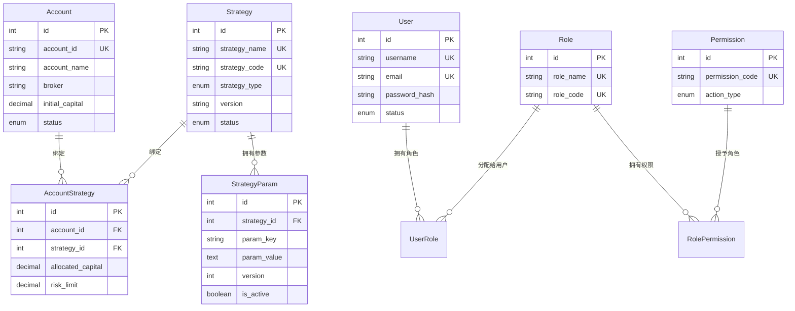

# Data Model: 数据存储模块性能优化

**Feature**: 001-data-storage-optimization
**Date**: 2025-10-01
**Status**: Complete

## Model Overview

本文档定义数据存储优化功能的核心数据模型,包括实体、属性、关系和验证规则。模型设计基于功能规范(spec.md)的实体定义和业务约束。

### 存储分层
- **HOT层 (Redis)**: Position (持仓状态) - 高频读写,<1ms响应
- **WARM层 (MySQL)**: Account, Strategy, StrategyParam, User, Role, Permission - 关系数据,<100ms响应
- **COOL层 (ClickHouse)**: Trade (交易记录), DailyKline (K线数据) - 时序数据,<500ms响应

---

## Core Entities

### 1. Account (账户) - WARM层

**用途**: 代表一个交易账户,记录资金、持仓等核心信息

#### 属性定义
| 字段名 | 类型 | 约束 | 说明 |
|--------|------|------|------|
| id | Integer | PK, Auto-increment | 内部ID |
| account_id | String(50) | Unique, Not Null | 账户ID(对应QMT_ACCOUNT_ID) |
| account_name | String(100) | Not Null | 账户名称(如"生产账户") |
| broker | String(50) | Not Null | 券商(QMT/GM/TDX) |
| initial_capital | Decimal(20,2) | Not Null | 初始资金(元) |
| current_capital | Decimal(20,2) | Nullable | 当前资金(元) |
| total_assets | Decimal(20,2) | Nullable | 总资产(元) |
| position_value | Decimal(20,2) | Nullable | 持仓市值(元) |
| status | Enum | Not Null, Default='active' | 状态(active/inactive/suspended) |
| created_at | Timestamp | Default=NOW() | 创建时间 |
| updated_at | Timestamp | On Update=NOW() | 更新时间 |

#### 验证规则 (from FR-009, FR-010, FR-011)
- `account_id` 全局唯一,长度6-50字符
- `initial_capital` > 0
- `current_capital` >= 0 (可为0表示全部亏损)
- `status` 只能为 'active', 'inactive', 'suspended'
- `broker` 只能为 'QMT', 'GM', 'TDX'

#### 关系
- **strategies**: Many-to-Many → Strategy (通过account_strategy关联表)

#### 生命周期
1. **创建**: 管理员通过Web界面创建,验证account_id唯一性
2. **更新**: 每日更新current_capital, total_assets, position_value
3. **停用**: 设置status='inactive',不删除记录(保留历史)

---

### 2. Strategy (策略) - WARM层

**用途**: 代表一个交易策略,可绑定多个账户

#### 属性定义
| 字段名 | 类型 | 约束 | 说明 |
|--------|------|------|------|
| id | Integer | PK, Auto-increment | 内部ID |
| strategy_name | String(100) | Unique, Not Null | 策略名称(如"问财选股V1") |
| strategy_code | String(50) | Unique, Not Null | 策略代码(英文标识,如"wencai_v1") |
| strategy_type | Enum | Not Null | 策略类型(wencai/remote/technical) |
| version | String(20) | Not Null | 版本号(如"1.0.0") |
| status | Enum | Not Null, Default='active' | 状态(active/testing/inactive) |
| description | Text | Nullable | 策略描述 |
| created_at | Timestamp | Default=NOW() | 创建时间 |
| updated_at | Timestamp | On Update=NOW() | 更新时间 |

#### 验证规则 (from FR-013, FR-016)
- `strategy_name` 全局唯一,长度3-100字符
- `strategy_code` 全局唯一,只能包含小写字母、数字、下划线
- `strategy_type` 只能为 'wencai', 'remote', 'technical'
- `status` 只能为 'active', 'testing', 'inactive'
- `version` 符合语义化版本格式(x.y.z)

#### 关系
- **accounts**: Many-to-Many → Account (通过account_strategy关联表)
- **params**: One-to-Many → StrategyParam

---

### 3. AccountStrategy (账户-策略关联) - WARM层

**用途**: 管理账户和策略的多对多关系,记录分配资金和风险限额

#### 属性定义
| 字段名 | 类型 | 约束 | 说明 |
|--------|------|------|------|
| id | Integer | PK, Auto-increment | 内部ID |
| account_id | Integer | FK → Account.id, Not Null | 账户ID |
| strategy_id | Integer | FK → Strategy.id, Not Null | 策略ID |
| allocated_capital | Decimal(20,2) | Not Null | 分配资金(元) |
| risk_limit | Decimal(5,2) | Not Null | 风险限额(百分比,如5.0表示5%) |
| status | Enum | Not Null, Default='active' | 绑定状态(active/paused) |
| created_at | Timestamp | Default=NOW() | 绑定时间 |
| updated_at | Timestamp | On Update=NOW() | 更新时间 |

#### 验证规则 (from FR-014, FR-015)
- `(account_id, strategy_id)` 联合唯一
- `allocated_capital` > 0, <= Account.current_capital
- `risk_limit` >= 0, <= 100
- 同一账户的所有策略allocated_capital之和 <= Account.current_capital

---

### 4. StrategyParam (策略参数) - WARM层

**用途**: 存储策略参数的历史版本,支持版本对比

#### 属性定义
| 字段名 | 类型 | 约束 | 说明 |
|--------|------|------|------|
| id | Integer | PK, Auto-increment | 内部ID |
| strategy_id | Integer | FK → Strategy.id, Not Null | 所属策略ID |
| param_key | String(100) | Not Null | 参数键(如"slot_count") |
| param_value | Text | Not Null | 参数值(JSON格式) |
| param_type | Enum | Not Null | 参数类型(int/float/string/json) |
| version | Integer | Not Null | 版本号(递增) |
| is_active | Boolean | Not Null, Default=False | 是否为当前激活版本 |
| remark | String(200) | Nullable | 版本备注(如"提高仓位测试") |
| created_at | Timestamp | Default=NOW() | 创建时间 |

#### 验证规则 (from FR-017, FR-018, FR-019, FR-020)
- `(strategy_id, param_key, version)` 联合唯一
- 同一`(strategy_id, param_key)`只能有一个`is_active=True`的记录
- `version` 自动递增(取当前最大version+1)
- `param_value` 必须符合`param_type`的格式:
  - int: 纯数字字符串
  - float: 浮点数字符串
  - string: 任意字符串
  - json: 有效JSON格式

#### 关系
- **strategy**: Many-to-One → Strategy

#### 生命周期
1. **创建**: 保存新参数时,查询当前最大version,插入version+1
2. **激活**: 将旧激活版本的`is_active`设为False,将新版本设为True
3. **对比**: 查询指定version的所有参数,进行diff

---

### 5. Position (持仓) - HOT层 (Redis Hash)

**用途**: 存储实时持仓状态,高频读写

#### Redis数据结构
```
Key: held_days:{account_id}
Type: Hash
Fields:
  {stock_code}: {days}  # 如 "SH600000": "5"
  _inc_date: {date}     # 如 "2025-10-01" (持仓天数自增日期标记)

Key: max_prices:{account_id}
Type: Hash
Fields:
  {stock_code}: {price}  # 如 "SH600000": "10.85"

Key: min_prices:{account_id}
Type: Hash
Fields:
  {stock_code}: {price}  # 如 "SH600000": "9.50"
```

#### 逻辑模型
| 字段名 | 类型 | 说明 |
|--------|------|------|
| account_id | String(50) | 账户ID |
| stock_code | String(10) | 股票代码(如SH600000) |
| held_days | Integer | 持仓天数 |
| max_price | Decimal(10,3) | 开仓后最高价(元) |
| min_price | Decimal(10,3) | 开仓后最低价(元) |

#### 验证规则 (from FR-001, FR-005)
- `held_days` >= 0
- `max_price` > 0, `min_price` > 0
- `max_price` >= `min_price`

#### 操作
- **买入**: `HSET held_days:{account_id} {code} 0`
- **卖出**: `HDEL held_days:{account_id} {code}`
- **天数+1**: `HINCRBY held_days:{account_id} {code} 1`
- **更新最高价**: `HSET max_prices:{account_id} {code} {price}`

---

### 6. Trade (交易记录) - COOL层 (ClickHouse)

**用途**: 存储所有交易记录,支持复杂查询和聚合统计

#### 属性定义
| 字段名 | 类型 | 说明 |
|--------|------|------|
| id | UInt64 | 自增ID |
| timestamp | DateTime | 交易时间戳 |
| date | Date | 交易日期(分区键) |
| account_id | String | 账户ID |
| stock_code | String | 股票代码 |
| stock_name | String | 股票名称 |
| order_type | Enum8 | 订单类型(buy_order/sell_order/buy_trade/sell_trade/cancel) |
| strategy_name | String | 策略名称 |
| price | Decimal(10,3) | 价格(元) |
| volume | UInt32 | 数量(股) |
| amount | Decimal(20,2) | 金额(元) |
| remark | String | 备注 |

#### ClickHouse表定义
```sql
CREATE TABLE IF NOT EXISTS trade_records (
    id UInt64,
    timestamp DateTime,
    date Date,
    account_id String,
    stock_code String,
    stock_name String,
    order_type Enum8('buy_order'=1, 'sell_order'=2, 'buy_trade'=3, 'sell_trade'=4, 'cancel'=5),
    strategy_name String,
    price Decimal(10,3),
    volume UInt32,
    amount Decimal(20,2),
    remark String
) ENGINE = MergeTree()
PARTITION BY toYYYYMM(date)
ORDER BY (account_id, stock_code, timestamp)
SETTINGS index_granularity = 8192;
```

#### 验证规则 (from FR-021, FR-022, FR-023, FR-024)
- `timestamp` 在交易时间范围内(9:30-15:00)
- `price` > 0, `volume` > 0, `amount` = price * volume
- `order_type` 枚举值有效

#### 查询模式
- **按日期范围**: `WHERE date BETWEEN '2024-01-01' AND '2024-12-31'`
- **按账户**: `WHERE account_id = '55009728'`
- **按股票**: `WHERE stock_code = 'SH600000'`
- **月度统计**: `SELECT toYYYYMM(date) AS month, COUNT(*), SUM(amount) GROUP BY month`

---

### 7. DailyKline (K线数据) - COOL层 (ClickHouse)

**用途**: 存储股票日线历史数据,支持快速查询

#### 属性定义
| 字段名 | 类型 | 说明 |
|--------|------|------|
| id | UInt64 | 自增ID |
| stock_code | String | 股票代码 |
| date | Date | 交易日期 |
| datetime | UInt32 | 日期整数(YYYYMMDD) |
| open | Decimal(10,3) | 开盘价(元) |
| high | Decimal(10,3) | 最高价(元) |
| low | Decimal(10,3) | 最低价(元) |
| close | Decimal(10,3) | 收盘价(元) |
| volume | UInt64 | 成交量(股) |
| amount | Decimal(20,2) | 成交额(元) |

#### ClickHouse表定义
```sql
CREATE TABLE IF NOT EXISTS daily_kline (
    id UInt64,
    stock_code String,
    date Date,
    datetime UInt32,
    open Decimal(10,3),
    high Decimal(10,3),
    low Decimal(10,3),
    close Decimal(10,3),
    volume UInt64,
    amount Decimal(20,2)
) ENGINE = MergeTree()
PARTITION BY toYYYYMM(date)
ORDER BY (stock_code, date)
SETTINGS index_granularity = 8192;
```

#### 验证规则 (from FR-025, FR-026, FR-027, FR-028)
- `high` >= `low`, `open` >= `low`, `close` >= `low`
- `high` >= `open`, `high` >= `close`
- `volume` > 0, `amount` > 0
- `(stock_code, date)` 联合唯一

#### 查询模式
- **单只股票近60日**: `WHERE stock_code='SH600000' AND date >= today() - 60 ORDER BY date DESC`
- **批量查询**: `WHERE stock_code IN ('SH600000', 'SZ000001', ...) AND date >= '2024-01-01'`

---

### 8. User (用户) - WARM层

**用途**: Web管理后台的登录用户

#### 属性定义
| 字段名 | 类型 | 约束 | 说明 |
|--------|------|------|------|
| id | Integer | PK, Auto-increment | 内部ID |
| username | String(50) | Unique, Not Null | 用户名 |
| password_hash | String(255) | Not Null | 密码哈希(bcrypt) |
| email | String(100) | Unique, Not Null | 邮箱 |
| real_name | String(100) | Nullable | 真实姓名 |
| status | Enum | Not Null, Default='active' | 状态(active/inactive/locked) |
| last_login_at | Timestamp | Nullable | 最后登录时间 |
| last_login_ip | String(45) | Nullable | 最后登录IP(IPv6兼容) |
| created_at | Timestamp | Default=NOW() | 创建时间 |
| updated_at | Timestamp | On Update=NOW() | 更新时间 |

#### 验证规则 (from FR-029, FR-032)
- `username` 长度3-50字符,只能包含字母、数字、下划线
- `email` 符合邮箱格式
- `password_hash` 使用bcrypt算法,强度>=10

#### 关系
- **roles**: Many-to-Many → Role (通过user_role关联表)

---

### 9. Role (角色) - WARM层

**用途**: 定义用户权限集合

#### 属性定义
| 字段名 | 类型 | 约束 | 说明 |
|--------|------|------|------|
| id | Integer | PK, Auto-increment | 内部ID |
| role_name | String(50) | Unique, Not Null | 角色名称(如"管理员") |
| role_code | String(50) | Unique, Not Null | 角色代码(如"admin") |
| description | String(200) | Nullable | 角色描述 |
| created_at | Timestamp | Default=NOW() | 创建时间 |

#### 预定义角色 (from FR-030)
- **admin**: 管理员 - 所有权限
- **developer**: 策略开发 - 策略配置、参数管理
- **trader**: 交易员 - 查看持仓、交易记录
- **viewer**: 只读用户 - 仅查看权限

#### 关系
- **users**: Many-to-Many → User (通过user_role关联表)
- **permissions**: Many-to-Many → Permission (通过role_permission关联表)

---

### 10. Permission (权限) - WARM层

**用途**: 定义具体操作权限

#### 属性定义
| 字段名 | 类型 | 约束 | 说明 |
|--------|------|------|------|
| id | Integer | PK, Auto-increment | 内部ID |
| permission_name | String(100) | Unique, Not Null | 权限名称(如"查看账户") |
| permission_code | String(100) | Unique, Not Null | 权限代码(如"account:read") |
| resource_type | String(50) | Not Null | 资源类型(account/strategy/trade) |
| action_type | Enum | Not Null | 操作类型(create/read/update/delete) |
| description | String(200) | Nullable | 权限描述 |
| created_at | Timestamp | Default=NOW() | 创建时间 |

#### 权限代码格式 (from FR-031)
`{resource}:{action}` 例如:
- `account:read` - 查看账户
- `account:create` - 创建账户
- `strategy:manage` - 管理策略(包含create/update/delete)
- `trade:execute` - 执行交易

---

## Entity Relationships

### ER Diagram (Mermaid)


---

## State Transitions

### Account Status
```
[创建] → active (活跃)
active → inactive (停用) - 管理员手动停用
active → suspended (暂停) - 系统检测到异常
inactive → active (重新激活)
suspended → active (解除暂停)
```

### Strategy Status
```
[创建] → testing (测试中)
testing → active (上线) - 测试通过
active → inactive (停用) - 策略下线
active → testing (回归测试) - 发现问题
```

### User Status
```
[注册] → active (活跃)
active → inactive (停用) - 管理员手动停用
active → locked (锁定) - 连续登录失败5次
locked → active (解锁) - 管理员解锁
```

---

## Validation Rules Summary

### 跨实体验证
1. **账户策略资金分配**: `SUM(AccountStrategy.allocated_capital) <= Account.current_capital`
2. **持仓数量限制**: 每个账户最多持仓100只股票 (CON-003)
3. **参数版本唯一激活**: 同一`(strategy_id, param_key)`只能有一个`is_active=True`
4. **交易时间验证**: `Trade.timestamp` 必须在交易日的9:30-15:00

### 数据完整性
1. **外键约束**: 所有FK字段必须引用有效记录
2. **级联删除**: Account删除时,级联删除AccountStrategy
3. **软删除**: Strategy/User不物理删除,设置status='inactive'

---

## Index Strategy

### MySQL索引
```sql
-- Account
CREATE INDEX idx_account_id ON accounts(account_id);
CREATE INDEX idx_status ON accounts(status);

-- Strategy
CREATE INDEX idx_strategy_code ON strategies(strategy_code);
CREATE INDEX idx_status ON strategies(status);

-- StrategyParam
CREATE INDEX idx_strategy_version ON strategy_params(strategy_id, version);
CREATE INDEX idx_active ON strategy_params(strategy_id, param_key, is_active);

-- User
CREATE INDEX idx_username ON users(username);
CREATE INDEX idx_email ON users(email);
```

### ClickHouse索引
```sql
-- Trade: 已通过ORDER BY定义排序键 (account_id, stock_code, timestamp)
-- DailyKline: 已通过ORDER BY定义排序键 (stock_code, date)
```

### Redis无需索引
Hash结构天然支持O(1)查找

---

## Data Model Validation

- [x] 所有实体来自功能规范的Key Entities章节
- [x] 所有属性满足功能需求(FR-001 ~ FR-040)
- [x] 所有验证规则可测试
- [x] 所有关系明确定义
- [x] 所有状态转换完整

**Next**: Phase 1继续 - 生成API契约(contracts/)和快速上手指南(quickstart.md)
